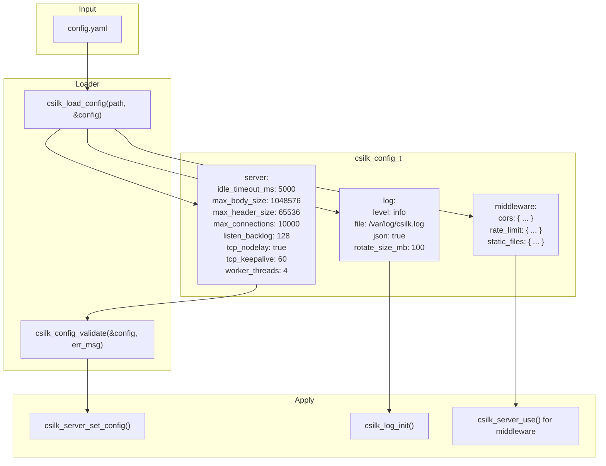
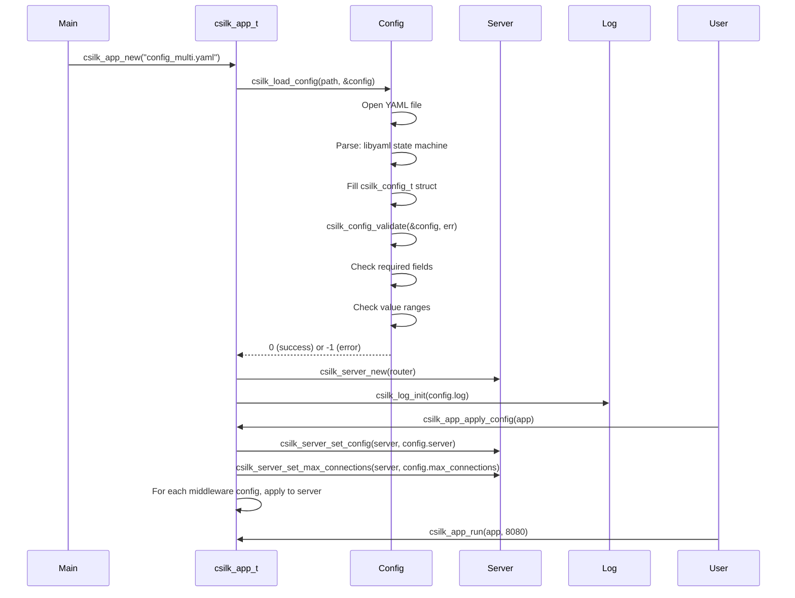
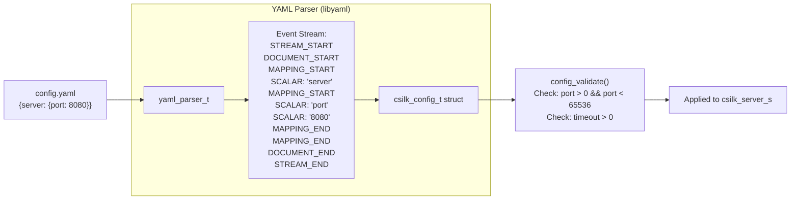

# Configuration

The server supports YAML configuration for defining server settings, logging, and middleware parameters. Configuration is loaded at startup via libyaml.

## Configuration System



## Configuration Lifecycle



## Full Configuration Schema

```yaml
# Server settings
server:
  idle_timeout_ms: 5000       # Connection idle timeout (ms)
  max_body_size: 1048576      # Max request body (1MB default)
  max_header_size: 65536      # Max request headers (64KB default)
  max_connections: 10000      # Max concurrent connections (0 = unlimited)
  listen_backlog: 128         # TCP listen backlog
  tcp_nodelay: true           # Disable Nagle's algorithm
  tcp_keepalive: 60           # TCP keepalive interval (seconds)
  worker_threads: 4           # Number of worker threads (0 = 1)

# Logging settings
log:
  level: info                 # trace, debug, info, warn, error, fatal
  file: "/var/log/csilk.log"  # Log file path (NULL = stdout)
  json: true                  # JSON format output
  rotate_size_mb: 100         # Max log file size before rotation

# CORS middleware
middleware:
  cors:
    enabled: true
    allow_origins: ["http://localhost:3000"]
    allow_methods: ["GET", "POST", "PUT", "DELETE"]
    allow_headers: ["Content-Type", "Authorization"]
    max_age: 3600

  # Rate limit middleware
  rate_limit:
    enabled: true
    requests_per_second: 100
    burst: 200

  # Static file middleware
  static_files:
    enabled: true
    root_dir: "./public"
    cache_time: 3600
```

## Configuration Data Flow


