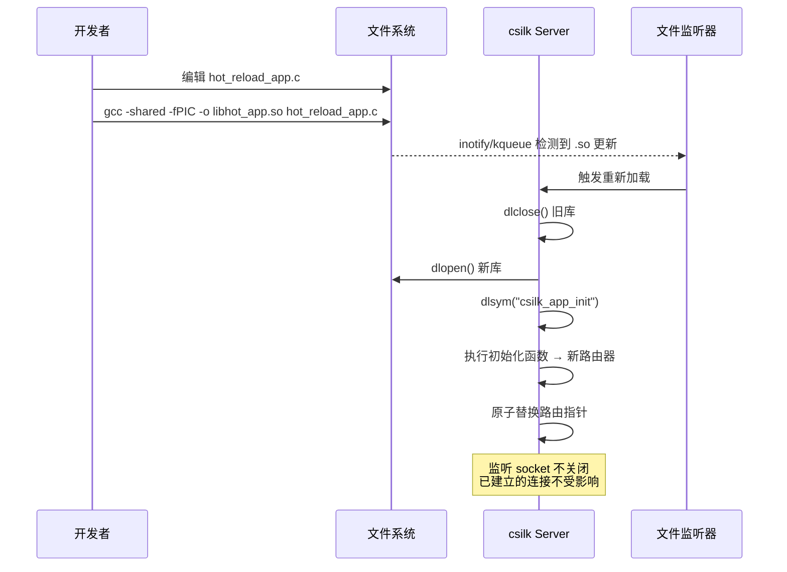

# Hot Reload 热重载开发指南

> **Version**: 0.5.0-dev | **Last updated**: 2026-06-29

csilk 的 Hot Reload（热重载）机制允许在**不重启服务器进程**的情况下动态替换路由处理器，极大提升开发效率。更改处理器代码 → 重新编译共享库 → 服务器自动监听文件变更并热替换路由器。

---

## 1. 工作原理



---

## 2. 编写可热重载模块

创建一个共享库项目，暴露入口函数：

```c
// hot_reload_app.c
#include "csilk/csilk.h"

void hello_handler(csilk_ctx_t* c) {
    /* 修改此消息 → 重新编译 → 浏览器刷新即可看到变化 */
    csilk_string(c, 200, "Hello from Hot-Reloadable Module! (v1)");
}

/* 入口函数：csilk_dev_hot_reload_start 通过此符号加载路由器 */
csilk_router_t*
csilk_app_init(void) {
    csilk_router_t* r = csilk_router_new();
    csilk_router_add(r, "GET", "/", (csilk_handler_t[]){hello_handler}, 1);
    return r;
}
```

编译为共享库：

```bash
gcc -shared -fPIC -o libhot_app.so examples/hot_reload_app.c \
    -Iinclude -Lbuild -lcsilk
```

---

## 3. 启动热重载服务器

```c
// main.c — 启动器
#include "csilk/csilk.h"
#include <stdio.h>

int main(int argc, char** argv) {
    const char* so_path = argc > 1 ? argv[1] : "./libhot_app.so";
    int port = argc > 2 ? atoi(argv[2]) : 8080;

    /* 创建服务器（初始无路由器 — 由热重载机制加载） */
    csilk_server_t* server = csilk_server_new(nullptr);
    if (!server) return 1;

    /* 启动热重载：加载 .so，启动文件监听 */
    if (csilk_dev_hot_reload_start(server, so_path, "csilk_app_init") != 0) {
        fprintf(stderr, "Hot reload init failed for %s\n", so_path);
        return 1;
    }

    printf("Dev server on port %d with hot-reload enabled\n", port);
    csilk_server_run(server, port);
    csilk_server_free(server);
    return 0;
}
```

编译启动器：

```bash
gcc -o dev_server main.c -Iinclude -Lbuild -lcsilk
```

---

## 4. 开发工作流

```bash
# 1. 构建 csilk 库
mkdir build && cd build && cmake .. -DCMAKE_BUILD_TYPE=Debug && make -j$(nproc)

# 2. 编译可热重载模块
cd ..
gcc -shared -fPIC -o libhot_app.so examples/hot_reload_app.c \
    -Iinclude -Lbuild -lcsilk

# 3. 编译启动器
gcc -o dev_server main.c -Iinclude -Lbuild -lcsilk

# 4. 启动开发服务器
./dev_server ./libhot_app.so 8080

# 5. 在另一个终端编辑 hot_reload_app.c，修改处理器代码

# 6. 重新编译模块
gcc -shared -fPIC -o libhot_app.so examples/hot_reload_app.c \
    -Iinclude -Lbuild -lcsilk

# 7. 服务器自动检测到 libhot_app.so 变化，热替换路由器
#    → 浏览器刷新即可看到更新
```

---

## 5. 完整示例

可热重载模块 (`routers/user_routes.c`)：

```c
#include "csilk/csilk.h"

void list_users(csilk_ctx_t* c) {
    csilk_string(c, 200, "[{\"id\":1,\"name\":\"Alice\"}]");
}

void get_user(csilk_ctx_t* c) {
    const char* id = csilk_get_param(c, "id");
    char resp[128];
    snprintf(resp, sizeof(resp), "{\"id\":%s,\"name\":\"User_%s\"}", id, id);
    csilk_string(c, 200, resp);
}

csilk_router_t*
csilk_app_init(void) {
    csilk_router_t* r = csilk_router_new();
    csilk_router_add(r, "GET", "/users",    (csilk_handler_t[]){list_users}, 1);
    csilk_router_add(r, "GET", "/users/:id", (csilk_handler_t[]){get_user}, 1);
    return r;
}
```

Makefile 简化编译：

```makefile
# Makefile
CSILK_DIR = /path/to/csilk
CFLAGS = -I$(CSILK_DIR)/include -fPIC
LDFLAGS = -L$(CSILK_DIR)/build -lcsilk

all: dev_server libroutes.so

libroutes.so: routers/user_routes.c
    gcc -shared $(CFLAGS) -o $@ $^ $(LDFLAGS)

dev_server: main.c
    gcc -o $@ $^ $(CFLAGS) $(LDFLAGS)

.PHONY: watch
watch:
    while inotifywait -e close_write libroutes.so; do \
        echo "Reloaded!"; \
    done
```

---

## 6. 注意事项

| 要点 | 说明 |
|:-----|:------|
| **入口函数签名** | `csilk_router_t* (*)(void)` — 无参数，返回新路由器 |
| **符号名** | 默认 `csilk_app_init`，可通过 `csilk_dev_hot_reload_start` 的第三个参数自定义 |
| **共享库位置** | `.so` 文件路径可以是相对路径或绝对路径 |
| **监听机制** | 基于 libuv 的 `fs_event` 句柄（inotify/kqueue） |
| **原子替换** | 路由器指针原子交换，正在处理的请求不受影响 |
| **监听 socket** | 热重载**不关闭**监听端口，客户端连接不中断 |
| **调试构建** | 开发阶段使用 `Debug` 构建 csilk，获得完整符号信息 |

---

## 7. 最佳实践

| 实践 | 说明 |
|:-----|:------|
| **SHOULD** 使用 Makefile 或脚本 | 一键编译共享库，减少手动操作 |
| **SHOULD** 仅开发环境使用 | 生产环境应编译静态链接的 Release 版本 |
| **MAY** 配合文件监听工具 | `inotifywait` 或 `entr` 可在文件保存时自动编译 |
| **MUST** 保持 ABI 兼容 | 共享库依赖的 csilk 头文件版本应与启动器一致 |
| **SHOULD** 设置 `LD_LIBRARY_PATH` | 确保运行时能找到 `libcsilk.so` |

---

## 延伸阅读

| 文档 | 内容 |
|:-----|:------|
| [示例 — hot_reload_app.c](../../examples/hot_reload_app.c) | 可热重载模块示例 |
| [示例 — hot_reload_launcher.c](../../examples/hot_reload_launcher.c) | 热重载启动器示例 |
| [快速开始](../getting-started.md) | 构建 csilk 库的基础步骤 |
