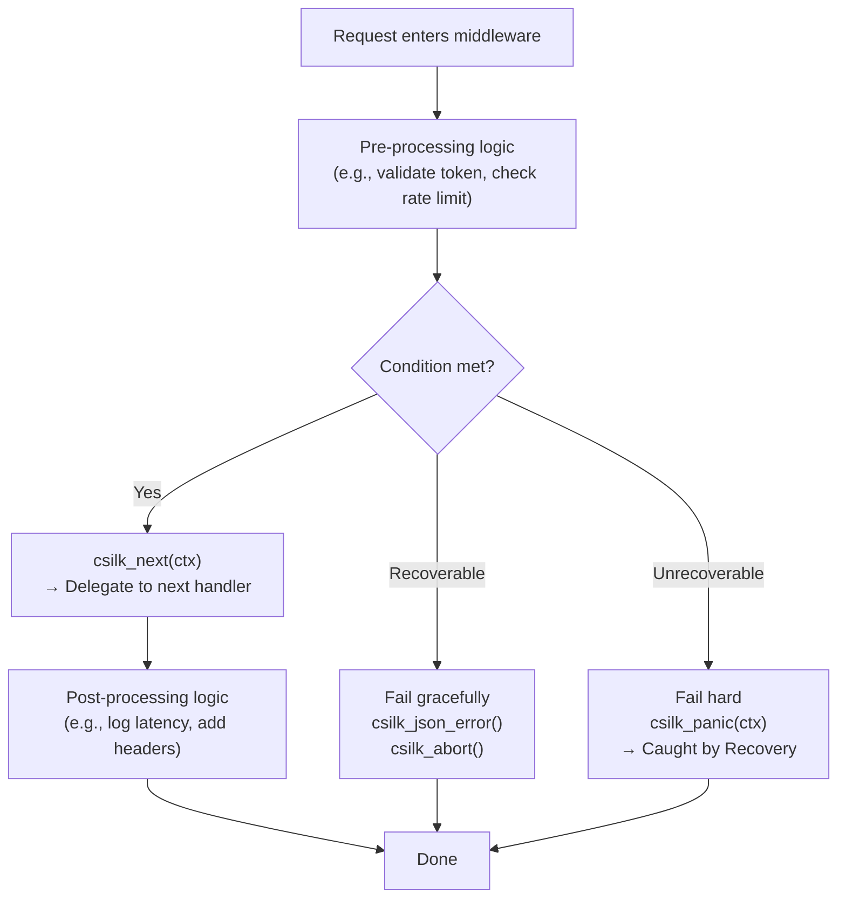
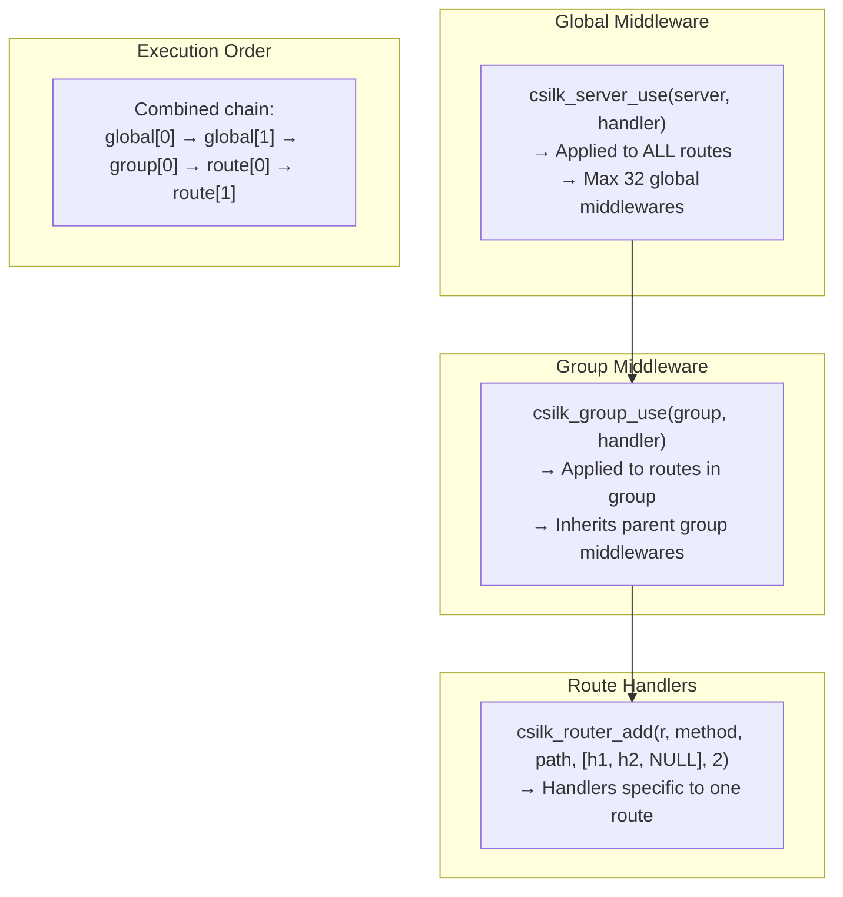
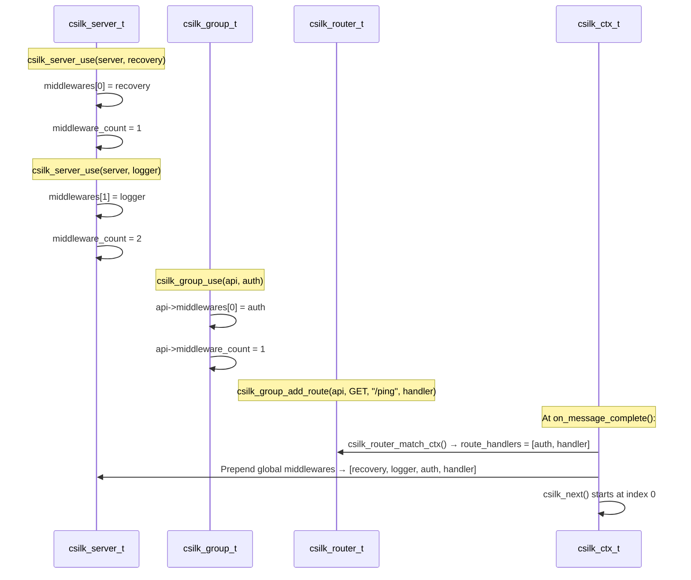
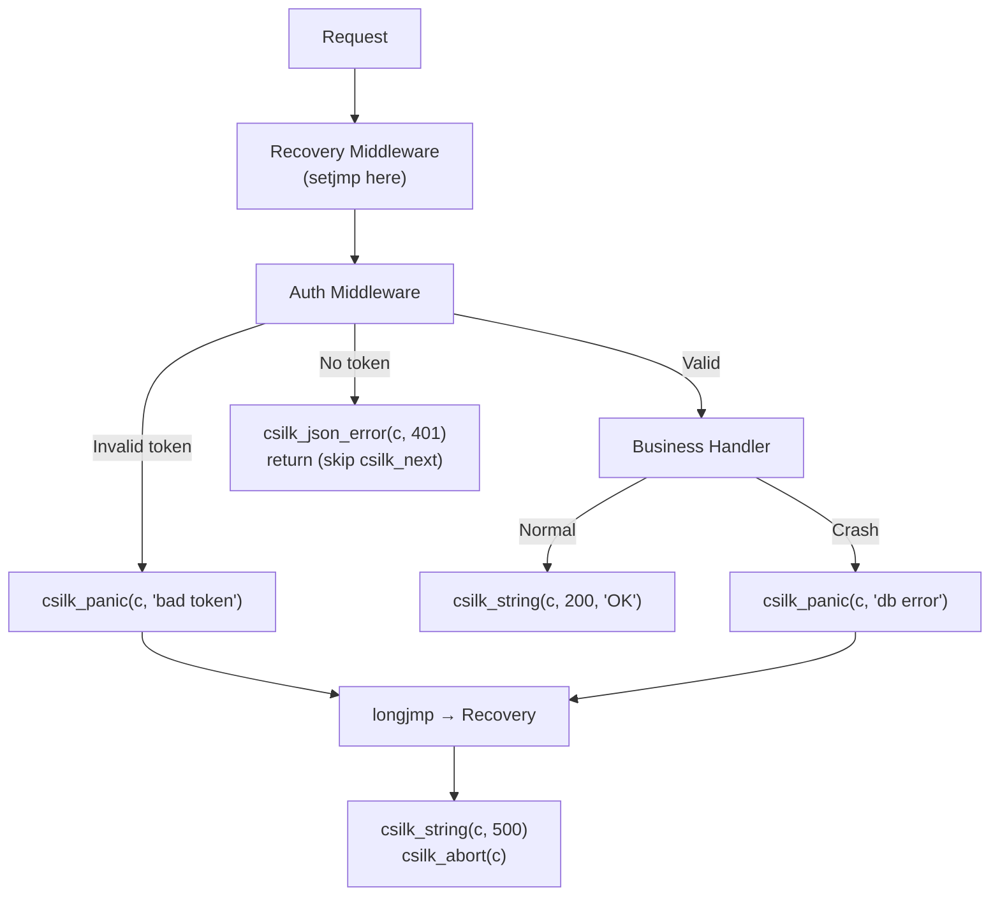

# Custom Middleware Development

Middleware in csilk is a function with signature `void handler(csilk_ctx_t* c)`. Middleware can intercept requests before and after the actual business handler executes.

## Middleware Pattern



## Basic Middleware Structure

```c
void my_middleware(csilk_ctx_t* c) {
    // === PRE-PROCESSING ===
    // Access request data
    const char* token = csilk_get_header(c, "Authorization");
    const char* ip = csilk_get_client_ip(c);

    // Validate / check conditions
    if (!token) {
        csilk_json_error(c, 401, "Missing token");
        return;  // Abort chain (don't call csilk_next)
    }

    // Store data for later middleware to use
    csilk_set(c, "user_id", (void*)42);

    // === DELEGATE ===
    csilk_next(c);

    // === POST-PROCESSING ===
    // Only runs if csilk_next returns normally
    // (i.e., no abort and no panic)
    CSILK_LOG_I("Request completed");
}
```

## Common Middleware Recipes

### 1. Authentication Middleware

```c
void auth_middleware(csilk_ctx_t* c) {
    const char* auth = csilk_get_header(c, "Authorization");
    if (!auth || strncmp(auth, "Bearer ", 7) != 0) {
        csilk_json_error(c, 401, "Unauthorized");
        return;
    }

    const char* token = auth + 7;
    if (!validate_token(token)) {
        csilk_json_error(c, 403, "Invalid token");
        return;
    }

    csilk_next(c);
    // Post: audit logging
}
```

### 2. Timing/Logging Middleware

```c
void timing_middleware(csilk_ctx_t* c) {
    uint64_t start = uv_hrtime();

    csilk_next(c);

    uint64_t elapsed = (uv_hrtime() - start) / 1000000;
    CSILK_LOG_I("%s %s → %d (%llums)",
        csilk_get_method(c),
        csilk_get_path(c),
        csilk_get_status(c),
        elapsed);
}
```

### 3. Response Header Injection

```c
void security_headers_middleware(csilk_ctx_t* c) {
    csilk_next(c);

    // Add security headers after handler runs
    csilk_set_header(c, "X-Content-Type-Options", "nosniff");
    csilk_set_header(c, "X-Frame-Options", "DENY");
    csilk_set_header(c, "X-XSS-Protection", "1; mode=block");
}
```

### 4. JWT Authorization Example

```c
void protected_resource_handler(csilk_ctx_t* c) {
    // Built-in JWT middleware already verified the token and stored payload
    cJSON* payload = (cJSON*)csilk_get(c, "jwt_payload");
    if (payload) {
        const char* user = cJSON_GetObjectItem(payload, "sub")->valuestring;
        CSILK_LOG_I("Access by user: %s", user);
    }
    csilk_string(c, 200, "Protected data");
}

// In main:
// csilk_group_use(api, (csilk_handler_t)csilk_jwt_middleware, "secret");
```

### 5. Request Tracing with Request ID

```c
void trace_middleware(csilk_ctx_t* c) {
    const char* req_id = csilk_get_request_id(c);
    
    // Add request ID to all logs via context-aware logging (future feature)
    // Or just manually:
    CSILK_LOG_I("[%s] Started request", req_id);
    
    csilk_next(c);
}
```

## Registration Methods



## Middleware Chain Assembly



## Best Practices

1. **Always call `csilk_next(c)`** in middleware that wants to continue the chain. Skipping it terminates the chain and sends the response.

2. **Use `csilk_abort(c)`** to terminate the chain early without setting a response body (useful with `csilk_redirect` which already set the response).

3. **Store data with `csilk_set(c, key, value)`** to pass data between middlewares and handlers. Data is stored on the context's linked list storage.

4. **Don't call `csilk_next()` in post-processing logic** -- only call it once in your middleware. The call stack handles the return path automatically.

5. **Use the Recovery middleware as the FIRST global middleware** to ensure any `csilk_panic()` calls in downstream handlers are caught.

6. **Use Arena-allocated memory** for temporary data within handlers. Memory allocated on the Arena is automatically freed at the end of the request cycle.

## Error Handling Flow



---

## Further Reading

For deep-dive architectural details of the middleware system and related components:

| Topic | Module Design Document |
|-------|----------------------|
| Middleware Onion Model & Chain Assembly | [Middleware](../module-design/middleware.md) |
| JWT / CSRF / CORS / WAF / Rate Limiter | [Security](../module-design/security.md) |
| Context Lifecycle & Arena Allocator | [Context](../module-design/context.md) |
| Server Hooks | [Hooks](../module-design/hooks.md) |
