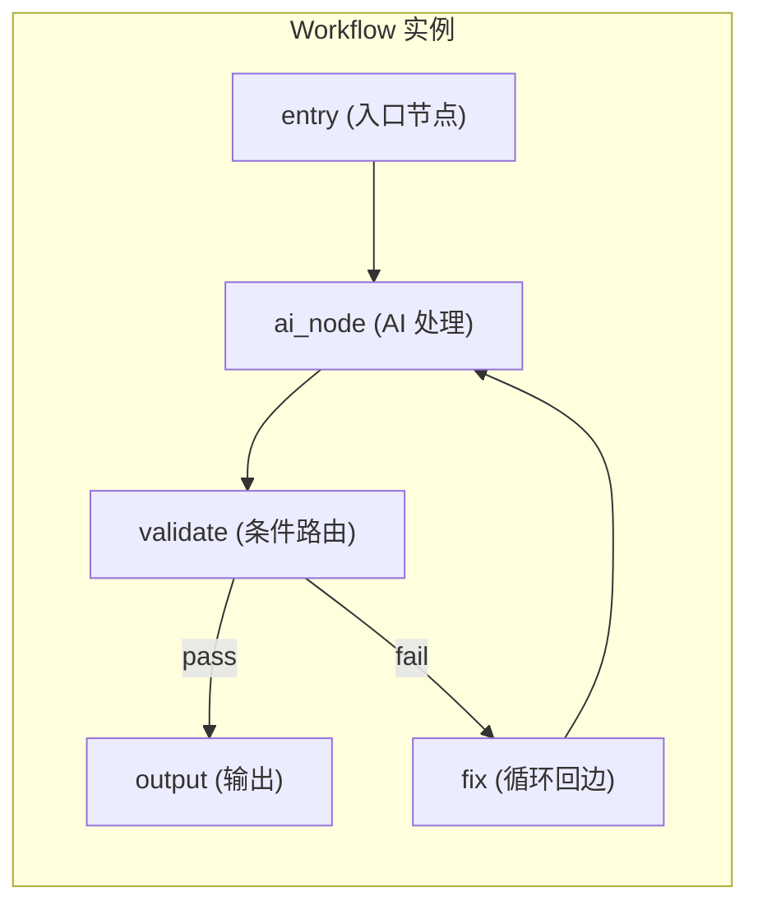

# AI Workflow 引擎使用指南

> **Version**: 0.5.0-dev | **Last updated**: 2026-06-29

csilk 的 Workflow 引擎是一个基于有向图的 AI 管道编排引擎，支持顺序执行、并行扇出、条件路由、智能体循环、WAL 持久化和分布式执行。每个 Workflow 由**节点**（Node）和**边**（Edge）构成 DAG。

---

## 1. 核心概念



| 概念 | 说明 |
|:-----|:------|
| **节点 (Node)** | 一个处理单元：C 函数处理器、内置 AI 节点或向量搜索节点 |
| **边 (Edge)** | 节点间的连接：顺序绑定、条件路由、循环回边、错误回退 |
| **Join 策略** | 多入边节点的触发策略：AND（全部到达）或 OR（任一到达） |
| **数据 (csilk_data_t)** | 节点间传递的通用容器，包含 type/value/free_fn |
| **Trace** | 执行追踪，记录每个节点的执行时间、输入输出 |

---

## 2. 快速开始

### 2.1 创建 Workflow 并运行

```c
#include "csilk/app/workflow.h"

// 节点处理函数
csilk_data_t* format_greeting(csil_wf_ctx_t* ctx, csilk_data_t* input, void* user_data) {
    const char* name = (const char*)input->value;
    char* greeting = csil_wf_strdup(ctx, "Hello, ");
    // 拼接字符串
    size_t len = strlen(greeting) + strlen(name) + 1;
    char* result = csil_wf_alloc(ctx, len);
    snprintf(result, len, "%s%s", greeting, name);
    return csil_wf_data_new(ctx, "text/plain", result);
}

csilk_data_t* to_upper(csil_wf_ctx_t* ctx, csilk_data_t* input, void* user_data) {
    char* str = strdup((const char*)input->value);
    for (char* p = str; *p; p++) *p = toupper(*p);
    return csil_wf_data_new(ctx, "text/plain", str);
}

void on_complete(csil_data_t* result) {
    printf("Workflow result: %s\n", (char*)result->value);
}

int main() {
    // 创建 Workflow
    csilk_wf_t* wf = csilk_wf_new("hello_pipeline");

    // 添加节点
    csilk_wf_node_t* n1 = csilk_wf_add(wf, "greeting", format_greeting, nullptr);
    csilk_wf_node_t* n2 = csilk_wf_add(wf, "uppercase", to_upper, nullptr);

    // 标记入口节点
    csilk_wf_node_set_entry(n1, 1);

    // 连接节点
    csilk_wf_bind(n1, n2);

    // 运行
    csilk_data_t input = {.type = "text/plain", .value = "world"};
    csilk_wf_run(wf, &input, on_complete);

    // 等待异步完成（实际应用在事件循环中运行）
    // csilk_wf_free(wf);
    return 0;
}
```

### 2.2 在 HTTP 请求中使用

```c
static csilk_wf_t* g_wf;

void run_workflow_handler(csilk_ctx_t* c) {
    cJSON* body = csilk_get_json(c);
    const char* text = cJSON_GetObjectItem(body, "text")->valuestring;

    csilk_data_t input = {
        .type  = "text/plain",
        .value = (void*)text,
    };

    csilk_wf_run(g_wf, &input, on_wf_done);
    csilk_json_string(c, 202, "{\"status\":\"accepted\"}");
    cJSON_Delete(body);
}

void on_wf_done(csilk_data_t* result) {
    CSILK_LOG_I("Workflow complete: %s", (char*)result->value);
}
```

---

## 3. 内置 AI 节点

### 3.1 基本 AI 节点

```c
void setup_ai_workflow(csilk_app_t* app) {
    csilk_wf_t* wf = csilk_wf_new("translator");

    // 配置 AI 节点
    csilk_ai_config_t ai_cfg = {
        .model       = "gpt-4",
        .system_msg  = "You are a translator. Translate the input to French.",
        .prompt      = "Translate: {{input.value}}",
        .temperature = 0.3,
        .max_tokens  = 500,
    };

    csilk_wf_node_t* n1 = csilk_wf_add_ai(wf, "translate", &ai_cfg);
    csilk_wf_node_set_entry(n1, 1);

    // 注册工具（可选）
    csilk_wf_register_tool(wf, "lookup_dict",
        "Look up a word in the dictionary",
        "{\"type\":\"object\",\"properties\":{\"word\":{\"type\":\"string\"}}}",
        dict_lookup_fn, nullptr);

    // 运行回调
    csilk_wf_run(wf, &input, on_translated);
}
```

`{{input.value}}` 模板语法让 AI 节点的 prompt 动态引用上游节点的输出。

### 3.2 向量搜索节点

```c
void setup_rag_workflow(void) {
    csilk_wf_t* wf = csilk_wf_new("rag_pipeline");

    // AI 引擎（用于生成 Embedding）
    csilk_ai_t* ai = csilk_ai_new("openai", getenv("OPENAI_API_KEY"), nullptr);

    // 向量数据库
    csilk_vector_db_t* vdb = csilk_vector_db_new("qdrant", "http://localhost:6333");

    csilk_vector_search_config_t vs_cfg = {
        .ai               = ai,
        .embedding_model  = "text-embedding-3-small",
        .db               = vdb,
        .collection       = "documents",
        .limit            = 5,
        .input_template   = "{{input.value}}",
    };

    csilk_wf_node_t* search = csilk_wf_add_vector_search(wf, "search_docs", &vs_cfg);
    csilk_wf_node_set_entry(search, 1);

    // 搜索结果传递给 AI 节点做 RAG
    csilk_ai_config_t ai_cfg = {
        .model      = "gpt-4",
        .system_msg = "Answer based on the retrieved documents.",
        .prompt     = "Documents: {{search_docs.value}}\n\nQuestion: {{input.value}}",
    };

    csilk_wf_node_t* answer = csilk_wf_add_ai(wf, "answer", &ai_cfg);
    csilk_wf_bind(search, answer);
}
```

---

## 4. 节点连接方式

### 4.1 顺序绑定

```c
csilk_wf_bind(n1, n2);  // n1 完成后触发 n2
```

### 4.2 条件路由

根据节点输出内容决定下一步：

```c
csilk_wf_on(n_validate, "pass", n_output);  // 验证通过 → 输出
csilk_wf_on(n_validate, "fail", n_fix);     // 验证失败 → 修复
```

### 4.3 循环回边

智能体自我修正的循环模式：

```c
// 定义循环：质量检查不通过则回到 AI 节点重试
csilk_wf_on(n_quality, "retry", n_ai);      // 普通重试
csilk_wf_on_loop(n_quality, "retry", n_ai); // 循环回边（不递增入边计数）
```

> **`csilk_wf_on_loop` vs `csilk_wf_on`**：`on_loop` 不递增目标节点的入边计数器，避免 AND-join 死锁。

### 4.4 错误回退

```c
csilk_wf_on_error(n_api_call, n_fallback);   // n_api_call 失败时触发 n_fallback
```

### 4.5 动态路由

运行时通过回调决定下一节点：

```c
const char* my_router(csil_data_t* input) {
    const char* text = (const char*)input->value;
    if (strstr(text, "error"))  return "error_handler";
    if (strstr(text, "slow"))   return "async_handler";
    return nullptr;  // 默认顺序路由
}

csilk_wf_route(n_classify, my_router);
```

---

## 5. Join 策略

当节点有多个入边时：

```c
// AND（默认）：所有上游节点完成后才触发
csilk_wf_node_set_join(n_summary, CSILK_WF_JOIN_AND);

// OR：任一上游节点完成后即触发
csilk_wf_node_set_join(n_fast_result, CSILK_WF_JOIN_OR);
```

---

## 6. 交互式节点

节点执行到交互节点时暂停，等待人工信号：

```c
csilk_wf_node_t* n_review = csilk_wf_add(wf, "human_review", review_handler, nullptr);
csilk_wf_node_set_interactive(n_review, 1);  // 需要人工审批

// 在外部（如 HTTP 请求）中发送继续信号：
void approve_handler(csilk_ctx_t* c) {
    const char* exec_id = csilk_get_param(c, "exec_id");
    const char* feedback = csilk_get_param(c, "feedback");

    csilk_data_t input = {.type = "text/plain", .value = (void*)feedback};
    csilk_wf_signal_continue(wf, exec_id, &input, on_complete);

    csilk_json_string(c, 200, "{\"status\":\"continued\"}");
}
```

---

## 7. 超时与重试

```c
// 节点级超时（毫秒）
csilk_wf_node_set_timeout(n_slow_api, 10000);  // 10 秒超时

// 节点级自动重试
csilk_wf_node_set_retry(n_api_call, 3, 1000);  // 最多重试 3 次，间隔 1 秒

// 全局执行 TTL（秒）
csilk_wf_set_ttl(wf, 300);  // 整个 Workflow 最多运行 5 分钟
```

---

## 8. 工具调用（Function Calling）

注册自定义 C 函数供 AI 节点调用：

```c
char* get_weather_fn(const char* args_json, void* user_data) {
    cJSON* args = cJSON_Parse(args_json);
    const char* city = cJSON_GetObjectItem(args, "city")->valuestring;

    // 调用天气 API
    char* result = malloc(256);
    snprintf(result, 256, "{\"city\":\"%s\",\"temp\":22,\"condition\":\"sunny\"}", city);

    cJSON_Delete(args);
    return result;  // 调用者负责 free
}

void setup_weather_workflow(csilk_wf_t* wf) {
    csilk_wf_register_tool(wf,
        "get_weather",
        "Get current weather for a city",
        "{\"type\":\"object\",\"properties\":{"
        "\"city\":{\"type\":\"string\",\"description\":\"City name\"}"
        "},\"required\":[\"city\"]}",
        get_weather_fn,
        nullptr);
}
```

### 动态工具发现（MCP 协议）

```c
int my_tool_discovery(csilk_wf_t* wf,
                      const csilk_wf_tool_entry_t* static_tools, size_t static_count,
                      csilk_wf_tool_entry_t** discovered_out, size_t* discovered_count_out,
                      void* user_data) {
    // 从远程 MCP 服务器动态发现工具
    csilk_wf_tool_entry_t* tools = calloc(2, sizeof(csilk_wf_tool_entry_t));
    tools[0] = (csilk_wf_tool_entry_t){
        .name = strdup("remote_search"),
        .description = strdup("Search remote knowledge base"),
        .parameters_json = strdup("{\"type\":\"object\",\"properties\":{...}}"),
        .fn = remote_search_fn,
    };
    *discovered_out = tools;
    *discovered_count_out = 1;
    return 0;
}

void setup(csilk_wf_t* wf) {
    csilk_wf_set_tool_discovery(wf, my_tool_discovery, nullptr);
}
```

---

## 9. WAL 持久化与恢复

```c
void setup_persistent_workflow(csilk_wf_t* wf) {
    // 启用 WAL，执行日志存储在指定目录
    csilk_wf_set_persistence(wf, "/var/log/workflows/");
}

// 服务器重启后恢复未完成的 Workflow
void resume_after_restart(void) {
    const char* exec_id = "exec_abc123";
    csilk_wf_resume(wf, exec_id, on_resume_complete);
}
```

---

## 10. 分布式执行

通过消息队列将节点 offload 到远程 worker：

```c
void setup_distributed(csilk_wf_t* wf, csilk_mq_t* mq) {
    // 启用分布式执行
    csilk_wf_enable_distributed(wf, mq);

    // 标记特定节点为远程执行
    csilk_wf_node_set_remote(n_heavy_compute, 1);
}
```

---

## 11. Token 预算控制

```c
csilk_wf_set_budget(wf, 100000);  // 整个 Workflow 最多消耗 100K tokens
```

---

## 12. 可视化与监控

### Mermaid 导出

```c
char* mermaid = csilk_wf_to_mermaid(wf);
printf("%s\n", mermaid);
free(mermaid);
```

### WebSocket 实时监控

```c
void monitor_handler(csilk_ctx_t* c) {
    csilk_ws_handshake(c);
    csilk_wf_register_monitor(wf, c);
}
```

### 执行追踪

```c
csilk_wf_run_traced(wf, &input, on_traced_complete);

void on_traced_complete(csil_data_t* result, csilk_wf_trace_t* trace) {
    char* json = csilk_wf_trace_to_json(trace);
    printf("Trace: %s\n", json);
    free(json);
    csilk_wf_trace_free(trace);
}
```

---

## 13. 声明式 Workflow（YAML/JSON 加载）

```yaml
# workflow.yaml
name: "customer_support"
nodes:
  - id: classify
    handler: classify_intent
    entry: true
  - id: research
    handler: search_kb
  - id: generate
    handler: generate_response
connections:
  - from: classify
    to: research
  - from: research
    to: generate
```

```c
// 注册处理器
void classify_intent(csil_wf_ctx_t* ctx, csilk_data_t* input, void* user_data) { ... }
csilk_wf_register_handler("classify_intent", classify_intent);

// 从 YAML 加载
csilk_wf_t* wf = csilk_wf_load_yaml("workflow.yaml");
```

也支持 JSON：`csilk_wf_t* wf = csilk_wf_from_json(json_string);`

---

## 14. 完整示例

一个 AI 客服 Workflow：分类 → RAG 检索 → LLM 生成 → 质量检查 → 输出/修正

```c
#include "csilk/csilk.h"
#include "csilk/app/workflow.h"
#include "csilk/drivers/ai.h"

static csilk_wf_t* g_wf;

// 节点处理函数
csilk_data_t* classify_intent(csil_wf_ctx_t* ctx, csilk_data_t* input, void* ud) {
    const char* msg = (const char*)input->value;
    if (strstr(msg, "refund")) return csil_wf_data_new(ctx, "text/plain", "refund");
    if (strstr(msg, "help"))   return csil_wf_data_new(ctx, "text/plain", "support");
    return csil_wf_data_new(ctx, "text/plain", "general");
}

csilk_data_t* quality_check(csil_wf_ctx_t* ctx, csilk_data_t* input, void* ud) {
    const char* text = (const char*)input->value;
    if (strlen(text) < 10) return csil_wf_data_new(ctx, "text/plain", "retry");
    return csil_wf_data_new(ctx, "text/plain", "pass");
}

void on_result(csilk_data_t* result) {
    CSILK_LOG_I("Final answer: %s", (char*)result->value);
}

void setup_support_workflow(void) {
    g_wf = csilk_wf_new("customer_support");

    csilk_ai_config_t ai_cfg = {
        .model      = "gpt-4",
        .system_msg = "You are a helpful support agent.",
        .prompt     = "Customer: {{input.value}}\nIntent: {{classify.value}}\nRespond helpfully.",
        .temperature = 0.5,
        .max_tokens  = 300,
    };

    csilk_wf_node_t* n1 = csilk_wf_add(g_wf, "classify", classify_intent, nullptr);
    csilk_wf_node_t* n2 = csilk_wf_add_ai(g_wf, "respond", &ai_cfg);
    csilk_wf_node_t* n3 = csilk_wf_add(g_wf, "quality",  quality_check, nullptr);
    csilk_wf_node_t* n4 = csilk_wf_add(g_wf, "final",    nullptr, nullptr);  // 空处理器，仅透传

    csilk_wf_node_set_entry(n1, 1);
    csilk_wf_bind(n1, n2);
    csilk_wf_bind(n2, n3);
    csilk_wf_on(n3, "pass", n4);
    csilk_wf_on_loop(n3, "retry", n2);  // 质量不通过，重新生成

    csilk_wf_set_budget(g_wf, 50000);
}

void api_handler(csilk_ctx_t* c) {
    cJSON* body = csilk_get_json(c);
    const char* msg = cJSON_GetObjectItem(body, "message")->valuestring;

    csilk_data_t input = {.type = "text/plain", .value = (void*)msg};
    csilk_wf_run(g_wf, &input, on_result);

    csilk_json_string(c, 202, "{\"status\":\"processing\"}");
    cJSON_Delete(body);
}
```

---

## 15. 最佳实践

| 实践 | 说明 |
|:-----|:------|
| **SHOULD** 使用 `csilk_wf_*` 内存函数 | `csilk_wf_strdup` / `csilk_wf_alloc` / `csilk_wf_data_new` 自动由 Arena 管理 |
| **MUST NOT** 在 handler 中阻塞 | 耗时操作使用异步 AI 调用或 offload 到线程池 |
| **SHOULD** 关键流程启用 WAL | `csilk_wf_set_persistence` 支持崩溃恢复 |
| **SHOULD** 设置 Token 预算 | `csilk_wf_set_budget` 防止无限 Token 消耗 |
| **MAY** 使用 YAML 声明式定义 | `csilk_wf_load_yaml` 将 Workflow 定义与代码分离 |
| **SHOULD** 标记交互节点 | `csilk_wf_node_set_interactive` 实现人工审批节点 |
| **MAY** 使用 Mermaid 可视化 | `csilk_wf_to_mermaid` 导出图形用于调试和文档 |
| **MUST** 设置超时或 TTL | `csilk_wf_node_set_timeout` 防止死节点卡死整个 Workflow |

---

## 延伸阅读

| 文档 | 内容 |
|:-----|:------|
| [模块设计 — Workflow 引擎](../../docs/module-design/workflow.md) | DAG 调度器、WAL 恢复、Agent 循环内部实现 |
| [AI 引擎指南](./ai-engine.md) | AI 驱动使用、聊天补全、Embeddings |
| [Python Workflow 绑定](./python.md#ai-workflow-engine) | Python 端 Workflow 用法 |
| [消息队列指南](./message-queue.md) | MQ 事件总线，用于分布式 Workflow |
