# csilk 架构白皮书与技术手册

> **版本**: 0.3.0 | **最后更新**: 2026-06-24

csilk 是一个轻量级（~150KB 静态二进制，< 2MB RSS 每 10K 保持连接）HTTP Web 框架，用 C 编写，在商品硬件上可实现 **P99 延迟 ≤ 5ms 且在 10K QPS 下**。它采用**分层事件驱动架构**结合**洋葱中间件模型**，灵感来自 Go 的 Gin 框架，由 libuv（默认）或 io_uring（可选，仅 Linux）、llhttp、nghttp2 和 cJSON 支持。框架支持零拷贝 HTTP 解析、SIMD 加速的基数树路由，以及用于多核可伸缩性的无锁每个工作线程连接池。

---

## 1. 层架构

```mermaid
%%{init: {
  'theme': 'base',
  'themeVariables': {
    'background': '#2E3440',
    'primaryColor': '#81A1C1',
    'primaryBorderColor': '#4C566A',
    'primaryTextColor': '#ECEFF4',
    'secondaryColor': '#3B4252',
    'secondaryBorderColor': '#434C5E',
    'secondaryTextColor': '#D8DEE9',
    'lineColor': '#81A1C1',
    'textColor': '#ECEFF4',
    'mainBkg': '#3B4252',
    'nodeBorder': '#4C566A',
    'clusterBkg': '#2E3440',
    'clusterBorder': '#4C566A',
    'titleColor': '#ECEFF4',
    'edgeLabelBackground': '#3B4252',
    'nodeTextColor': '#ECEFF4'
  },
  'flowchart': {'htmlLabels': true, 'curve': 'basis'}
}}%%
graph TB
    subgraph layer1["fa:fa-code 层 1: 应用"]
        H["fa:fa-users 用户处理程序 & 业务逻辑"]
        APP["fa:fa-cube csilk_app_t（便捷包装器）"]
    end

    subgraph layer2["fa:fa-layer-group 层 2: 中间件"]
        MW["fa:fa-plug Recovery | Logger | CORS | Auth | JWT | WAF<br/>RateLimit | CSRF | Static | Gzip | SSE | Multipart<br/>Metrics | RequestID | Validate | Session"]
    end

    subgraph layer3["fa:fa-cogs 层 3: 核心引擎"]
        subgraph req_proc["fa:fa-bolt 请求处理"]
            CTX["fa:fa-exchange-alt Context (csilk_ctx_t)"]
            ARENA["fa:fa-memory Arena 分配器"]
            HOOKS["fa:fa-anchor Hook 系统"]
        end
        subgraph ai_data["fa:fa-brain AI & 数据"]
            AI["fa:fa-robot AI 统一引擎"]
            DB["fa:fa-database 数据库抽象（SQLite/MySQL/PG/MongoDB）"]
            REFL["fa:fa-magic 反射引擎"]
        end
        subgraph routing["fa:fa-random 路由"]
            RTR["fa:fa-sitemap 路由器（基数树）"]
            GRP["fa:fa-folder-open 分组（分层）"]
        end
        subgraph network["fa:fa-network-wired 网络 & 协议"]
            SRV["fa:fa-server 服务器（libuv TCP / io_uring）"]
            HTTP["fa:fa-code llhttp 解析器"]
            TLS["fa:fa-lock OpenSSL（TLS/SSL）"]
            WS["fa:fa-plug WebSocket 引擎"]
        end
    end

    subgraph layer4["fa:fa-hdd 层 4: 基础设施"]
        UV["fa:fa-sync-alt libuv / io_uring<br/>（事件循环 + 线程池）"]
        CJ["fa:fa-file-code cJSON"]
        YAML["fa:fa-file-alt libyaml"]
        ZLIB["fa:fa-compress zlib"]
        SSL["fa:fa-key OpenSSL"]
        CURL["fa:fa-download libcurl"]
        MQ["fa:fa-envelope csilk_mq_t<br/>（消息队列）"]
    end

    subgraph observability["fa:fa-chart-line 可观测性"]
        METRICS["fa:fa-chart-bar Prometheus /metrics"]
        ADMIN["fa:fa-tachometer-alt Admin 仪表板 /admin"]
        ADMIN_STATS["fa:fa-chart-pie Admin 统计 /admin/stats"]
        ADMIN_WS["fa:fa-comment-alt Admin WS /admin/ws"]
    end

    H --> CTX
    APP --> SRV
    MW --> CTX
    SRV --> RTR
    SRV --> CTX
    SRV --> HTTP
    SRV --> TLS
    SRV --> WS
    AI --> CURL
    AI --> CJ
    GRP --> RTR
    CTX --> ARENA
    SRV --> UV
    HTTP --> UV
    TLS --> SSL
    WS --> UV
    SRV --> CJ
    SRV --> YAML
    SRV --> ZLIB
    SRV --> MQ
    ADMIN --> METRICS
    ADMIN --> SRV
    ADMIN --> MQ
```

---

## 2. 核心设计原则

### 2.1 Reactor 事件驱动模型与原生 TLS & ALPN

框架基于 `libuv`（默认）或 `io_uring`（可选，通过 `-DCSILK_USE_URING=ON` 仅 Linux）构建，确保所有网络 I/O 都是非阻塞的。抽象类型 `csilk_io_loop_t`（`include/csilk/core/sys_io.h`）包装了 `uv_loop_t*` 或 `struct io_uring*`，允许服务器核心在不改变源代码的情况下使用任一后端进行编译。

* **协议分发器**：在 TLS ALPN 协商期间，分发器根据 ALPN（`h2` vs `http/1.1`）将解密后的流量路由到 `llhttp`（HTTP/1.1）或 `nghttp2`（HTTP/2）。分发器**必须**在处理任何应用数据之前协商 ALPN。
* **HTTP/1.1 解析**：`llhttp` 驱动状态机解析器来处理 HTTP/1.1 请求。在解析回调期间，`csilk` 使用**零拷贝 HTTP 解析**通过字符串视图（`csilk_str_view_t`）直接引用原始网络接收缓冲区，完全消除 HTTP 头、URL 和正文的动态 `malloc`/`realloc`/`free` 堆分配。这实现了每个请求约 ~0 个分配的头处理（P99 ≤ 1µs 解析开销）。
* **HTTP/2 解析**：`nghttp2` 处理二进制 HTTP/2 帧、HPACK 头，并处理多路复用流。客户端**应该**使用 HTTP/2 进行延迟敏感的应用程序以获得多路复用能力。
* **原生 TLS 集成**：OpenSSL BIO 配对直接在事件循环上处理加密的网络流量。生产部署**必须**使用 TLS 1.3；TLS 1.2**应该**被接受以保持向后兼容：
  - **加密读取** -> `on_read` -> `BIO_write` -> `SSL_read` -> `llhttp_execute` / `csilk_h2_process_data`
  - **加密写入** -> `SSL_write` -> `BIO_read` -> `uv_write`

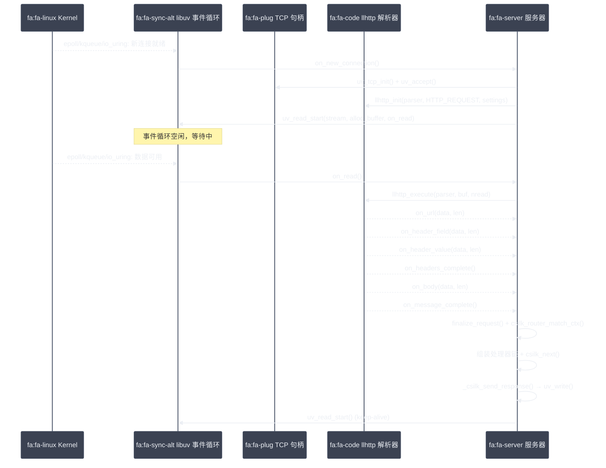

### 2.2 洋葱中间件模型

中间件通过 `csilk_next()` 机制实现双向请求拦截。

```mermaid
%%{init: {
  'theme': 'base',
  'themeVariables': {
    'background': '#2E3440',
    'primaryColor': '#81A1C1',
    'primaryBorderColor': '#4C566A',
    'primaryTextColor': '#ECEFF4',
    'secondaryColor': '#3B4252',
    'secondaryBorderColor': '#434C5E',
    'secondaryTextColor': '#D8DEE9',
    'lineColor': '#81A1C1',
    'textColor': '#ECEFF4',
    'mainBkg': '#3B4252',
    'nodeBorder': '#4C566A',
    'clusterBkg': '#2E3440',
    'clusterBorder': '#4C566A',
    'titleColor': '#ECEFF4',
    'edgeLabelBackground': '#3B4252',
    'nodeTextColor': '#ECEFF4'
  },
  'flowchart': {'htmlLabels': true, 'curve': 'basis'}
}}%%
flowchart LR
    REQ["fa:fa-arrow-right 请求"]

    subgraph onion["fa:fa-circle-nodes 洋葱层"]
        direction LR
        L1i["fa:fa-shield Recovery（前）<br/>setjmp()"] --> L2i["fa:fa-clock Logger（前）<br/>开始计时"]
        L2i --> L3i["fa:fa-shield-halved WAF（前）<br/>检查规则"]
        L3i --> L4i["fa:fa-key Auth（前）<br/>检查令牌"]
        L4i --> L5i["fa:fa-gauge-high RateLimit（前）<br/>检查配额"]
        L5i --> CORE["fa:fa-gem 业务处理程序<br/>（csilk_string/json）"]
        CORE --> L5o["RateLimit（后）<br/>（无操作）"]
        L5o --> L4o["Auth（后）<br/>（无操作）"]
        L4o --> L3o["WAF（后）<br/>（无操作）"]
        L3o --> L2o["fa:fa-clock Logger（后）<br/>记录延迟"]
        L2o --> L1o["fa:fa-shield Recovery（后）<br/>清理"]
    end

    L1o --> RES["fa:fa-arrow-left 响应"]
```

### 2.3 Hook 系统

除了洋葱中间件，hook 系统允许对全局生命周期事件进行非阻塞观察：

* `CSILK_HOOK_SERVER_START` / `CSILK_HOOK_SERVER_STOP`
* `CSILK_HOOK_CONN_OPEN` / `CSILK_HOOK_CONN_CLOSE`
* `CSILK_HOOK_REQUEST_BEGIN` / `CSILK_HOOK_REQUEST_END`

### 2.4 不透明上下文 & ABI 稳定性

从 v0.3.0 开始，`csilk_ctx_t` 定义为**不透明指针**。内部结构布局隐藏在 `include/csilk/core/ctx_types.h` 中。第三方中间件**不得**直接访问 `csilk_ctx_t` 内部 — 所有访问都通过公共 API（`csilk_get`/`csilk_set`/`csilk_string`）进行。这保证了在次版本更新之间的二进制兼容性（ABI 稳定性）。

### 2.5 可插拔驱动

服务通过干净的虚拟表实现可插拔。每个驱动**必须**实现 `include/csilk/drivers/` 中定义的接口。驱动**可以**通过 `csilk_driver_register()` 在运行时注册。驱动选择在构建时解析；未选中的提供者**不应该**链接到最终二进制文件中：

* **存储驱动**：`csilk_set/get` 会话变量的后备存储（例如 SQLite、Redis）。
* **加密/密码驱动**：可互换的加密后端（例如 OpenSSL）。
* **AI 驱动**：通用 LLM 提供商接口（例如 OpenAI、Ollama）。
* **向量数据库驱动**：向量数据库接口（例如 Qdrant、Milvus）。

### 2.6 每连接 Arena 内存管理

Arena 分配器每个连接映射块（默认 4KB）。请求处理期间（头、JSON 解析、URL 分割）的所有分配使用指针碰撞分配。

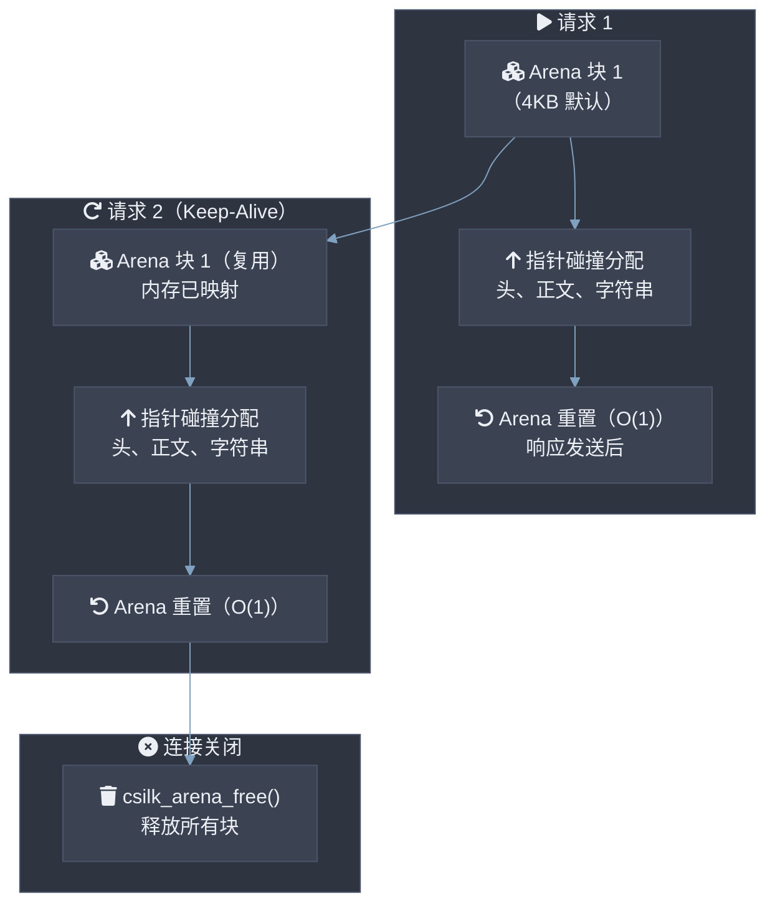

**关键优势**：

* 分配减少到简单指针算术（~3 CPU 指令每分配，无需每次请求对象调用 malloc/free）。
* O(1) 重置（设置偏移指针 `used = 0`）——典型成本 ≤ 5ns。
* 避免堆碎片化。当 TCP 连接关闭时，整个内存池一次性释放。
* 用户**必须**避免在 `csilk_next()` 边界之间持有 arena 指针（如果调用者可能重置 arena）。
* 长期分配**应该**使用 `malloc` 直接或 `csilk_arena_dup()` 从 arena 外复制。

### 2.7 基数树路由

前缀树（Patricia trie）路由，具有 O(path_length) 匹配，支持静态、参数化和通配符路由。在 x86_64 上配合 AVX2，SIMD 加速路径匹配可达到约 50ns 每路由查找。在服务器启动之前**必须**注册路由；路由器在请求处理期间是只读的（无锁读取）。通配符路由**应该**放在注册顺序的最后以确保静态路由优先。

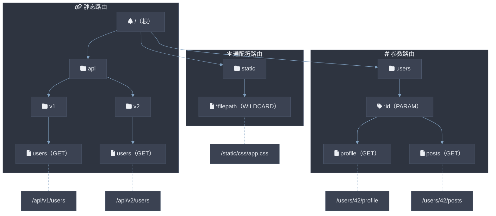

---

## 3. 崩溃恢复机制（setjmp/longjmp）

轻量级异常处理可将 panic 清晰路由回恢复中间件：

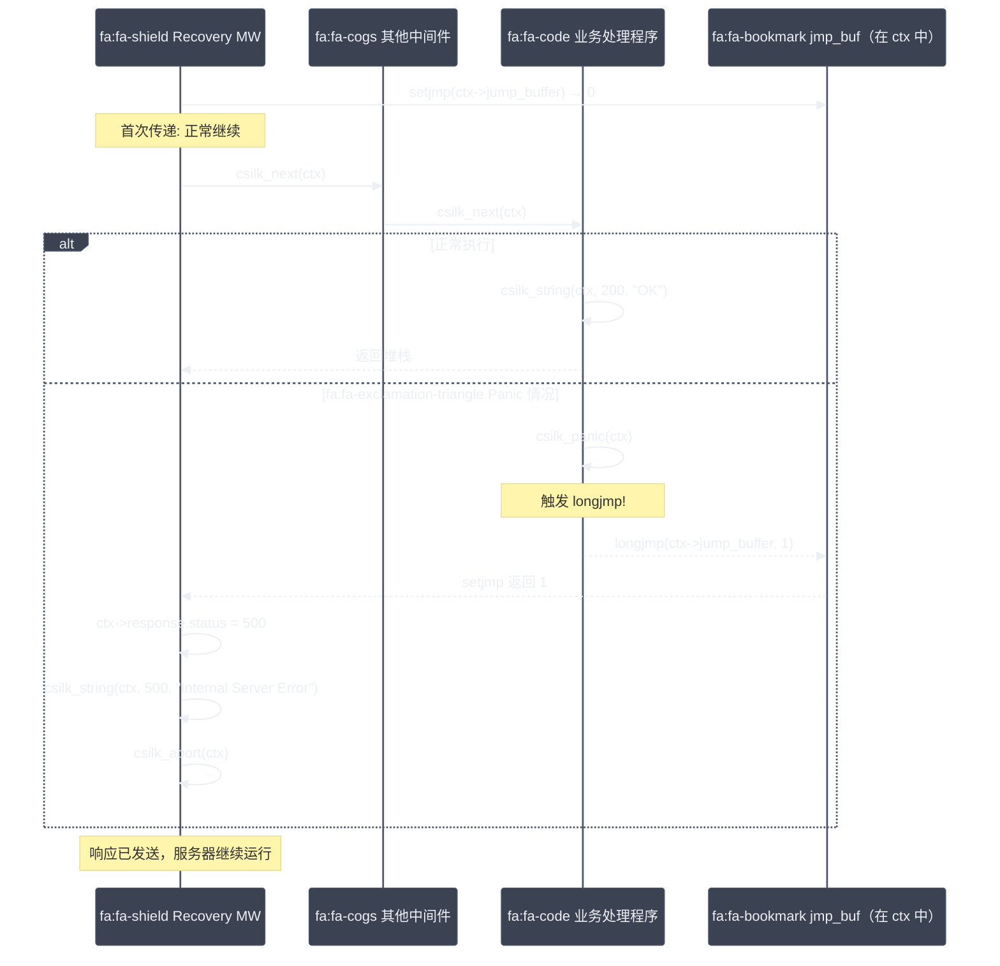

---

## 4. WebSocket & 消息队列

### 4.1 WebSocket 升级流程

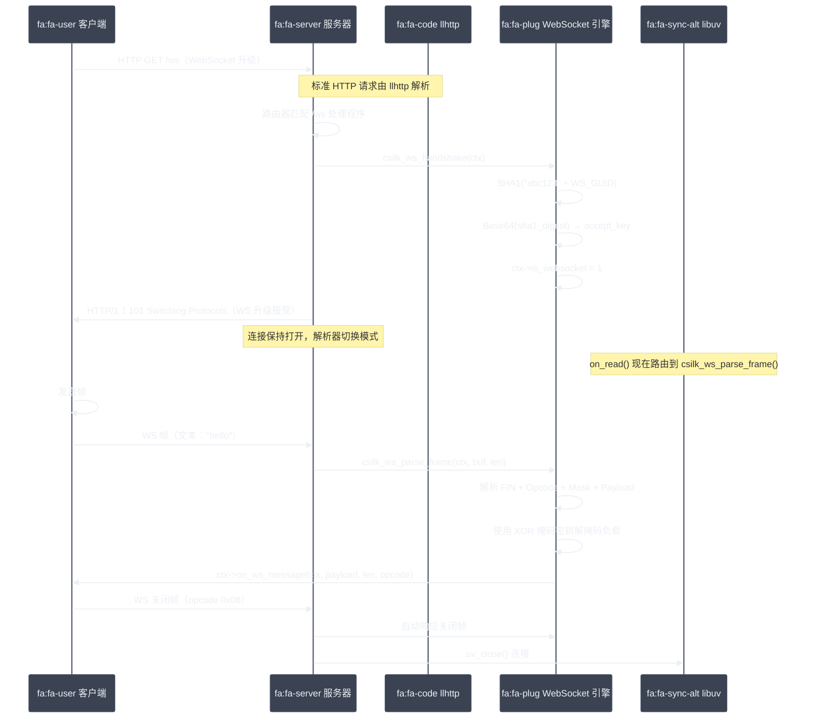

* **WebSocket 帧处理**：完全支持文本（opcode 0x1）、二进制（opcode 0x2）和关闭帧（opcode 0x8）符合 RFC 6455。
* **异步传输**：`csilk_ws_send` 通过 `uv_write` 异步运行。

### 4.2 线程安全消息队列（csilk_mq）

csilk 提供内置的基于主题的消息队列系统，支持线程安全通信：


* `csilk_mq_publish` 可从任何线程安全调用。它使用 `uv_async_send` 向主循环发送信号。
* MQ 系统实现洋葱中间件模式（`csilk_mq_use`）来统一处理主题。

---

## 5. 多工作线程架构

```mermaid
%%{init: {
  'theme': 'base',
  'themeVariables': {
    'background': '#2E3440',
    'primaryColor': '#81A1C1',
    'primaryBorderColor': '#4C566A',
    'primaryTextColor': '#ECEFF4',
    'secondaryColor': '#3B4252',
    'secondaryBorderColor': '#434C5E',
    'secondaryTextColor': '#D8DEE9',
    'lineColor': '#81A1C1',
    'textColor': '#ECEFF4',
    'mainBkg': '#3B4252',
    'nodeBorder': '#4C566A',
    'clusterBkg': '#2E3440',
    'clusterBorder': '#4C566A',
    'titleColor': '#ECEFF4',
    'edgeLabelBackground': '#3B4252',
    'nodeTextColor': '#ECEFF4'
  },
  'flowchart': {'htmlLabels': true, 'curve': 'basis'}
}}%%
flowchart TB
    subgraph main_thread["fa:fa-crown 主线程"]
        ML["fa:fa-sync-alt libuv / io_uring 事件循环"]
        MT["fa:fa-plug TCP 套接字（SO_REUSEPORT）"]
        MW["fa:fa-layer-group 全局中间件<br/>（recovery, logger, ...）"]
    end

    subgraph worker1["fa:fa-microchip 工作线程 1"]
        W1L["fa:fa-sync-alt libuv / io_uring 事件循环"]
        W1T["fa:fa-plug TCP 套接字（SO_REUSEPORT）"]
        W1M["fa:fa-layer-group 全局中间件"]
    end

    subgraph worker2["fa:fa-microchip 工作线程 2"]
        W2L["fa:fa-sync-alt libuv / io_uring 事件循环"]
        W2T["fa:fa-plug TCP 套接字（SO_REUSEPORT）"]
        W2M["fa:fa-layer-group 全局中间件"]
    end

    subgraph workern["fa:fa-microchip 工作线程 N"]
        WNL["fa:fa-sync-alt libuv / io_uring 事件循环"]
        WNT["fa:fa-plug TCP 套接字（SO_REUSEPORT）"]
        WNM["fa:fa-layer-group 全局中间件"]
    end

    K["fa:fa-network-wired 内核 TCP 栈<br/><code>SO_REUSEPORT</code> 分配连接"] --> MT
    K --> W1T
    K --> W2T
    K --> WNT
```

### 客户端池线程安全

由于连接请求在接受它们的工作线程上运行，实现了无锁每个工作线程连接池。每个工作线程循环管理自己的 `csilk_client_t` 空闲列表，消除了互斥锁争用并保证了工作线程构建客户端结构时的线程安全。

---

## 6. 请求生命周期

下面的时序图显示了从客户端到网络响应的请求完整生命周期：

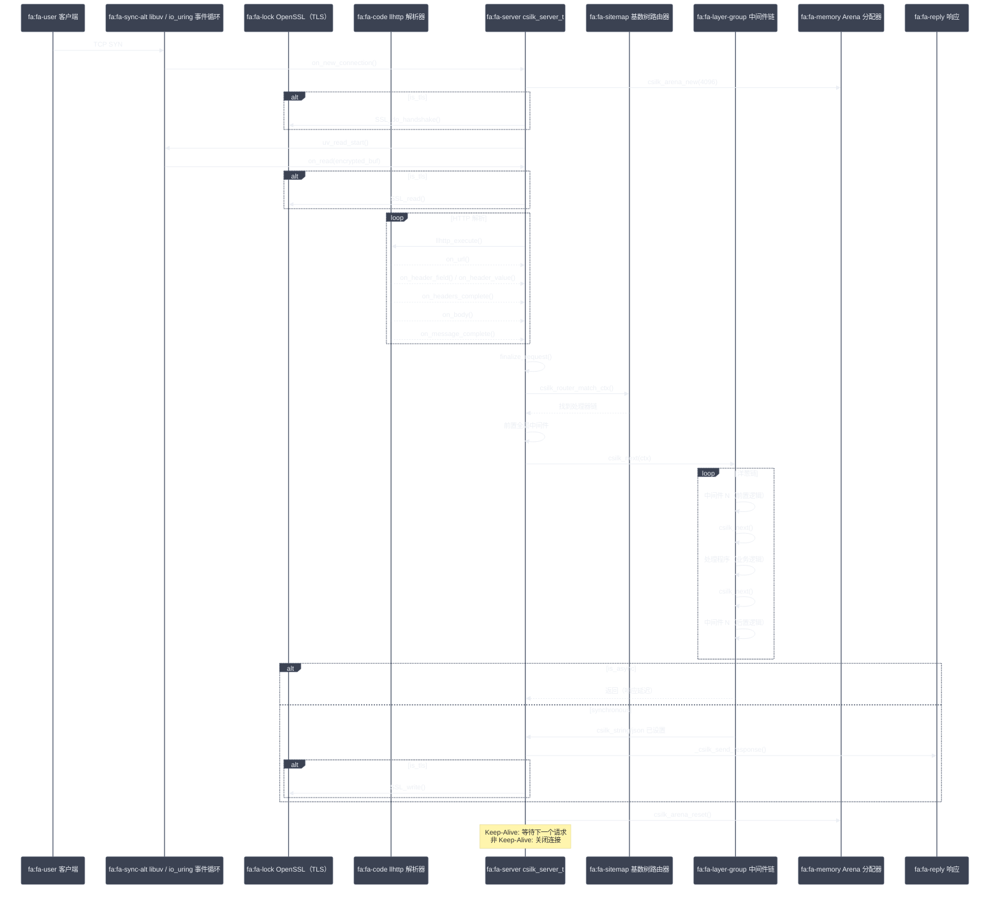

---

## 7. 数据库驱动矩阵

统一数据库驱动实现标准接口（`csilk/drivers/db.h`）：

| 维度 | SQLite | MySQL | PostgreSQL | MongoDB |
|:-----|:------:|:-----:|:----------:|:------:|
| **系统复杂度** | ⭐ 1/5 嵌入本地 | ⭐⭐⭐ 3/5 独立服务 | ⭐⭐⭐ 3/5 独立服务 | ⭐⭐⭐ 3/5 独立服务 |
| **运维成本** | ⭐ 1/5 无守护进程 | ⭐⭐⭐ 3/5 连接池管理 | ⭐⭐⭐ 3/5 连接池管理 | ⭐⭐⭐ 3/5 驱动池管理 |
| **读写吞吐量** | ~10K QPS（单写入） | ~50K QPS（集群） | ~80K QPS（集群） | ~60K QPS（分片集群） |
| **数据一致性** | 强一致（单文件） | 最终一致（异步复制） | 强一致（WAL + Raft） | 最终一致（副本集） |

---

## 8. 可观测性 & 仪表板

### 8.1 Prometheus 指标

原生指标输出格式：

* `http_requests_total`: 按方法、路径和状态码分区的计数器。
* `http_request_duration_seconds`: 请求延迟计算（P99、P95）的直方图桶。
* `http_active_connections`: 当前活动连接数。

### 8.2 Admin 仪表板（/admin）

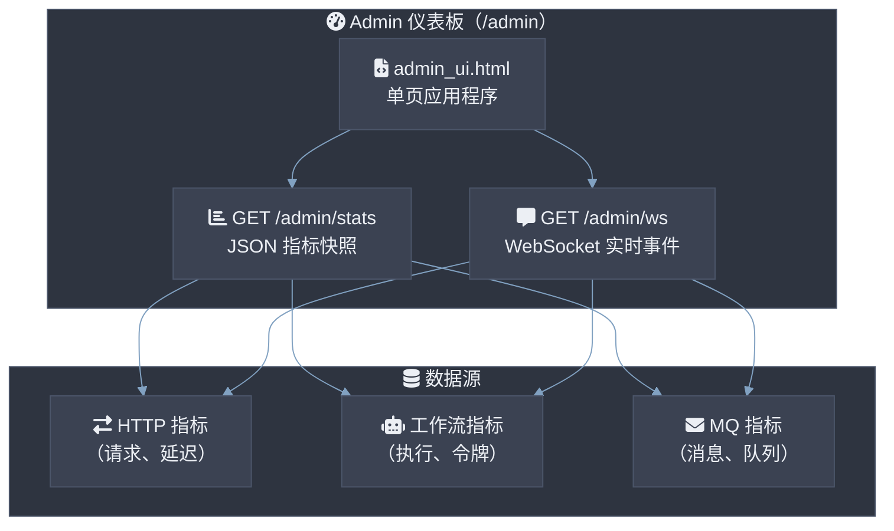

---

## 9. 性能特性

* **零拷贝静态文件服务**：使用 `sendfile` 系统调用服务文件（抽象为 `uv_fs_sendfile`）。传输调用直接从内核缓存到套接字描述符，避免用户空间上下文切换。
* **跟踪关联**：请求 ID 中间件在请求头和日志遥测中注入唯一 UUID v4。

---

## 10. 开发者指南

### 10.1 编写 WebSocket 处理程序

```c
void ws_on_message(csilk_ctx_t* c, const uint8_t* payload, size_t len, int opcode) {
    csilk_ws_send(c, (uint8_t*)"Hello Client", 12, 1);
}

void ws_handler(csilk_ctx_t* c) {
    csilk_ws_handshake(c);
    if (c->is_websocket) {
        c->on_ws_message = ws_on_message;
    }
}
```

### 10.2 编写中间件

```c
void my_middleware(csilk_ctx_t* c) {
    // 前置逻辑：例如，检查令牌
    csilk_next(c);
    // 后置逻辑：例如，记录延迟
}
```

### 10.3 启动服务器

```c
int main() {
    csilk_router_t* r = csilk_router_new();
    csilk_group_t* g = csilk_group_new(r, "/api");
    csilk_GET(g, "/ping", handler);

    csilk_server_t* s = csilk_server_new(r);
    csilk_server_run(s, 8080);
    return 0;
}
```

---

## 11. 组件依赖关系图

```mermaid
%%{init: {
  'theme': 'base',
  'themeVariables': {
    'background': '#2E3440',
    'primaryColor': '#81A1C1',
    'primaryBorderColor': '#4C566A',
    'primaryTextColor': '#ECEFF4',
    'secondaryColor': '#3B4252',
    'secondaryBorderColor': '#434C5E',
    'secondaryTextColor': '#D8DEE9',
    'lineColor': '#81A1C1',
    'textColor': '#ECEFF4',
    'mainBkg': '#3B4252',
    'nodeBorder': '#4C566A',
    'clusterBkg': '#2E3440',
    'clusterBorder': '#4C566A',
    'titleColor': '#ECEFF4',
    'edgeLabelBackground': '#3B4252',
    'nodeTextColor': '#ECEFF4'
  },
  'flowchart': {'htmlLabels': true, 'curve': 'basis'}
}}%%
graph TB
    csilk_h["fa:fa-book csilk.h<br/>（公共 API）"] --> internal_h["fa:fa-cogs csilk/core/internal.h<br/>（内部 API 伞）"]
    internal_h --> hash_h["fa:fa-hashtag hash.h<br/>（SHA-1/SHA-256/HMAC）"]
    internal_h --> codec_h["fa:fa-exchange-alt codec.h<br/>（Base64/URL-decode）"]
    internal_h --> ws_h["fa:fa-plug ws_frame.h<br/>（WebSocket 帧）"]
    internal_h --> crypto_h["fa:fa-lock crypto_dispatch.h<br/>（加密存根）"]
    internal_h --> mq_h["fa:fa-envelope mq_types.h<br/>（消息队列）"]
    app_h["fa:fa-cube csilk/app/app.h<br/>（高级 API）"]
    admin_h["fa:fa-tachometer-alt csilk/app/admin.h<br/>（Admin 仪表板 API）"]

    subgraph src_core["fa:fa-server src/core/"]
        server_c["fa:fa-cogs server.c<br/>TCP + HTTP + libuv/io_uring"] --> router_c["fa:fa-sitemap router.c<br/>基数树"]
        server_c --> context_c["fa:fa-exchange-alt context.c<br/>Req/Res + Handlers"]
        server_c --> ws_c["fa:fa-plug websocket.c<br/>WS 握手 + 帧"]
        context_c --> arena_c["fa:fa-memory arena.c<br/>内存池"]
        context_c --> url_c["fa:fa-link url.c<br/>URL 解析"]
        server_c --> config_c["fa:fa-file-alt config.c<br/>YAML 配置"]
        server_c --> logger_c["fa:fa-clock logger.c<br/>结构化日志"]
        server_c --> reflect_c["fa:fa-magic reflect.c<br/>JSON <-> C 结构体"]
        ai_c["fa:fa-robot ai.c<br/>统一 AI 引擎"] --> ai_openai_c["fa:fa-cloud ai_openai.c<br/>OpenAI 驱动"]
        ai_c --> ai_ollama_c["fa:fa-box ai_ollama.c<br/>Ollama 驱动"]
        utils_c["fa:fa-tools utils.c<br/>SHA1 + Base64"]
    end

    subgraph middleware_src["fa:fa-layer-group src/middleware/（15 个模块）"]
        logger_mw["fa:fa-clock logger.c"] --> context_c
        auth_mw["fa:fa-key auth.c"] --> context_c
        jwt_mw["fa:fa-id-card jwt.c<br/>JWT 认证"] --> context_c
        cors_mw["fa:fa-globe cors.c"] --> context_c
        rl_mw["fa:fa-gauge ratelimit.c"] --> context_c
        csrf_mw["fa:fa-shield csrf.c"] --> context_c
        static_mw["fa:fa-folder static.c"] --> context_c
        gzip_mw["fa:fa-compress gzip.c"] --> context_c
        sse_mw["fa:fa-broadcast-tower sse.c"] --> context_c
        multipart_mw["fa:fa-upload multipart.c"] --> context_c
        metrics_mw["fa:fa-chart-bar metrics.c<br/>Prometheus"] --> context_c
        reqid_mw["fa:fa-tag request_id.c"] --> context_c
        session_mw["fa:fa-user session.c"] --> context_c
        validate_mw["fa:fa-check-circle validate.c"] --> context_c
    end

    subgraph app_src["fa:fa-cube src/app/"]
        app_c["fa:fa-cubes app.c<br/>高级包装器"] --> server_c
        app_c --> router_c
        app_c --> config_c
        admin_c["fa:fa-tachometer-alt admin.c<br/>仪表板"] --> server_c
        admin_c --> mq_c["fa:fa-envelope mq.c<br/>消息队列"]
    end

    subgraph drivers_src["fa:fa-database src/drivers/"]
        sqlite["fa:fa-database sqlite.c"] --> db_c["fa:fa-cogs data/db.c"]
        mysql["fa:fa-database mysql.c"] --> db_c
        postgres["fa:fa-database postgres.c"] --> db_c
        mongodb["fa:fa-leaf mongodb.c"] --> db_c
    end

    server_c --> libuv["fa:fa-sync-alt libuv / io_uring"]
    server_c --> llhttp["fa:fa-code llhttp"]
    context_c --> cjson["fa:fa-file-code cJSON"]
```

---

## 12. 目录结构

```
csilk/
├── include/
│   ├── csilk.h                    # 伞形头（包含所有模块头文件）
│   └── csilk/
│       ├── types.h                # 核心类型、常量、驱动虚拟表
│       ├── context.h              # 请求上下文访问器 API
│       ├── response.h             # 响应写入（状态/JSON/重定向/分块）
│       ├── router.h               # 基数树路由器
│       ├── server.h               # 服务器生命周期 + 配置
│       ├── middleware.h            # 内置中间件函数声明
│       ├── websocket.h            # WebSocket API
│       ├── sse.h                  # 服务器发送事件 API
│       ├── mq.h                   # 消息队列发布/订阅 API
│       ├── group.h                # 路由组
│       ├── hooks.h                # 生命周期 hook 系统
│       ├── workflow.h             # 工作流引擎伞形
│       ├── admin.h                # Admin 仪表板伞形
│       ├── errors.h               # HTTP 状态码常量
│       ├── config.h               # 服务器/应用程序配置结构
│       ├── crypto.h               # 加密实用函数
│       ├── hot_reload.h           # 热重载 API
│       ├── version.h              # CSILK_VERSION 宏（生成）
│       ├── app/
│       │   ├── app.h              # 高级应用 API
│       │   ├── workflow.h         # 工作流引擎公共 API
│       │   └── workflow_wal.h     # WAL 持久化 API
│       ├── core/
│       │   ├── internal.h         # 内部伞形
│       │   ├── hash.h             # SHA-1、SHA-256、HMAC-SHA256
│       │   ├── codec.h            # Base64、Base64URL、URL 解码
│       │   ├── bounded_buf.h      # 栈限定的限定字符串/JSON 构建器
│       │   ├── ws_frame.h         # WebSocket 帧解析
│       │   ├── crypto_dispatch.h  # 加密/密码分发存根
│       │   ├── mq_types.h         # 内部 MQ 数据结构
│       │   ├── ctx_types.h        # csilk_ctx_s 结构布局
│       │   └── srv_types.h        # csilk_server_s / csilk_client_s 布局
│       ├── drivers/
│       │   ├── ai.h               # AI 驱动接口
│       │   ├── db.h               # 数据库驱动接口
│       │   ├── cipher.h           # 密码驱动接口
│       │   ├── perm.h             # 权限驱动接口
│       │   └── vector.h           # 向量数据库驱动接口
│       ├── test/
│       │   └── test.h             # 测试实用工具（OOM 模拟、上下文助手）
│       └── reflection/
│           └── reflect.h          # 运行时类型反射
├── src/
│   ├── core/                      # 服务器引擎
│   │   ├── server.c               # 生命周期：create/run/stop/free/hooks/workers
│   │   ├── connection.c           # 池、accept、I/O、计时器、on_read
│   │   ├── http1.c                # llHTTP 回调、分发、响应序列化
│   │   ├── tls.c                  # OpenSSL 初始化、BIO-pair、ALPN 协商
│   │   ├── context.c              # 请求读取、生命周期、绑定、cookie
│   │   ├── response.c             # 响应写入（状态/JSON/重定向/分块）
│   │   ├── router.c               # 基数树路由匹配
│   │   ├── arena.c                # 碰撞分配器
│   │   ├── config.c               # YAML 配置加载器
│   │   ├── h2.c                   # HTTP/2 集成（nghttp2）
│   │   ├── h2.h                   # HTTP/2 内部头文件
│   │   ├── logger.c               # 结构化日志记录
│   │   ├── recovery.c             # setjmp/longjmp 错误恢复
│   │   ├── url.c                  # URL 解析和分割
│   │   ├── utils.c                # 杂项实用函数
│   │   ├── base64.c               # Base64/Base64URL 编码/解码
│   │   ├── sha1.c                 # SHA-1 哈希（WebSocket 握手）
│   │   ├── uuid.c                 # UUID v4 生成
│   │   ├── bounded_buf.c          # 栈限定的限定字符串/JSON 构建器
│   │   ├── hot_reload.c           # 文件监视热重载（inotify）
│   │   ├── test_utils.c           # 测试 OOM 实用工具
│   │   ├── admin.c                # Admin 仪表板
│   │   ├── srv_impl.h             # 跨文件声明（服务器拆分）
│   │   └── srv_internal.h         # 内部服务器类型
│   │   └── uring/                 # io_uring 后端（仅 Linux，可选）
│   │       ├── uring_server.c
│   │       ├── uring_connection.c
│   │       ├── uring_thread_pool.c
│   │       ├── uring_internal.h
│   │       └── uv_stubs.c
│   ├── app/                       # 轻量级应用包装
│   │   ├── app.c
│   │   └── group.c
│   ├── data/                      # 数据库抽象
│   │   ├── db.c                   # 池生命周期、查询/执行分发
│   │   └── db_internal.h          # csilk_db_pool_s 私有结构
│   ├── ai/                        # AI 统一接口
│   │   └── ai.c
│   ├── workflow/                  # AI 工作流引擎
│   │   ├── wf_ai.c                # AI 聊天节点、内存助手、模板
│   │   ├── wf_lifecycle.c         # 生命周期：创建、销毁、注册
│   │   ├── wf_monitor.c           # 实时监控事件
│   │   ├── wf_scheduler.c         # 执行引擎、DAG 调度、WAL 恢复
│   │   ├── wf_trace.c             # 执行跟踪记录
│   │   ├── workflow_internal.h    # 内部结构 & 存根
│   │   ├── workflow_loader.c      # JSON/YAML 解析器加载器
│   │   └── workflow_wal.c         # WAL 持久化引擎
│   ├── middleware/                # 内置中间件模块
│   ├── protocols/                 # WebSocket、Swagger
│   ├── drivers/                   # 驱动实现
│   ├── messaging/                 # 消息队列
│   ├── reflection/                # 运行时类型反射
│   ├── security/                  # 权限系统
│   └── util/                      # 实用模块
├── tests/                         # 单元/集成/模糊测试
├── examples/                      # 示例应用程序
├── docs/                          # 架构、研究、分析文档
├── cmake/                         # CMake 模块
└── CMakeLists.txt                 # C23，版本 0.3.0
```

---

## 13. 文档生成

csilk 使用 **Doxygen** 从注释文件构建 API 文档：

* `include/` 中的所有公共头文件和 `src/` 中的实现文件都包含完整的 Doxygen 标签（`@brief`、`@param`、`@return`）。
* 本地生成文档的命令：`make docs`（需要 Doxygen 1.12+）。
* CI 配置为 GitHub Pages 自动部署生成的 HTML 文档。
