# 管理后台 — 统一监控控制器

> **状态**: 已实现（v0.4.0+）| **最后更新**: 2026-06-29
>
> **管理后台规则**: 后台面板在生产环境中 **必须** 默认禁用 — 通过 `csilk_admin_serve` 可选启用。所有管理路由在生产环境中 **应该** 受到认证保护。stats 端点 **必须** 从所有已检测子系统汇总数据，且不阻塞事件循环。热路径指标 **必须** 使用无锁计数器。

## 1. 概述

管理后台提供一个单一的 Web 界面，用于实时监控所有 csilk 子系统：

- **HTTP 指标**：请求速率、延迟分布、连接池
- **消息队列**：发布/投递速率、队列深度
- **AI 引擎**：Token 消耗、请求数、错误率
- **数据库**：查询量、写入量、错误率
- **安全**：限流拦截数、CSRF 违规数、认证失败数
- **进程**：RSS 内存、CPU 时间、运行时间
- **火焰图**：按需 CPU 性能分析（100 Hz 栈采样，5 秒窗口）

## 2. 架构

```mermaid
graph TB
    subgraph Frontend["fa:fa-html5 前端 (share/csilk/admin_ui.html)"]
        HTML["fa:fa-file-code HTML + Tailwind CSS"]
        CHARTS["fa:fa-chart-bar Chart.js（实时图表）"]
        WS_CLIENT["fa:fa-plug WebSocket 客户端（实时更新）"]
    end

    subgraph Backend["fa:fa-server 后端 (src/core/admin.c)"]
        UI["GET /admin/ui<br/>提供 HTML 模板"]
        STATS["GET /admin/stats<br/>聚合 JSON 指标"]
        TOPO["GET /admin/topology<br/>路由器路由列表"]
        FG["GET /admin/flamegraph<br/>5 秒 CPU 火焰图 SVG"]
        WS["GET /admin/ws<br/>WebSocket 实时推送（1Hz）"]
    end

    subgraph Sources["fa:fa-database 指标来源"]
        HTTP_MET["fa:fa-tachometer csilk_metrics_*<br/>无锁计数器"]
        MQ_STAT["fa:fa-envelope csilk_mq_stats_t"]
        AI_STAT["fa:fa-robot csilk_ai_stats_t"]
        DB_STAT["fa:fa-database csilk_db_stats_t"]
        SEC_STAT["fa:fa-shield csilk_security_stats_t"]
        PROC["fa:fa-microchip csilk_process_stats_t<br/>(/proc/self/stat)"]
        FLAME["fa:fa-fire flamegraph.c<br/>perf_event_open 采样"]
    end

    WS --> WS_CLIENT
    UI --> HTML
    STATS --> HTTP_MET & MQ_STAT & AI_STAT & DB_STAT & SEC_STAT & PROC
    FG --> FLAME
    TOPO --> ROUTER

    style Frontend fill:#2E3440,stroke:#81A1C1
    style Backend fill:#3B4252,stroke:#81A1C1
    style Sources fill:#434C5E,stroke:#81A1C1
```



## 3. 路由表

| 方法 | 路径 | 处理器 | 描述 |
|:----|:-----|:-------|:-----|
| GET | `{path}` | `admin_ui_handler` | 提供 HTML 仪表盘 |
| GET | `{path}/stats` | `admin_stats_handler` | 完整 JSON 指标快照 |
| GET | `{path}/topology` | `admin_topology_handler` | 路由器路由列表 |
| GET | `{path}/flamegraph` | `admin_flamegraph_handler` | 5 秒 CPU 火焰图 SVG |
| WS | `{path}/ws` | `admin_ws_handler` | WebSocket 实时推送（1 Hz） |

使用 `csilk_admin_serve_secure` 时，所有路由都会被提供的认证中间件包裹。

## 4. 指标聚合

### 4.1 Stats JSON 结构

```json
{
  "total_requests": 15234,
  "avg_latency": 1.20,
  "mq":     { "published": 8921, "delivered": 8890, "depth": 15 },
  "ai":     { "requests": 567, "tokens": 125000, "errors": 3 },
  "db":     { "queries": 45000, "execs": 12000, "errors": 0 },
  "sys":    { "active_connections": 128, "pooled_connections": 64,
              "arena_size_kb": 4096, "arena_used_kb": 2048 },
  "security": { "rate_limit_blocks": 12, "csrf_violations": 0,
                "auth_failures": 3 },
  "process":  { "rss_kb": 24576, "cpu_user": 120.5, "cpu_sys": 30.2 }
}
```

### 4.2 指标来源

| 部分 | 来源 | 收集方法 |
|:----|:-----|:---------|
| `total_requests` | `csilk_metrics_get_total_requests()` | 无锁原子操作 |
| `avg_latency` | `csilk_metrics_get_total_duration()` | 无锁原子操作 |
| `mq` | `csilk_mq_get_stats()` | 互斥锁保护（调用方持锁） |
| `ai` | `csilk_ai_get_stats()` | 无锁原子计数器 |
| `db` | `csilk_db_get_stats()` | 无锁原子计数器 |
| `sys.connections` | `csilk_server_get_stats()` | 从 server 结构体读取 |
| `sys.arena` | `csilk_arena_get_stats()` | 从活跃 arena chunk 读取 |
| `security` | `csilk_security_get_stats()` | 无锁原子计数器 |
| `process` | `csilk_process_get_stats()` | `/proc/self/stat` 解析 |

### 4.3 线程安全

所有指标来源在热路径上使用 **无锁原子计数器**（`atomic_fetch_add`）。
stats 处理器从事件循环线程调用 — 无需额外同步。

## 5. WebSocket 实时流

`/admin/ws` 端点建立 WebSocket 连接，每 **秒** 推送一个 JSON 统计快照：

```
1. 客户端连接：ws://host:{port}/admin/ws
2. 服务器注册监视器：
   - csilk_mq_register_monitor(mq, c) 用于 MQ 事件
   - csilk_wf_register_monitor(wf, c) 用于工作流事件
3. uv_timer_t 每 1000 毫秒触发，调用 admin_stats_handler 逻辑
   并通过 csilk_ws_send 发送 JSON 负载。
4. 客户端接收实时数据并更新图表。
```

## 6. 火焰图性能分析

火焰图端点使用 Linux `perf_event_open` 对所有线程进行采样：

| 参数 | 值 |
|:----|:---|
| 采样频率 | 100 Hz |
| 持续时间 | 5 秒 |
| 输出格式 | SVG（通过 Brendan Gregg 的 FlameGraph） |
| 并发 | 单会话（运行时返回 409） |
| 实现 | `src/util/flamegraph.c` |

```
1. 客户端发送 GET /admin/flamegraph
2. 服务器为每个在线 CPU 调用 perf_event_open
3. 采样 5 秒（mmap 环形缓冲区）
4. 停止，生成 SVG 火焰图
5. 返回 image/svg+xml
```

## 7. 前端架构

管理后台 UI 是一个单独的静态 HTML 文件（`share/csilk/admin_ui.html`），包含嵌入式 CSS 和 JavaScript：

| 库 | 用途 |
|:---|:-----|
| **Tailwind CSS**（CDN） | 实用优先的样式 |
| **Chart.js** | 实时折线图（QPS、延迟） |
| **Mermaid.js** | 工作流 DAG 可视化 |
| **Lucide Icons** | SVG 图标集 |

前端连接到 `/admin/ws` 获取实时数据，如果 WebSocket 不可用，则回退到每 5 秒轮询 `/admin/stats`。

## 8. 安全模式

`csilk_admin_serve_secure(app, path, auth_mw)` 使用认证中间件包裹所有管理路由：

```c
void csilk_admin_serve_secure(csilk_app_t* app, const char* path,
                               csilk_handler_t auth_middleware) {
    // 在 path 下注册组并添加认证中间件
    csilk_app_use_group(app, path, auth_middleware);

    // 注册路由（与 csilk_admin_serve 相同）
    csilk_app_get(app, ui_path, admin_ui_handler);
    csilk_app_get(app, stats_path, admin_stats_handler);
    // ...
}
```

## 9. 相关文档

| 文档 | 内容 |
|:----|:-----|
| [用户手册 — 管理后台](../user-manual/admin.md) | 使用指南、自定义端点、保护管理后台 |
| [模块设计 — 应用层](../module-design/app.md) | 应用层启动、管理后台集成 |
| [源码 — admin.c](../../src/core/admin.c) | 实现 |
| [源码 — flamegraph.c](../../src/util/flamegraph.c) | perf_event_open 性能分析 |
| [管理后台 UI HTML](../../share/csilk/admin_ui.html) | 前端模板 |
