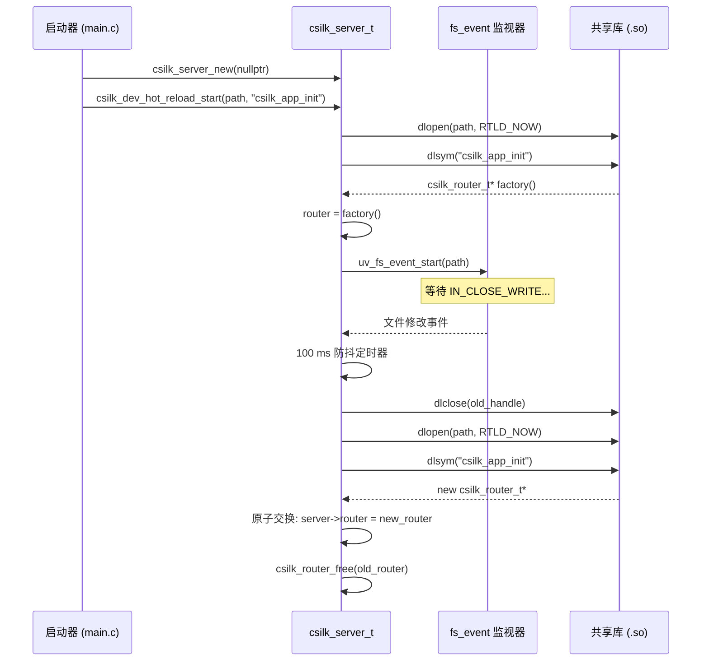

# 热重载 — 实时路由交换

> **状态**: 已实现（v0.3.0+）| **最后更新**: 2026-06-29
>
> **热重载规则**: 入口函数 **必须** 具有 `csilk_router_t* (*)(void)` 签名。加载的 `.so` 与服务器二进制之间的 ABI 兼容性 **必须** 保持。监听套接字在重载期间 **不得** 关闭。路由交换 **必须** 是原子的（指针赋值，无需锁）。文件系统事件 **必须** 进行防抖处理（100 ms 窗口）。

## 1. 概述

热重载机制允许开发者无需重启服务器进程即可更新路由处理器。工作流程如下：

1. 路由被编译成 **共享库**（`.so`/`.dylib`），暴露一个工厂函数。
2. 启动进程通过 `dlopen()` 加载库，调用工厂函数，并将返回的路由器附加到服务器。
3. **libuv `fs_event` 监视器** 监控 `.so` 文件的修改。
4. 文件变更时，旧库被 `dlclose()` 卸载，新库通过 `dlopen()` 加载，路由指针原子性地交换。

## 2. 架构



## 3. 关键数据结构

```c
// include/csilk/hot_reload.h
int csilk_dev_hot_reload_start(csilk_server_t* server,
                                const char* lib_path,
                                const char* init_sym);
```

### 内部状态

```c
// src/core/hot_reload.c
typedef struct {
    csilk_server_t* server;           // 所属服务器实例
    char* lib_path;                   // .so 路径（arena 复制）
    char* init_sym;                   // 工厂函数符号名
    void* dl_handle;                  // 当前 dlopen() 句柄
    csilk_io_fs_event_t fs_event;     // libuv 文件系统监视器
    csilk_io_timer_t debounce_timer;  // 100 ms 防抖定时器
} hot_reload_ctx_t;
```

## 4. 核心算法

### 4.1 初始化（`csilk_dev_hot_reload_start`）

```
1. 分配 hot_reload_ctx_t（堆）。
2. 存储 server 指针，复制 lib_path 和 init_sym。
3. 调用 load_and_swap_router() 进行初始加载。
4. 创建 uv_fs_event_t，开始监视 lib_path。
5. 事件触发 → 防抖 → 重新加载。
```

### 4.2 加载与交换（`load_and_swap_router`）

```
1. dlopen(lib_path, RTLD_NOW | RTLD_LOCAL)
   - RTLD_NOW：立即解析所有符号（快速失败）。
   - RTLD_LOCAL：符号不导出给后续加载的库
     （防止跨重载的符号冲突）。
2. dlsym(handle, init_sym)
3. 调用 init_fn() → 获取新的 csilk_router_t*。
4. csilk_server_set_router(server, new_router)
   - 内部交换路由器指针（原子存储）。
   - 释放旧路由器（csilk_router_free）。
5. 如果之前设过 dl_handle，则 dlclose(old_handle)。
6. 将新 dl_handle 存储在 ctx->dl_handle 中。
```

### 4.3 文件事件处理

```
1. uv_fs_event_t 回调触发（Linux 上为 IN_CLOSE_WRITE）。
2. 启动（或重启）100 ms 防抖定时器。
3. 定时器到期时，调用 load_and_swap_router()。
   - 如果加载新库失败，记录错误并保留旧库。
   - 服务器继续使用前一个路由器提供服务。
```

## 5. 线程安全

热重载机制完全在 **libuv 事件循环线程** 上运行。路由器指针交换是 **原子存储**（单指针赋值）。由于路由在请求处理期间是 **只读** 的（无并发修改），因此不需要锁：

- **交换前**：`server->router` 指向旧路由器。正在进行的请求继续使用它。
- **交换后**：新请求看到新路由器。已经将 `server->router` 读入局部变量的进行中请求继续使用旧指针（arena 后备，仍然有效）。

## 6. 错误处理

| 场景 | 行为 |
|:----|:-----|
| 启动时 `.so` 未找到 | `csilk_dev_hot_reload_start` 返回 -1，服务器无法启动 |
| 启动后 `.so` 被删除 | 文件监视器丢失目标；下次写入不会触发 |
| 重载时 `dlopen` 失败 | 记录错误，保留旧路由器，服务器继续运行 |
| 重载时 `dlsym` 失败 | 保留旧路由器，`dlclose` 新库 |
| 工厂函数返回 `nullptr` | 保留旧路由器，`dlclose` 新库 |
| 快速连续文件写入 | 防抖定时器合并多个事件 |

## 7. 平台说明

| 平台 | 动态加载 | 文件事件 |
|:----|:--------|:---------|
| Linux | `dlopen` / `dlsym` / `dlclose`（`libdl`） | `inotify` 通过 `uv_fs_event_t` |
| macOS | `dlopen` / `dlsym` / `dlclose`（内置） | `kqueue` / `FSEvents` 通过 `uv_fs_event_t` |
| Windows | `LoadLibrary` / `GetProcAddress` / `FreeLibrary` | `ReadDirectoryChangesW` 通过 `uv_fs_event_t` |

## 8. ABI 兼容性

共享库 **必须** 链接与启动器相同版本的 `libcsilk`。不兼容的结构体布局或函数签名将导致未定义行为。最佳实践：

- 对启动器和共享库使用 **相同构建** 的 csilk。
- 避免跨重载更改 `csilk_router_t` 或 `csilk_ctx_t` 的内部布局。
- 对于生产环境，使用静态链接（禁用热重载）。

## 9. 相关文档

| 文档 | 内容 |
|:----|:-----|
| [用户手册 — 热重载](../user-manual/hot-reload.md) | 使用指南、开发工作流、Makefile |
| [模块设计 — 服务器](../module-design/server.md) | 服务器生命周期中的路由交换机制 |
| [源码 — hot_reload.c](../../src/core/hot_reload.c) | 实现 |
| [示例 — hot_reload_app.c](../../examples/hot_reload_app.c) | 可热重载模块模板 |
