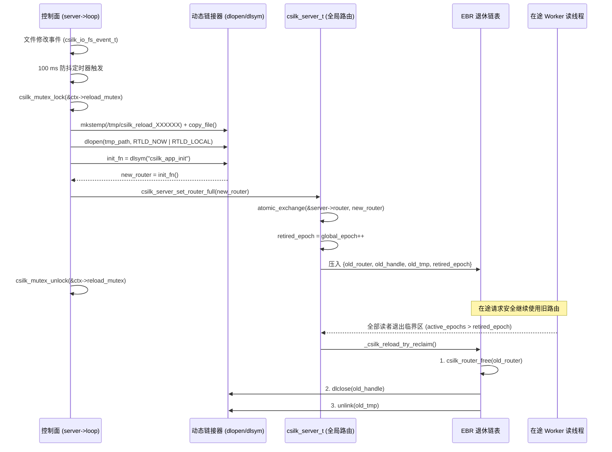

# 热重载 — 实时路由交换 (RCU 与 EBR 机制)

> **状态**: 已实现（v0.5.2）| **最后更新**: 2026-08-24
>
> **热重载规则**: 入口函数 **必须** 具有 `csilk_router_t* (*)(void)` 签名。加载的 `.so` 与服务器二进制之间的 ABI 兼容性 **必须** 保持。监听套接字在重载期间 **不得** 关闭。路由交换 **必须** 是原子的（`atomic_exchange` 指针赋值，无锁读取）。控制面重载执行 **必须** 互斥串行化（`reload_mutex`）。文件系统事件 **必须** 进行防抖处理（100 ms 窗口）。动态共享库 **必须** 拷贝至独立的 `mkstemp(0600)` 临时文件以规避动态链接器句柄缓存。旧路由与动态库句柄 **必须** 通过基于代数的内存回收机制（EBR）宽限期安全卸载。

## 1. 概述

热重载机制允许开发者无需重启服务器进程且不中断现有长连接即可更新路由处理器：

1. 路由被编译成 **共享库**（`.so`/`.dylib`），暴露一个工厂函数（如 `csilk_app_init`）。
2. 通过 `mkstemp(0600)` 创建唯一的临时文件副本，规避动态链接器（`dlopen`）的句柄缓存机制。
3. 启动进程通过 `dlopen(..., RTLD_NOW | RTLD_LOCAL)` 加载动态库，调用工厂函数生成新路由。
4. 控制面事件循环（`server->loop`）上的 **`csilk_io_fs_event_t` 监视器** 监控 `.so` 文件的修改。
5. 文件变更时（经过 100 ms 防抖），加载新动态库并原子发布新路由；旧路由、动态库句柄与临时文件进入 **EBR（Epoch-Based Reclamation）** 退休链表，等待在途请求全部退出后安全释放与卸载。

## 2. 架构


```mermaid
sequenceDiagram
    participant ControlPlane as 控制面 (server->loop)
    participant Linker as 动态链接器 (dlopen/dlsym)
    participant Server as csilk_server_t (全局路由)
    participant EBR as EBR 退休链表
    participant Readers as 在途 Worker 读线程

    ControlPlane->>ControlPlane: 文件修改事件 (csilk_io_fs_event_t)
    ControlPlane->>ControlPlane: 100 ms 防抖定时器触发
    ControlPlane->>ControlPlane: csilk_mutex_lock(&ctx->reload_mutex)
    ControlPlane->>Linker: mkstemp(/tmp/csilk_reload_XXXXXX) + copy_file()
    ControlPlane->>Linker: dlopen(tmp_path, RTLD_NOW | RTLD_LOCAL)
    ControlPlane->>Linker: init_fn = dlsym("csilk_app_init")
    Linker-->>ControlPlane: new_router = init_fn()
    ControlPlane->>Server: csilk_server_set_router_full(new_router)
    Server->>Server: atomic_exchange(&server->router, new_router)
    Server->>Server: retired_epoch = global_epoch++
    Server->>EBR: 压入 {old_router, old_handle, old_tmp, retired_epoch}
    ControlPlane->>ControlPlane: csilk_mutex_unlock(&ctx->reload_mutex)
    
    Note over Readers,EBR: 在途请求安全继续使用旧路由
    Readers-->>Server: 全部读者退出临界区 (active_epochs > retired_epoch)
    Server->>EBR: _csilk_reload_try_reclaim()
    EBR->>EBR: 1. csilk_router_free(old_router)
    EBR->>Linker: 2. dlclose(old_handle)
    EBR->>Linker: 3. unlink(old_tmp)
```

## 3. 关键数据结构

```c
// include/csilk/core/hot_reload.h
int csilk_dev_hot_reload_start(csilk_server_t* server,
                               const char*     lib_path,
                               const char*     init_sym);
int csilk_dev_hot_reload_trigger(csilk_server_t* server);
void csilk_dev_hot_reload_stop(csilk_server_t* server);
```

### 内部状态 (`src/core/config/hot_reload.c`)

```c
typedef struct {
    csilk_server_t*     server;         // 所属服务器实例
    char*               lib_path;       // .so 路径（堆分配）
    char*               init_sym;       // 工厂函数符号名
    void*               dl_handle;      // 当前 dlopen() 句柄
    char*               tmp_path;       // 当前加载的临时文件路径
    csilk_io_fs_event_t fs_event;       // 跨后端文件系统监视器
    csilk_io_timer_t    debounce_timer; // 100 ms 防抖定时器
    int                 is_watching;    // 1 表示文件监视器处于活动状态
    csilk_mutex_t       reload_mutex;   // 保证重载互斥串行执行的互斥锁
} hot_reload_ctx_t;
```

## 4. 核心算法与安全保证

### 4.1 安全加载与原子交换 (`load_and_swap_router`)

1. **互斥串行化**: 获取 `ctx->reload_mutex`，防止并发调用 `csilk_dev_hot_reload_trigger()` 产生状态竞争。
2. **隔离临时副本**: 通过 `create_temp_lib_copy()` 调用 `mkstemp(0600)` 创建唯一临时文件，发生错误立即安全阻断。
3. **动态加载**:
   - `dlopen(tmp_path, RTLD_NOW | RTLD_LOCAL)`：立即解析符号且保持局部性。
   - `dlsym(handle, init_sym)`：获取工厂函数。
   - `init_fn()`：创建新路由器实例。
4. **严格 OOM 回滚**: 若 `dlsym`、`init_fn` 或 `strdup(tmp_path)` 失败，立即调用 `dlclose`、`unlink`、`csilk_router_free` 干净回滚并释放互斥锁。
5. **EBR 原子发布**: 调用 `csilk_server_set_router_full()`，原子指针交换并排队旧资源进入延迟回收。

### 4.2 基于代数的内存回收 (EBR)

- 每个读取路由的 Worker 线程在 TLS 的 `csilk_rcu_slot_t` 中持有当前代数。
- 当旧路由被替换时，记录退休时间戳 `retired_epoch = global_epoch++`。
- 回收器检查所有活跃读槽位；当 $\min(\text{active\_epochs}) > \text{retired\_epoch}$ 时，安全释放旧路由、卸载共享库并删除临时文件。

## 5. 线程安全

热重载机制完全在 **libuv 事件循环线程** 上运行。路由器指针交换是 **原子存储**（单指针赋值）。由于路由在请求处理期间是 **只读** 的（无并发修改），因此不需要锁：

- **交换前**：`server->router` 指向旧路由器。正在进行的请求继续使用它。
- **交换后**：新请求看到新路由器。已经将 `server->router` 读入局部变量的进行中请求继续使用旧指针（arena 后备，仍然有效）。

## 6. 错误处理

| 场景 | 行为 |
|:----|:-----|
| 启动时 `.so` 未找到 | `csilk_dev_hot_reload_start` 返回 -1，服务器无法启动 |
| 启动后 `.so` 被删除 | 文件监视器丢失目标；下次写入不会触发 |
| 重载时 `dlopen` 失败 | 记录错误，保留旧路由器，服务器继续运行 |
| 重载时 `dlsym` 失败 | 保留旧路由器，`dlclose` 新库 |
| 工厂函数返回 `nullptr` | 保留旧路由器，`dlclose` 新库 |
| 快速连续文件写入 | 防抖定时器合并多个事件 |

## 7. 平台说明

| 平台 | 动态加载 | 文件事件 |
|:----|:--------|:---------|
| Linux | `dlopen` / `dlsym` / `dlclose`（`libdl`） | `inotify` 通过 `uv_fs_event_t` |
| macOS | `dlopen` / `dlsym` / `dlclose`（内置） | `kqueue` / `FSEvents` 通过 `uv_fs_event_t` |
| Windows | `LoadLibrary` / `GetProcAddress` / `FreeLibrary` | `ReadDirectoryChangesW` 通过 `uv_fs_event_t` |

## 8. ABI 兼容性

共享库 **必须** 链接与启动器相同版本的 `libcsilk`。不兼容的结构体布局或函数签名将导致未定义行为。最佳实践：

- 对启动器和共享库使用 **相同构建** 的 csilk。
- 避免跨重载更改 `csilk_router_t` 或 `csilk_ctx_t` 的内部布局。
- 对于生产环境，使用静态链接（禁用热重载）。

## 9. 相关文档

| 文档 | 内容 |
|:----|:-----|
| [用户手册 — 热重载](../user-manual/hot-reload.md) | 使用指南、开发工作流、Makefile |
| [模块设计 — 服务器](../module-design/server.md) | 服务器生命周期中的路由交换机制 |
| [源码 — hot_reload.c](../../src/core/hot_reload.c) | 实现 |
| [示例 — hot_reload_app.c](../../examples/advanced/hot_reload_app.c) | 可热重载模块模板 |
