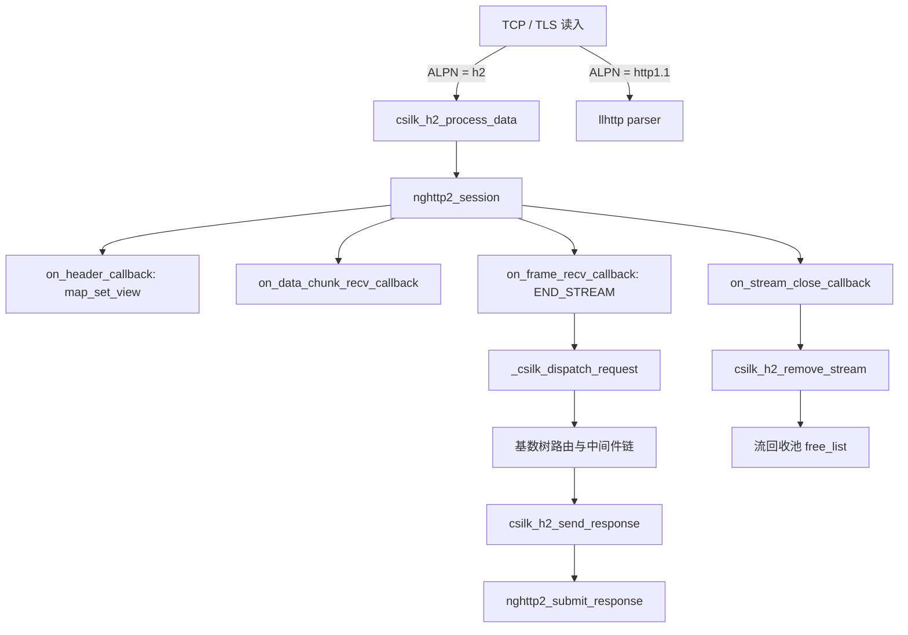

# HTTP/2 集成 — 实现状态与架构设计

> **状态**: 第一阶段（Session 框架）、第二阶段（请求分发/响应）、第三阶段（Server Push）、第四阶段（自适应流表与零系统调用流池）、第五阶段（零拷贝头部物化）和第六阶段（引用计数生命周期与异步安全）已全量完成。  
> **版本**: v0.5.2+ | **最后更新**: 2026-08-30
>
> **HTTP/2 规则**: ALPN 协商 **必须** 在任何数据路由之前完成。流上下文 **必须** 使用连接级流池与 arena 内存池复用 — 每个流复用过程 **零 `malloc`/`free` 系统调用**。Server Push **不得** 在 HTTP/1.1 连接上通告。HPACK 动态表大小 **应该** 按部署调整（默认：nghttp2 4096 字节）。

## 1. 概述
HTTP/2（RFC 7540）引入了二进制帧、多路复用和头部压缩（HPACK）。csilk 框架集成了 `nghttp2`，并构建了自适应多路复用流哈希表、无锁流回收池和请求头零拷贝物化流水线。

## 2. 实现状态

### 第一阶段 — Session 框架 ✅
- **ALPN 协商**：`src/core/server/` 配置 OpenSSL ALPN 以提供 `h2` 和 `http/1.1`。TLS 握手后，`alpn_select_cb` 检测协商的协议并设置 `client->protocol`。
- **nghttp2 session**：`csilk_h2_init_session()` 以服务器模式创建 nghttp2 session，注册回调（`on_header`、`on_frame_recv`、`on_data_chunk_recv`、`on_stream_close`、`send_callback`），并配置标准 HTTP/2 设置（最大并发流数、初始窗口大小）。
- **数据路由**：ALPN 协商后，`process_tls_read()` 将解密数据路由到 `csilk_h2_process_data()`（用于 HTTP/2 连接）或 `llhttp`（用于 HTTP/1.1）。
- **`csilk/http/h2.h` 公共 API**：暴露 `csilk_h2_init_session`、`csilk_h2_process_data`、`csilk_h2_get_stream`、`csilk_h2_get_or_create_stream`、`csilk_h2_free_streams`、`csilk_h2_remove_stream`、`csilk_h2_send_response`、`csilk_h2_submit_push`。

### 第二阶段 — 请求分发和响应 ✅
- **统一分发**：`_csilk_dispatch_request()` 处理 HTTP/1.1 与 HTTP/2 的通用路由匹配、中间件流水线与生命周期钩子。
- **头部解析**（`on_header_callback`）：将 `:method`、`:path`、`:scheme`、`:authority` 伪头部和常规头部解析到 arena 支撑的 `csilk_request_t` 结构中。
- **帧完成**（`on_frame_recv_callback`）：当 HEADERS 或 DATA 帧上设置了 `NGHTTP2_FLAG_END_STREAM` 时，触发请求分发。
- **尾部头部（Trailers）支持**：严格区分初始请求 HEADERS 与尾部 HEADERS（类别 `NGHTTP2_HCAT_HEADERS`），保障应用层分发 **严格恰好一次（Exactly-Once）**。
- **请求体积累**（`on_data_chunk_recv_callback`）：传入的 DATA 帧载荷拼接汇聚至 `c->request.body`。
- **流清理**（`on_stream_close_callback`）：标记 `stream_closed = 1`，原子递减 `stream_ref`，当所有异步操作结束时自动归还流回收池。

### 第三阶段 — Server Push ✅
- **`csilk_push_promise` / `csilk_h2_submit_push`**：用于向客户端发送 `PUSH_PROMISE` 帧的公共 API。
- **响应分发**：推送的资源通过路由器自动分发，响应在承诺的流上发送。

### 第四阶段 — 自适应流表与零系统调用流池 ✅
- **自适应流哈希表 (`csilk_h2_stream_map_t`)**：16 个嵌入式紧凑槽位，超出负载阈值时动态扩容至 2 的幂次堆内存数组。
- **流回收池 (`map->free_list`)**：保留流上下文及其 Arena Chunk 链，就地重置（`csilk_arena_reset()`），实现 **4.47 M stream-cycles/sec** 吞吐量与零运行时系统调用。
- **全字段重置契约**：单调递增 `stream_gen` 与 `request_seq`，重置全部请求/响应状态，杜绝 ABA 与悬挂回调。

### 第五阶段 — 零拷贝头部物化与单趟编码 ✅
- **`map_set_view` 零拷贝解析**：直接将 nghttp2 缓冲区内存指针传递给 `map_set_view()`，消除中间 `malloc`/`free` 与冗余字符串复制。
- **单趟响应编码**：响应头采用 $O(1)$ 快速计数与单趟 `nghttp2_nv` 编码直接压入 nghttp2 帧。

### 第六阶段 — 引用计数生命周期与异步安全 ✅
- **原子流引用计数 (`stream_ref`)**：在背景 Worker 或线程池执行异步任务（`csilk_async_op_t`）期间锁定流内存。
- **跨线程安全派发**：非属主 Worker 线程的 unref 操作自动将物理释放任务 dispatch 派发回属主 Worker 事件循环。

## 3. 架构

## 4. 依赖
- **nghttp2**（v1.52+）：帧解析、HPACK、session 管理。
- **OpenSSL**：支持 ALPN 扩展的 TLS 1.3。

## 5. 性能指标
- 头部物化吞吐量：0 头部请求达到 **7.93 M req/s（36 ns p50）**，5 头部请求达到 **830 K req/s（931 ns p50）**。
- 多流查找延迟：10 并发流仅 **26.2 ns**（38.13 M ops/s），10,000 并发流仅 **62.8 ns**（15.92 M ops/s）。
- 基于 Arena 与回收池的零内存碎片架构支持在多核 CPU 下实现接近线性的并发吞吐扩展。
