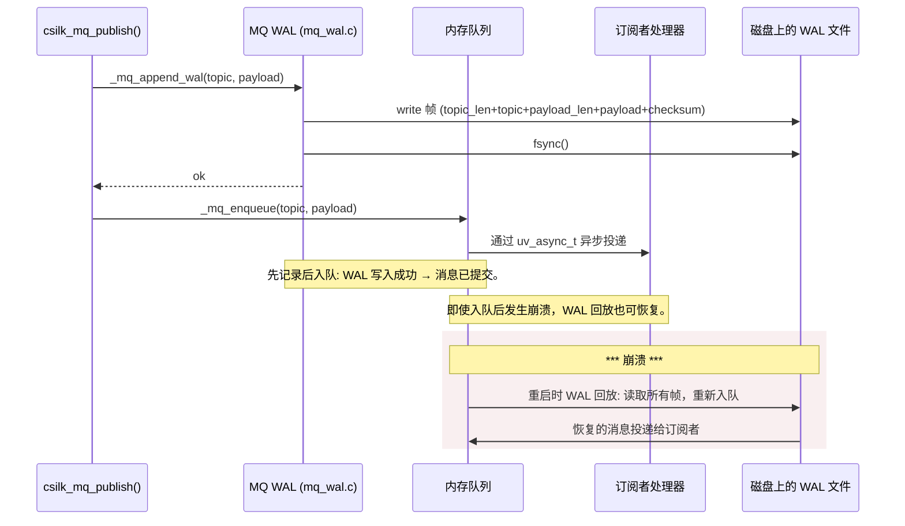
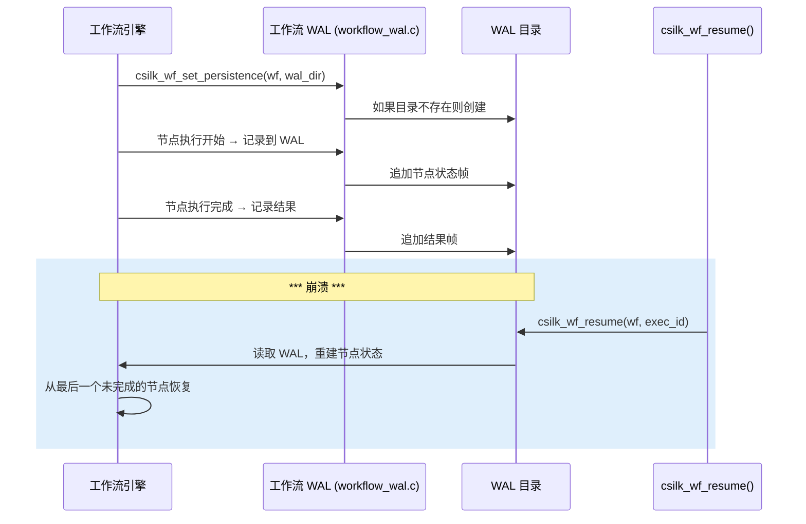

# WAL 持久化 — 消息队列与工作流的预写日志

> **状态**: 已实现（v0.4.0+）| **最后更新**: 2026-06-29
>
> **WAL 规则**: 每条消息 **必须** 在入队到内存之前追加到 WAL。WAL 帧 **必须** 包含校验和以验证完整性。恢复 **必须** 按追加顺序回放帧。WAL 文件每次写入后 **必须** 执行 fsync() 确保持久性。

## 1. 概述

csilk 在两个子系统中实现了预写日志（WAL）持久化：

| 子系统 | WAL 文件 | 目的 |
|:------|:---------|:-----|
| **消息队列** | 每个 MQ 实例单个文件 | 持久消息投递 — 崩溃后恢复未投递消息 |
| **工作流** | 每个工作流执行一个目录 | 进行中 DAG 执行的崩溃恢复 |

核心原则：**先记录再执行**。每条消息/节点状态变更在内存数据结构更新之前，先写入稳定存储。

## 2. MQ WAL 架构



### 2.1 帧格式

每个 WAL 帧采用紧凑的二进制编码：

```
+0: topic_len   (uint32_t, 4 字节, 小端序)
+4: topic       (topic_len 字节, 不以 null 结尾)
+N: payload_len (uint32_t, 4 字节, 小端序)
+M: payload     (payload_len 字节)
+K: checksum    (uint32_t, 4 字节, topic + payload 所有字节的 XOR)

总开销: 每条消息 16 字节
```

### 2.2 写入路径

```
_mq_append_wal(mq, topic, payload, len)
  1. 获取 wal_mutex（序列化并发发布）
  2. 计算 topic + payload 字节的 XOR 校验和
  3. 构建 5 元素 iovec：[topic_len, topic, payload_len, payload, checksum]
  4. 单次 uv_fs_write 调用（scatter/gather，无额外拷贝）
  5. 使用 uv_fs_fsync 确保持久性
  6. 释放 wal_mutex
  7. 成功返回 0，写入/fsync 失败返回 -1
```

### 2.3 恢复路径（`_mq_recovery`）

```
服务器启动时，如果 WAL 文件存在：
  1. 打开 WAL 文件进行读取
  2. 循环：
     a. 读取 topic_len（4 字节）
     b. 读取 topic（topic_len 字节）
     c. 读取 payload_len（4 字节）
     d. 读取 payload（payload_len 字节）
     e. 读取 stored_checksum（4 字节）
     f. 计算 topic + payload 的 XOR 校验和
     g. 如果校验和匹配：
        - 调用 _mq_enqueue(mq, topic, payload, payload_len)
        h. 如果校验和不匹配：记录警告，停止回放
  3. 关闭 WAL 文件
  4. 将 WAL 截断为 0 字节（已回放的消息现在在内存中）
```

## 3. 工作流 WAL 架构



### 3.1 工作流 WAL 目录结构

```
wal_dir/
├── exec_abc123.wal       # 一次运行的执行日志
├── exec_def456.wal
└── ...
```

每次执行产生一个 `.wal` 文件，包含一系列帧，每个节点生命周期事件（开始、完成、失败）一帧。

## 4. 线程安全

| 组件 | 同步机制 | 说明 |
|:-----|:---------|:-----|
| MQ WAL 写入 | `wal_mutex` | 每个 MQ 实例的互斥锁保护 WAL fd 和写入 |
| MQ WAL 恢复 | 启动时单线程 | 在事件循环启动前运行 |
| 工作流 WAL | 事件循环上的单线程 | 所有工作流操作在事件循环线程上执行 |

## 5. 性能考虑

| 方面 | 特性 | 指导建议 |
|:----|:-----|:---------|
| 每条消息开销 | 16 字节 + fsync | SSD 上每次写入约 10-50 µs |
| 写入放大 | 每条消息 1 次 fsync | 对于高吞吐量，使用定期 fsync 批量处理 |
| 恢复成本 | O(n) 扫描 WAL 文件 | 10K 消息通常 <1 ms |
| 校验和成本 | O(n) XOR 遍历负载 | 每核约 100 MB/s |

### 5.1 写入批处理（未来）

当前实现对每帧执行 fsync()。对于高吞吐场景（>10K 消息/秒），应采用批处理方法，批量处理 N 帧并定期 fsync：

```
批处理：追加 N 帧而不 fsync
然后：在第 N 帧后执行单次 fsync
权衡：崩溃时最多丢失 N 帧 vs N 倍吞吐量提升
```

## 6. 完整性检查

| 层 | 检查 | 检测能力 |
|:---|:----|:---------|
| 帧 | topic+payload 的 XOR 校验和 | 单比特翻转、短截断 |
| 恢复 | 校验和不匹配 → 停止回放 | 损坏的 WAL 不会产生幻影消息 |
| 文件 | O_SYNC / fsync | 在内核崩溃后生存（介质上的数据） |

## 7. 相关文档

| 文档 | 内容 |
|:----|:-----|
| [用户手册 — 消息队列](../user-manual/message-queue.md) | MQ 使用、WAL 启用 |
| [用户手册 — 工作流](../user-manual/workflow.md) | 工作流 WAL 恢复 |
| [模块设计 — 消息系统](../module-design/messaging.md) | MQ 架构、分发 |
| [模块设计 — 工作流](../module-design/workflow.md) | DAG 调度器、WAL 恢复 |
| [源码 — mq_wal.c](../../src/messaging/mq_wal.c) | MQ WAL 实现（376 行） |
| [源码 — workflow_wal.c](../../src/workflow/workflow_wal.c) | 工作流 WAL 实现 |
