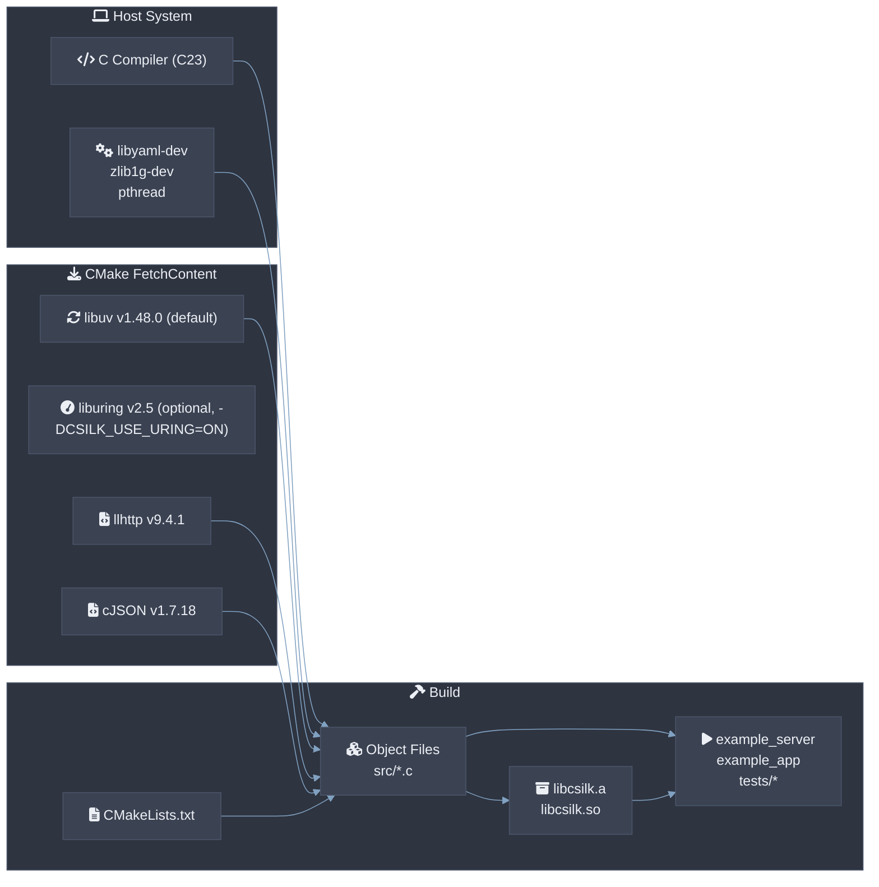
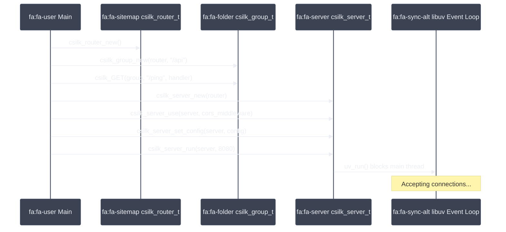

# 快速入门

## 先决条件

- CMake 3.11+（**必须**在 `$PATH` 中可用）
- 支持 C23 的 C 编译器（GCC 13+ 或 Clang 19+）
- Git
- libyaml-dev（**必须**用于 YAML 配置解析）
- zlib1g-dev（用于 gzip 压缩中间件 — **应该**在生产环境中启用）
- libssl-dev（**必须**是 OpenSSL 1.1.1+ 用于 HTTPS/TLS、JWT、密码驱动）
- libcurl-dev 7.80.0+（**必须**用于 AI 驱动 HTTP 传输）
- libuv（通过 CMake FetchContent 自动获取，用于 libuv 后端）
- liburing（当 `-DCSILK_USE_URING=ON` 时通过 CMake FetchContent 自动获取）
- 可选：libmysqlclient-dev、libpq-dev、libmongoc-dev（用于数据库驱动 — 通过 `-DCSILK_USE_*` CMake 标志启用）

## 构建与依赖流程



## 从源代码构建

```bash
git clone https://github.com/username/csilk.git
cd csilk
mkdir build && cd build
cmake .. -DCMAKE_BUILD_TYPE=Release
make -j$(nproc)
```

### 构建选项

| 选项 | 默认值 | 说明 |
|--------|---------|-------------|
| `CSILK_USE_URING` | OFF | 使用 io_uring 后端替代 libuv（仅 Linux） |
| `CMAKE_BUILD_TYPE` | - | `Debug`、`Release`、`RelWithDebInfo` |
| `CSILK_BUILD_SHARED` | OFF | 构建共享库（`libcsilk.so`） |
| `USE_ASAN` | OFF | 启用 AddressSanitizer |
| `USE_FUZZER` | OFF | 构建模糊测试工具 |
| `USE_COVERAGE` | OFF | 启用 gcov 覆盖率报告 |
| `CSILK_USE_MYSQL` | OFF | 启用 MySQL 数据库驱动 |
| `CSILK_USE_POSTGRES` | OFF | 启用 PostgreSQL 数据库驱动 |
| `CSILK_USE_MONGODB` | OFF | 启用 MongoDB 数据库驱动 |
| `ENABLE_OOM_TEST` | OFF | 启用 out-of-memory 模拟测试 |

## 创建新项目

Csilk 提供了脚手架工具 `csilkskel`，可快速生成具有专业分层架构的新项目，并内置 Swagger UI 和 Admin Dashboard。

```bash
# 生成新项目（交互式 Python 工具）
python3 scripts/csilkskel -n my-service

# 构建并运行新项目
cd my-service
mkdir build && cd build
cmake ..
make
./my-service
```

生成的项目包括：
- **分层架构**：专门的目录用于 API 处理程序、服务逻辑和数据模型。
- **交互式文档**：内置 Swagger UI，可在 `http://localhost:8080/` 访问。
- **Admin 仪表板**：实时监控可在 `http://localhost:8080/admin/` 访问。
- **反射示例**：一个完整的 User 服务，演示自动 JSON 绑定。

## 运行示例
...

```bash
# 低级 API 演示
./build/example_server

# 高级应用 API 演示
./build/example_app
```

## 示例服务器 walkthrough



## 运行测试

```bash
cd build && ctest --output-on-failure
```

## 最小服务器程序

```c
#include "csilk/csilk.h"

void ping(csilk_ctx_t* c) {
    csilk_string(c, 200, "pong");
}

int main() {
    csilk_router_t* r = csilk_router_new();
    csilk_router_add(r, "GET", "/ping", (csilk_handler_t[]){ping, NULL}, 1);

    csilk_server_t* s = csilk_server_new(r);
    csilk_server_run(s, 8080);

    csilk_router_free(r);
    csilk_server_free(s);
    return 0;
}
```

## Python 绑定快速入门

如果您更喜欢 Python，可以使用 `ctypes` 包装器来编写 `csilk` 应用程序：

1. 编译 `csilk` 共享库：
```bash
cmake .. -DCSILK_BUILD_SHARED=ON
make
```

2. 以开发模式安装 python 包：
```bash
pip install -e ./python
```

3. 创建简单的 `app.py` 脚本：
```python
from csilk import App, Context

app = App()

@app.get("/ping")
def ping(ctx: Context):
    ctx.string(200, "pong")

if __name__ == "__main__":
    app.run(8080)
```

4. 运行应用程序：
```bash
python3 app.py
```