# csilk 文档

> **版本**: 0.3.0 | **最后更新**: 2026-07-04

[English](../index.md) | [中文](index.md)

csilk 是一个轻量级（静态二进制文件约 150KB，每 1 万个保持连接约 < 2MB RSS）的 C 语言 HTTP Web 框架，在通用硬件上实现了 **10K QPS 下 P99 延迟 ≤ 5ms**。基于 **libuv（默认）或 io_uring（可选，仅 Linux）**、llhttp、nghttp2 和 cJSON 构建，单工作线程模式下可实现约 50K QPS 的吞吐量，16 核多工作线程模式下线性扩展至约 200K QPS。开发者 **必须**使用支持 C23 的编译器（GCC 13+ 或 Clang 19+）进行编译。公共 API **必须**通过 `csilk_ctx_t*` 不透明句柄使用——直接访问结构体 **不属于** 稳定 ABI 的一部分。所有资源管理 **应该**优先使用 arena 分配（每次分配约 3 条 CPU 指令，重置 ≤ 5ns）而非堆 `malloc`/`free`。

## 项目架构概览

```mermaid
%%{init: {'theme': 'base', 'themeVariables': {'background': '#2E3440','primaryColor':'#81A1C1','primaryBorderColor':'#4C566A','primaryTextColor':'#ECEFF4','secondaryColor':'#3B4252','secondaryBorderColor':'#434C5E','secondaryTextColor':'#D8DEE9','lineColor':'#81A1C1','textColor':'#ECEFF4','mainBkg':'#3B4252','nodeBorder':'#4C566A','clusterBkg':'#2E3440','clusterBorder':'#4C566A','titleColor':'#ECEFF4','edgeLabelBackground':'#3B4252','nodeTextColor':'#ECEFF4'}, 'flowchart': {'htmlLabels': true, 'curve': 'basis'}}}%%
graph TB
    subgraph Application
        H["fa:fa-code Business Handlers"]
        APP["fa:fa-cube csilk_app_t (High-Level API)"]
    end

    subgraph Middleware_Layer["fa:fa-shield Middleware Layer"]
        REC["fa:fa-medkit Recovery"]
        LOG["fa:fa-pencil Logger"]
        AUTH["fa:fa-key Auth"]
        CORS["fa:fa-globe CORS"]
        RT["fa:fa-clock-o Rate Limit"]
        CSRF["fa:fa-shield CSRF"]
        ST["fa:fa-folder-open Static Files"]
        GZ["fa:fa-archive Gzip"]
        SSE["fa:fa-bullhorn SSE"]
        MP["fa:fa-upload Multipart"]
        JWT["fa:fa-tag JWT"]
        MET["fa:fa-bar-chart Metrics"]
        RID["fa:fa-tag RequestID"]
        SES["fa:fa-cookie Session"]
        VAL["fa:fa-check-square Validate"]
        WAF["fa:fa-fire WAF"]
    end

    subgraph Core_Framework["fa:fa-cogs Core Framework"]
        S["fa:fa-server Server (libuv / io_uring backend)"]
        R["fa:fa-sitemap Router (Radix Tree)"]
        G["fa:fa-folder Group (prefix routing)"]
        C["fa:fa-exchange Context (req/res lifecycle)"]
        AR["fa:fa-database Arena Allocator"]
        WS["fa:fa-plug WebSocket"]
        CFG["fa:fa-cog Config (YAML)"]
        RF["fa:fa-search Reflection Engine"]
        AI_ENG["fa:fa-robot AI Unified Engine"]
    end

    subgraph Dependencies
        UV["fa:fa-cogs libuv / io_uring (async I/O)"]
        LL["fa:fa-file-code llhttp (HTTP/1.1 parser)"]
        NG["fa:fa-code-fork nghttp2 (HTTP/2 parser)"]
        JSON["fa:fa-code cJSON"]
        YAML["fa:fa-file-text libyaml"]
        Z["fa:fa-archive zlib"]
        CURL["fa:fa-download libcurl"]
    end

    S --> CFG
    S --> UV
    S --> LL
    RF --> JSON
    AI_ENG --> CURL
    AI_ENG --> JSON
    GZ --> Z
    C --> JSON

    CORS --> C
    RT --> C
    CSRF --> C
    ST --> C
    GZ --> C
    SSE --> C
    MP --> C
    S --> R
    S --> C
    G --> R
    C --> AR
    S --> WS
```



## 关键资源

| 文档                                        | 描述                                                                                                                                                                                                                                                                                                                                                                                                                                                                                                                                                                                                                                                                        |
| ----------------------------------------------- | ---------------------------------------------------------------------------------------------------------------------------------------------------------------------------------------------------------------------------------------------------------------------------------------------------------------------------------------------------------------------------------------------------------------------------------------------------------------------------------------------------------------------------------------------------------------------------------------------------------------------------------------------------------------------------------- |
| [快速入门](getting-started.md)           | 构建、安装并运行你的第一个服务器                                                                                                                                                                                                                                                                                                                                                                                                                                                                                                                                                                                                                                          |
| [架构](architecture.md)                 | 高层架构、核心设计原则和组件依赖图                                                                                                                                                                                                                                                                                                                                                                                                                                                                                                                                                                                                      |
| [性能调优](performance-tuning.md)     | 优化 P99 延迟和最大化吞吐量的综合指南                                                                                                                                                                                                                                                                                                                                                                                                                                                                                                                                                                                                            |
| [模块设计](module-design/)                 | 核心模块内部深入解析：[Server](module-design/server.md)、[App Layer](module-design/app.md)、[Router](module-design/router.md)、[Context](module-design/context.md)、[Arena](module-design/arena.md)、[Middleware](module-design/middleware.md)、[Data](module-design/data.md)、[Messaging](module-design/messaging.md)、[Security](module-design/security.md)、[Protocols](module-design/protocols.md)、[Drivers](module-design/drivers.md)、[Metrics](module-design/metrics.md)、[AI](module-design/ai.md)、[Workflow](module-design/workflow.md)、[Reflection](module-design/reflection.md)、[Crypto](module-design/crypto.md)、[Hooks](module-design/hooks.md) |
| [用户手册](user-manual/)                     | 配置、中间件开发、安全、AI 引擎、工作流、数据库、消息队列、部署、钩子、反射、管理面板和 Python 绑定                                                                                                                                                                                                                                                                                                                                                                                                                                                                                                                                                                                                                                                                                          |
| [Python 绑定手册](user-manual/python.md) | 安装、类参考和 AI 工作流编排指南                                                                                                                                                                                                                                                                                                                                                                                                                                                                                                                                                                                                              |
| [API 参考](html/index.html)                | Doxygen 生成的 API 文档                                                                                                                                                                                                                                                                                                                                                                                                                                                                                                                                                                                                                                                |

## 快速开始

```c
#include "csilk/csilk.h"

void hello(csilk_ctx_t* c) {
    csilk_string(c, 200, "Hello World!");
}

int main() {
    csilk_router_t* r = csilk_router_new();
    csilk_router_add(r, "GET", "/hello", (csilk_handler_t[]){hello, NULL}, 1);

    csilk_server_t* s = csilk_server_new(r);
    csilk_server_run(s, 8080);

    csilk_router_free(r);
    csilk_server_free(s);
    return 0;
}
```

更多文档正在翻译中...
