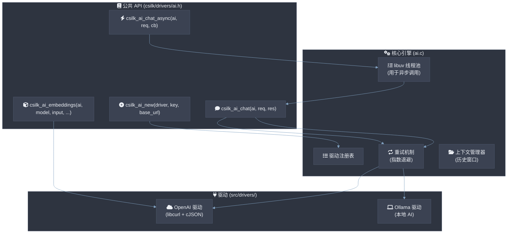

# AI 统一接口

AI 模块为 Csilk 应用程序提供了**与提供商无关的抽象**，用于集成大型语言模型 (LLM) 和其他 AI 服务。所有 AI 驱动 **MUST** 实现 `csilk_ai_driver_t` vtable 接口。聊天完成 **MUST NOT** 阻塞事件循环 — 使用 `csilk_ai_chat_async()` 进行非阻塞调用。流式响应 **SHOULD** 通过 Server-Sent Events (SSE) 传递。在模型和索引之间嵌入维度不匹配 **MUST** 在运行时被拒绝。

## 架构



## 关键特性

### 1. 统一请求/响应
消息、聊天完成和嵌入的标准化结构确保应用程序逻辑与特定 AI 提供商解耦。

### 2. 高性能异步 I/O
Web 应用程序不应该被缓慢的 AI 网络调用阻塞。Csilk 提供 `csilk_ai_chat_async`，它利用框架内部的 `libuv` 线程池在后台运行 AI 请求。

### 3. 原生流式传输 (SSE)
Server-Sent Events (SSE) 支持允许进行"打字机样式"的实时输出。
- 在请求中设置 `stream = true`。
- 提供 `on_chunk` 回调以接收文本增量。

### 4. 函数调用 (工具使用)
通过定义模型可以请求执行的 C 函数工具来构建自主代理。Csilk 自动解析模型请求的 `tool_calls`。

### 5. 自动� robustness
- **自动重试**: 内置指数退避处理瞬时网络错误（502, 503）和速率限制（429）。
- **历史管理**: `csilk_ai_context_t` 管理 FIFO 滑动窗口的对话历史，以尊重模型令牌限制。

### 6. AI 遥测集成

AI 引擎集成到 admin dashboard 中进行实时监控：

- **模型调用跟踪**: 每次 `csilk_ai_chat` 和 `csilk_ai_chat_async` 调用都记录模型名称、令牌计数和延迟。
- **仪表板集成**: AI 指标通过 admin dashboard `/admin/stats` JSON 端点暴露，作为 `ai_requests_total`、`ai_tokens_total` 和 `ai_latency_ms`。
- **错误跟踪**: 失败的 AI 请求按错误类型（超时、速率限制、无效响应）进行计数和分类。

---

## 驱动配置

### OpenAI 驱动
- **名称**: `"openai"`
- **依赖**: `libcurl`
- **支持的 API**: 聊天完成、嵌入、流式传输、函数调用。

### Ollama 驱动
- **名称**: `"ollama"`
- **目的**: 本地私有 LLM 集成。
- **默认基础 URL**: `http://localhost:11434`

---

## 使用示例（异步聊天）

```c
void on_chat_complete(int status, csilk_ai_chat_response_t* res, void* data) {
    if (status == 0) {
        printf("AI: %s\n", res->content);
    }
    csilk_ai_chat_response_free(res);
}

// ... 在处理器内 ...
csilk_ai_t* ai = csilk_ai_new("openai", key, NULL);
csilk_ai_chat_request_t req = { .model = "gpt-4", .messages = msgs, .message_count = 1 };

csilk_ai_chat_async(ai, &req, on_chat_complete, NULL);
```

---

## 使用示例（函数调用）

```c
csilk_ai_tool_t tools[] = {
    { .type = "function", .function = { .name = "get_weather", .description = "..." } }
};

req.tools = tools;
req.tool_count = 1;

csilk_ai_chat(ai, &req, &res);

if (res.tool_call_count > 0) {
    // 模型想要调用函数！
    execute_local_function(res.tool_calls[0].name, res.tool_calls[0].arguments);
}
```