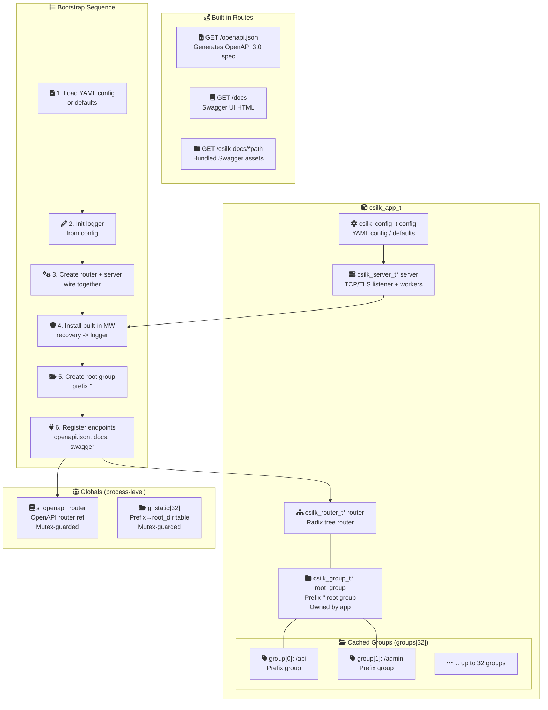
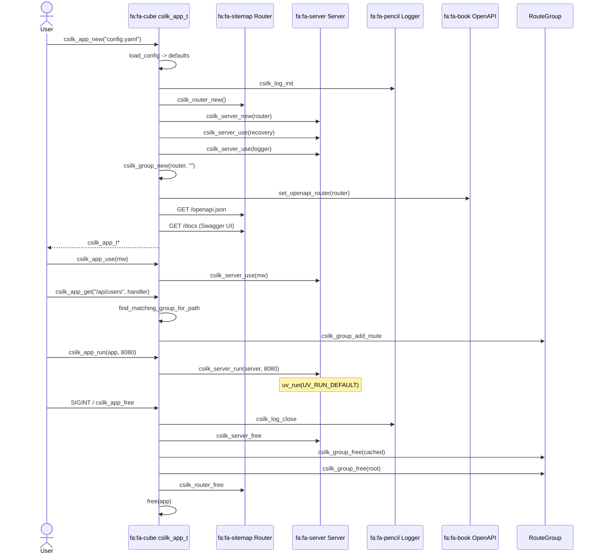

# 应用层设计

> **版本**: 0.3.0 | **最后更新**: 2026-06-27

csilk 的 App Layer 是面向开发者的高级入口——将路由、服务器、配置、日志、中间件和 OpenAPI 整合为单一的 `csilk_app_t` 门面。它是框架的"电池 Included"封装，让用户无需手动拼装子组件即可快速构建生产级 HTTP 服务。用户 **MUST** 通过 `csilk_app_t` 接口创建应用实例 —— 直接操作 `csilk_server_t` 和 `csilk_router_t` 仅适用于需要精细控制的高级场景。应用启动时间 ≤ 5ms (冷启动，含 YAML 解析 + 路由注册)。

---

## 1. 整体架构



### 组件关系

| 角色 | 类型 | 说明 |
|------|------|------|
| 门面 | `csilk_app_t` | 单一入口，封装所有子系统的创建、配置和生命周期 |
| 路由 | `csilk_router_t*` | 底层 radix tree 路由器，由 app 创建且只由 app 持有 |
| 服务器 | `csilk_server_t*` | libuv HTTP 服务器，持有 router 引用 |
| 路由组 | `csilk_group_t*` | 前缀分组 + 中间件链组装，root 组前缀为 `""` |
| 组缓存 | `cached_group_t[32]` | 按前缀查找/延迟创建，避免重复 group 对象 |
| 静态路由 | `static_route_t[32]` | 全局 URL 前缀 → 文件系统目录映射表 |
| OpenAPI | `static csilk_router_t*` | 互斥锁保护的 OpenAPI 路由器引用，支持运行时 toggle |

---

## 2. 核心数据结构

### `csilk_app_s` — 应用实例

```c
struct csilk_app_s {
    csilk_config_t config;              // YAML 配置或默认值
    csilk_router_t* router;             // 路由树（持有）
    csilk_server_t* server;             // HTTP 服务器（持有）
    csilk_group_t* root_group;          // 根路由组，前缀 ""
    cached_group_t groups[32];          // 前缀 → 路由组缓存
    int group_count;                    // 缓存中有效条目数（0..32）
};
```

**所有权规则**：
- `router`、`server`、`root_group` 均由 app 创建且由 app 独占持有
- `groups[]` 中的子组属于 root_group，由 app 统一释放
- `config` 是栈内嵌结构体（非指针），随 app 一起释放

### `cached_group_t` — 路由组缓存条目

```c
typedef struct {
    char prefix[128];      // URL 路径前缀（查找键）
    csilk_group_t* group;  // 路由组句柄（延迟创建）
} cached_group_t;
```

**设计意图**：当同一前缀被多次引用（如 `csilk_app_use_group` + `csilk_app_add_route`）时，避免重复创建 `csilk_group_t`。线性扫描，`CSILK_MAX_GROUPS = 32` 保证开销可接受。

### `static_route_t` — 静态文件路由条目

```c
typedef struct {
    char url_prefix[128];  // URL 前缀（查找键）
    char root_dir[256];    // 本地文件系统目录
} static_route_t;
```

**设计意图**：全局表 `g_static[32]` 受 app mutex 保护，请求时由 `static_serve` 处理函数扫描匹配。最长前缀优先。

---

## 3. API 设计

### 生命周期

| 函数 | 说明 |
|------|------|
| `csilk_app_new(config_path)` | 创建 app，加载 YAML 配置或使用默认值，初始化 logger、router、server、root group、内置端点 |
| `csilk_app_free(app)` | 逆序释放：logger close → server free → groups free → router free → config free |
| `csilk_app_run(app, port)` | 进入 libuv 事件循环（阻塞），port ≤ 0 时使用 config 中的值 |

### 日志控制

| 函数 | 说明 |
|------|------|
| `csilk_app_log_level(app, level)` | 设置最低日志级别，重新初始化 logger |
| `csilk_app_log_file(app, path, max_sz)` | 启用文件日志及可选的轮转阈值 |
| `csilk_app_log_json(app, enable)` | 切换 JSON 结构化输出 / 纯文本 |

### 中间件

| 函数 | 说明 |
|------|------|
| `csilk_app_use(app, handler)` | 注册全局中间件（所有路由生效），注册到 server 级别 |
| `csilk_app_use_group(app, prefix, handler)` | 注册前缀作用域中间件，创建或查找缓存组 |
| `csilk_app_apply_config(app)` | 根据 config 自动安装中间件（static files 等） |

### 路由注册

| 函数 / 宏 | 说明 |
|-----------|------|
| `csilk_app_add_route(app, method, path, handler)` | 单处理器路由，自动匹配最佳前缀组 |
| `csilk_app_add_handlers(app, method, path, handlers, n)` | 多处理器链 |
| `csilk_app_add_route_extended(...)` | 含 OpenAPI 元数据（input_type/output_type/summary/description） |
| `csilk_app_add_route_perm(...)` | 含权限元数据（perm_required/perm_resource） |
| `csilk_app_add_route_extended_perm(...)` | 同时含 OpenAPI + 权限元数据 |
| `csilk_app_get/post/put/delete/patch/options/head` | HTTP 方法便捷宏 |
| `csilk_app_*_ext / csilk_app_*_perm` | 对应宏的 extended/perm 版本 |

### 静态文件

| 函数 | 说明 |
|------|------|
| `csilk_app_static(app, prefix, root_dir)` | 注册 URL 前缀 → 目录映射，注册 `/*path` 和 `/` 两条路由 |

### OpenAPI / Swagger

| 函数 | 说明 |
|------|------|
| `csilk_app_enable_openapi(app, enable)` | 启用/禁用 `/openapi.json` 端点（1/0），默认启用 |

### 底层访问

| 函数 | 说明 |
|------|------|
| `csilk_app_router(app)` | 获取底层 router 句柄（高级操作） |
| `csilk_app_server(app)` | 获取底层 server 句柄（高级操作） |
| `csilk_app_config(app)` | 获取 app 配置的堆副本（调用者 free） |
| `csilk_app_set_server_config(app, c)` | 覆盖服务器配置 |

---

## 4. 关键算法

### 4.1 路由组匹配 (`find_matching_group_for_path`)

```
输入: app, path="/api/users/123"
输出: best_group, relative_path="/users/123"

算法:
  1. 默认返回 root_group（前缀长度 0）
  2. 线性扫描 groups[0..group_count]:
     - 仅当 path 以 prefix 开头（strncmp 检查）
     - 且有干净边界（path[prefix_len] == '/' 或 '\0'）
     - 取最长 prefix 匹配
  3. 返回匹配 group + 相对路径指针
```

**为什么这么做**：避免了为每个路由注册执行字符串重复分配和拼接。`relative_path` 只是原始 path 字符串的偏移指针，零拷贝。

### 4.2 静态文件分发 (`static_serve`)

```
输入: ctx (含 path)
算法:
  1. 检查 path 是否包含目录遍历（".."）→ 403 Forbidden
  2. 加 app mutex，遍历 g_static[]:
     - strncmp 匹配 url_prefix
     - 取最长的前缀匹配
  3. 释放 mutex（避免在磁盘 I/O 期间持有锁）
  4. 设置 static_prefix 到 ctx
  5. 调用 csilk_static(c, root_dir)
  6. 无匹配 → 404
```

**双重注册**：`csilk_app_static` 为每个前缀注册两条路由：
- `/*path` — 通配符捕获前缀后的所有路径
- `/` — 前缀根路径

这使得 `/static/` 和 `/static/foo/bar.jpg` 均能正确匹配。

### 4.3 应用启动序列 (`csilk_app_new`)

```
Phase 1 — Config & Logger
  1. calloc app struct
  2. uv_once 初始化进程级 app mutex
  3. 加载 YAML 配置或填充硬编码默认值
     (port 8080, info 级别日志, 5s 空闲超时,
      30s I/O 超时, 1MB 最大 body, 64KB header,
      8KB URL, 100 个 header, 128 backlog, TCP_NODELAY on)
  4. 初始化 logger

Phase 2 — Core Objects
  5. csilk_router_new() → app->router
  6. csilk_server_new(app->router) → app->server
  7. csilk_server_set_config(server, &config.server)
  8. csilk_server_use(server, csilk_recovery_handler)
  9. csilk_server_use(server, csilk_logger_handler)
  10. csilk_group_new(router, "") → app->root_group

Phase 3 — Built-in Endpoints
  11. set_openapi_router(app->router) // 全局引用
  12. GET /openapi.json → openapi_handler
  13. GET /docs → docs_handler (Swagger UI)
  14. csilk_app_static(app, "/csilk-docs", CSILK_SWAGGER_UI_DIR)
```

**失败路径**：Phase 1 或 2 中任何步骤失败 → `goto fail`，逆序释放已分配资源后返回 nullptr。

### 4.4 静态文件路径遍历防护

```c
static int contains_path_traversal(const char* path)
```

检查 `path` 中是否含有 `..` 序列，且前一个字符为 `/` 或 `path` 开头，后一个字符为 `/` 或 NUL。这覆盖了 `../`、`/../`、`/..` 及 `..` 独立出现的场景。

在 `static_serve` 中、查找前缀表之前执行，避免不必要的锁和 IO。

---

## 5. 并发模型

| 组件 | 保护机制 | 说明 |
|------|----------|------|
| `s_openapi_router` | `uv_mutex_t s_app_mutex` | 全局 OpenAPI 路由器引用，`get/set_openapi_router` 加锁 |
| `g_static[]` | `s_app_mutex` | 全局静态路由表，`csilk_app_static` 写时加锁，`static_serve` 读时短暂加锁 |
| `s_app_mutex_once` | `UV_ONCE_INIT` | `uv_once` 保证 mutex 仅初始化一次（即使并发调用 `csilk_app_new`） |
| 请求处理 | 无锁（单线程） | 路由匹配和处理器执行在 libuv 线程内完成，无需额外同步 |

**关键设计**：`static_serve` 在获取锁完成前缀查找后，释放锁再进行 `csilk_static()` 磁盘 I/O，避免 I/O 期间阻塞其他请求。

---

## 6. 生命周期



---

## 7. 使用示例

### 7.1 最小 App

```c
#include "csilk/app/app.h"

void hello(csilk_ctx_t* c) {
    csilk_string(c, 200, "Hello World!");
}

int main(void) {
    csilk_app_t* app = csilk_app_new("config.yaml");
    csilk_app_get(app, "/", hello);
    csilk_app_run(app, 8080);   // blocks
    csilk_app_free(app);
    return 0;
}
```

### 7.2 分组 + 中间件 + OpenAPI 元数据

```c
csilk_app_t* app = csilk_app_new(nullptr);  // 默认配置

// 全局中间件
csilk_app_use(app, csilk_logger_handler);
csilk_app_use(app, csilk_recovery_handler);

// 分组中间件
csilk_app_use_group(app, "/api", csilk_auth_middleware);

// 带 OpenAPI 元数据的路由
csilk_app_get_ext(app, "/api/users/:id", get_user_handler,
                  nullptr, "User", "GetUser", "Retrieve user by ID");
csilk_app_post_ext(app, "/api/users", create_user_handler,
                   "CreateUserInput", "User", "CreateUser", "Create a new user");

csilk_app_run(app, 8080);
```

### 7.3 静态文件服务

```c
// /static/foo.jpg → ./public/foo.jpg
csilk_app_static(app, "/static", "./public");
// /csilk-docs/index.html → /usr/local/share/csilk/swagger-ui/index.html
csilk_app_static(app, "/csilk-docs", CSILK_SWAGGER_UI_DIR);
```

### 7.4 完整生命周期（含权限 + OpenAPI 控制）

```c
csilk_app_t* app = csilk_app_new("config.yaml");

// 配置
csilk_app_log_level(app, CSILK_LOG_DEBUG);
csilk_app_log_file(app, "/var/log/csilk.log", 10 * 1024 * 1024);

// 禁用 OpenAPI 端点
csilk_app_enable_openapi(app, 0);

// 路由（带权限声明）
csilk_app_get_perm(app, "/admin/users", admin_list_handler,
                   "admin", "users:*");

// 启动
if (csilk_app_run(app, 0) != 0) {  // port 0 → use config port
    fprintf(stderr, "server failed\n");
    return 1;
}
csilk_app_free(app);
```

---

## 8. 相关文件

| 文件 | 角色 |
|------|------|
| `include/csilk/app/app.h` | 公共 API 头文件 |
| `include/csilk/app/admin.h` | Admin dashboard API |
| `include/csilk/core/internal.h` | 内部头文件 |
| `src/app/app.c` | App 门面实现（936 行） |
| `src/app/group.c` | 路由组实现（middleware 链、前缀拼接） |
| `src/core/admin.c` | Admin dashboard（stats、WebSocket、topology/flamegraph） |
| `src/workflow/` | Workflow 引擎（热重载、DAG 调度） |
| `include/csilk/types.h` | `csilk_app_t` opaque 类型前向声明 |
| `python/csilk/app.py` | Python CTypes 绑定 |

---

## 9. 设计权衡

### 为什么 `csilk_app_t` 是 opaque 的？

- **ABI 稳定性**：用户不能直接访问结构体成员，内部布局变更不破坏二进制兼容性
- **封装性**：强制用户通过 API 函数交互，避免错误地直接修改内部状态
- **演进自由**：可以在不改变头文件的前提下重构成员字段

### 为什么路由组用线性扫描匹配前缀？

- 32 个组的硬上限使 O(n) 线性扫描的开销可忽略（32 次 strncmp）
- 不需要 hash 或树结构——那会引入分配开销和额外的内存管理
- `CSILK_MAX_GROUPS` 是可以调整的编译时常量，若需要可以用跳表替换

### 为什么 OpenAPI 路由器是全局引用而非 app 成员？

- 允许多个 app 实例共享同一个 OpenAPI 端点
- `openapi_handler` 和 `docs_handler` 是静态函数，不持有 app 指针——它们通过全局引用访问路由器
- 运行时 toggle 只需原子地 swap 指针值

### 为什么静态文件路由表是全局的而非 app 内部？

- `static_serve` 是静态 handler 函数，不接受 app 参数
- 通过全局表 + mutex 让多个 handler 调用共享同一个前缀→目录映射
- 简化了内置端点 `/csilk-docs/` 的注册（在 `csilk_app_new` 中直接调用 `csilk_app_static`）

### 为什么使用 `uv_once` 初始化 mutex？

- `uv_mutex_init` 不是线程安全的——两个线程同时调用可能导致竞态
- `uv_once` 保证 `init_app_mutex` 仅执行一次，即使多个线程同时调用 `csilk_app_new`
- 初始化后，`get/set_openapi_router` 的锁/解锁操作是线程安全的
