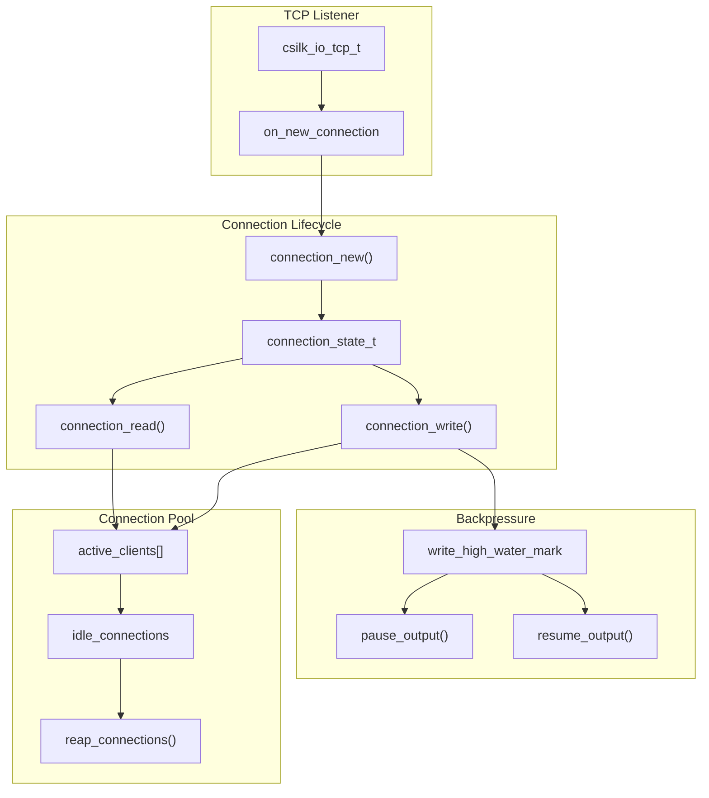
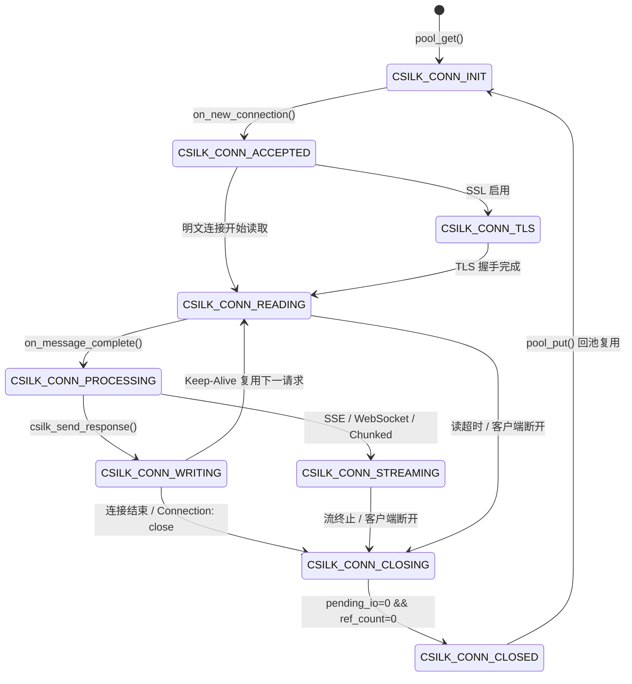

# 连接管理深度解析

> **Version**: 0.5.2 | **Last updated**: 2026-08-22

csilk 的连接管理系统负责 TCP 连接的接受、维护、复用和关闭。

---

## 1. 架构概览



---

## 2. 连接结构 (csilk_client_t)

```c
struct csilk_client_s {
    uint64_t           generation;   /**< ABA 防御代数序列号 */
    csilk_conn_state_t state;        /**< 连接 9 状态生命周期状态机 */

    csilk_io_tcp_t handle;           /**< 底层 I/O 套接字句柄 (libuv / io_uring) */

    csilk_io_timer_t timer;          /**< 连接 Keep-Alive 空闲超时定时器 */
    csilk_io_timer_t read_timer;     /**< 请求读取超时定时器 */
    csilk_io_timer_t write_timer;    /**< 响应写入超时定时器 */
    csilk_io_timer_t request_timer;  /**< 总请求处理超时定时器 */

    llhttp_t parser;                 /**< llhttp HTTP/1.1 解析器 */
    SSL*     ssl;                    /**< OpenSSL TLS 会话句柄 (HTTPS) */

    csilk_server_t* server;          /**< 所属服务器实例 */
    worker_pool_t*  owner_pool;      /**< 归属 Worker 线程池 (严格单线程约束) */

    _Atomic(int) ref_count;          /**< 上下文及异步持有引用计数 */
    _Atomic(int) pending_io;         /**< 活跃未决 I/O 及定时器关闭计数 */

    csilk_ctx_t ctx;                 /**< 当前活跃 HTTP 请求上下文 */
    csilk_h2_stream_map_t h2_stream_map; /**< HTTP/2 多路复用流哈希映射 */
};
```

---

## 3. 连接生命周期状态机 (9 状态)

```c
typedef enum csilk_conn_state_e {
    CSILK_CONN_INIT = 0,       /**< 初始态 / 空闲连接池复用态 */
    CSILK_CONN_ACCEPTED,       /**< TCP 连接建立，已绑定套接字 */
    CSILK_CONN_TLS,            /**< TLS 握手进行中 */
    CSILK_CONN_READING,        /**< 正在从套接字读取 HTTP 数据 */
    CSILK_CONN_PROCESSING,     /**< 请求解析完成，正在执行中间件及业务 Handler */
    CSILK_CONN_WRITING,        /**< 正在向客户端发送响应头与响应体 */
    CSILK_CONN_STREAMING,      /**< 分块流式传输 / SSE / WebSocket 活跃传输态 */
    CSILK_CONN_CLOSING,        /**< 关闭流程中：排空未决 I/O、关闭定时器 */
    CSILK_CONN_CLOSED          /**< 已完全销毁或归还 Worker 局部连接池 */
} csilk_conn_state_t;
```



---

## 4. 形式化归属与无 ABA/UAF 销毁保证

1. **Owner Worker 线程排他销毁**：`client_destroy()` **永远仅在 Owner Worker 线程的事件循环中执行**。
2. **跨线程回收代理**：非 Owner 线程检测到连接需要回收时，分配 `csilk_recycle_task_payload_t` 结构并携带当前 `client->generation`，通过无锁 MPSC 队列派发到 Owner Worker 执行。
3. **代数校验防御 (ABA Defense)**：Owner Worker 在执行回收任务时，严格校验 `client->generation == gen && client->state == CSILK_CONN_CLOSING`，若代数不匹配则直接丢弃任务，防止破坏已被重新分配复用的新连接。
4. **引用计数与未决 I/O 不变式**：
   - 必须同时满足 `ref_count == 0` 与 `pending_io == 0` 且处于 `CLOSING` / `CLOSED` 状态时，才触发最终物理回收。
   - `atomic_fetch_sub` 后如果产生负数，自动截断回 0，保证绝不下溢。

---

## 5. 出站流式背压与高低水位控制

```c
// 默认水位线配置
#define CSILK_WRITE_HWM_DEFAULT        (64 * 1024)       // 高水位: 64 KB
#define CSILK_WRITE_LWM_DEFAULT        (16 * 1024)       // 低水位: 16 KB
#define CSILK_WRITE_MAX_BUFFER_DEFAULT (16 * 1024 * 1024)// 最大排队: 16 MB
```

- **高水位触发**：当连接出站未决队列超过 `write_high_water_mark` 时，`csilk_response_write()`、`csilk_sse_send()` 和 `csilk_ws_send()` 返回 `0`，提示生产者暂停发送。
- **低水位排空恢复**：当已发送完成、未决出站队列降至 `write_low_water_mark` 以下时，触发用户注册的 `csilk_on_drain()` 回调，生产者恢复写入。
- **最大容量保护**：超过 `max_write_buffer_size` 直接拒绝并返回 `-1`，防止慢客户端耗尽服务器内存。

---

## 6. 参考文件

| 文件 | 作用 |
|------|------|
| `src/core/server/connection.c` | 连接接受与生命周期核心 |
| `src/core/server/connection_io.c` | 数据读取、写入与超时控制 |
| `src/core/server/connection_close.c` | 状态机流转、引用计数与跨线程回收派发 |
| `src/core/server/connection_pool.c` | Worker 局部零锁连接池与 Arena 复用 |
| `tests/core/test_client_lifetime_stress.c` | 100,000 次连接高频复用形式化审计测试 |

