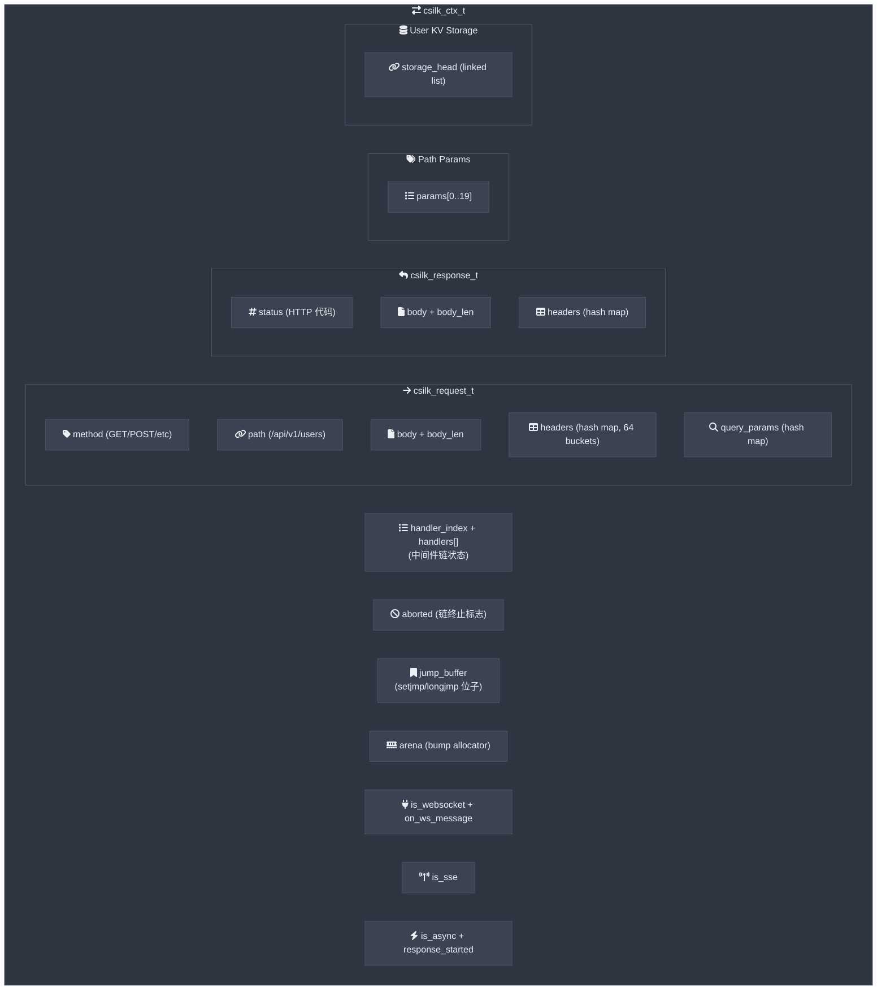
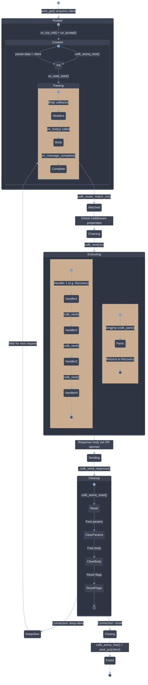
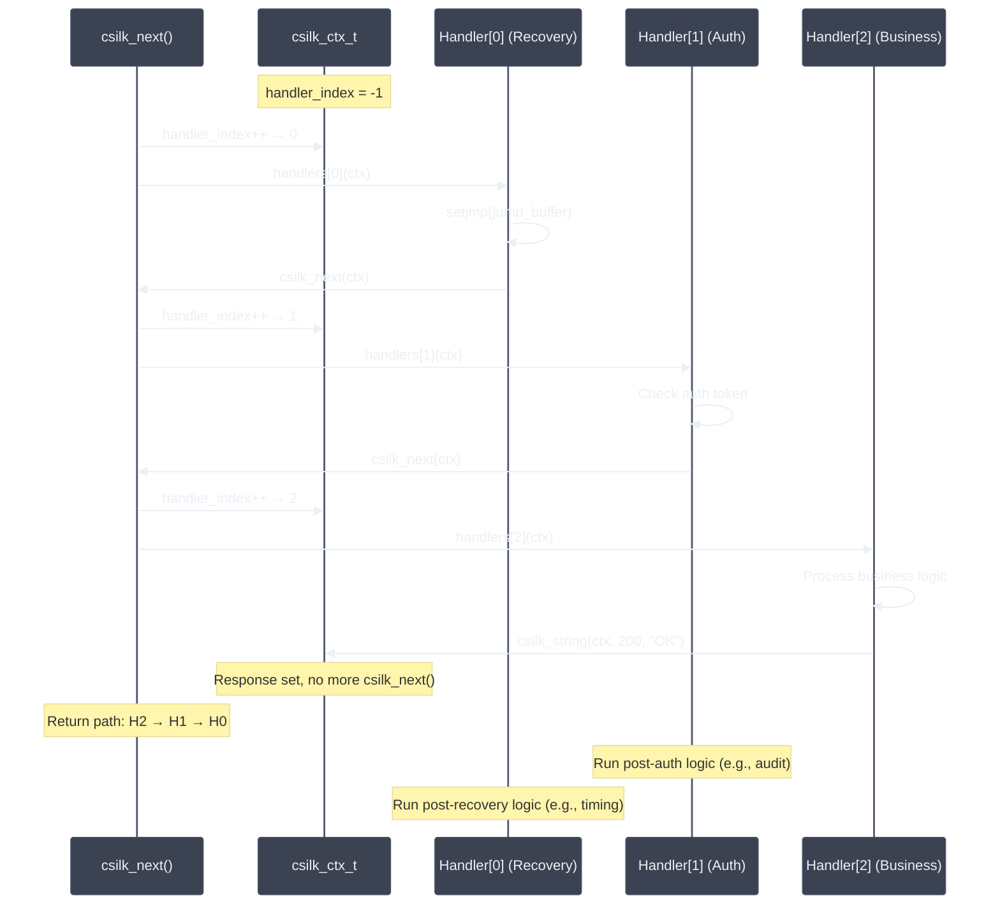
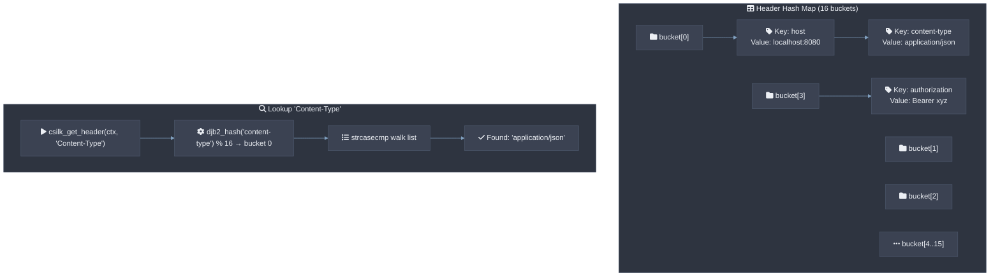

# 上下文设计

`csilk_ctx_t` (请求上下文) 是 csilk 的核心对象。它承载请求状态、响应缓冲区、处理器链、WebSocket 回调和 Arena 分配器贯穿整个请求生命周期。所有 HTTP 头使用 **零拷贝** `csilk_str_view_t` 引用原始接收缓冲区 — 无需每个头的 `malloc`。上下文在 keep-alive 请求之间通过 arena 指针重置在 O(1) 内完成。用户 **MUST NOT** 在请求之间持有 `csilk_str_view_t` 指针；数据 **SHOULD** 通过 `csilk_arena_strdup()` 复制到堆中（如果需要超出当前请求生命周期）。

## 上下文结构



## 上下文生命周期



### 多线程安全

在多工作线程模式下（通过 `worker_threads > 1` 配置），csilk 使用每个工作线程的 **无锁连接对象池** (`pool_get`/`pool_put`) 避免互斥锁争用。每个工作线程拥有自己独立的池，消除了共享互斥池设计中存在的争用问题。

## 处理器链执行

处理器链使用简单的索引迭代器模式：



## 头哈希表

头使用不区分大小写的 DJB2 哈希表 (16 个固定桶) 和链表：



## 响应生成流程


## 上下文清理

### 常规清理

在 keep-alive 请求之间 (csilk_ctx_cleanup)，高效重置状态：

1. **释放注册的读缓冲区** - 在请求解析期间积累的所有原始网络读缓冲区（由零拷贝字符串视图引用）被释放。
2. `csilk_arena_reset()` - O(1) 指针重置；所有每请求分配（包括持久化头和查询参数）被释放。
3. `free()` 路径参数（键/值）。
4. `free()` 请求体（如果已复制/分配，否则它是零拷贝引用，在步骤 1 中释放）。
5. `free()` 请求路径。
6. `memset()` 头/查询/响应映射为零。
7. 重置所有标志：`aborted`, `is_websocket`, `is_sse`, `is_async`, `response_started`。
8. 重置 `handler_index = -1`, `storage_head = NULL`, 和 `read_buffers_count = 0`。

### 延迟清理 (Panic-Safe)

延迟清理 API (`csilk_ctx_defer` / `csilk_ctx_defer_free`) 防止在 `setjmp`/`longjmp` 边界上的资源泄漏。当处理器 panic via `csilk_panic`，栈解回被跳过 via `longjmp`，所以处理器持有的堆分配、打开的文件描述符和互斥锁正常会泄漏。延迟清理列表在 arena 重置前按 LIFO 顺序处理，确保所有注册清理回调即使在 panic 路径下也被调用：

```c
char* buf = malloc(1024);
csilk_ctx_defer(c, free, buf);       // free(buf) 在清理或 panic 时调用
csilk_ctx_defer(c, close, &fd);      // close(fd) 在清理或 panic 时调用
csilk_ctx_defer(c, uv_mutex_unlock, &mutex);  // unlock 在清理或 panic 时调用
```

项在 arena 中分配并随 arena 重置自动释放。回调由 `csilk_ctx_cleanup` 和 panic 恢复路径自动调用。