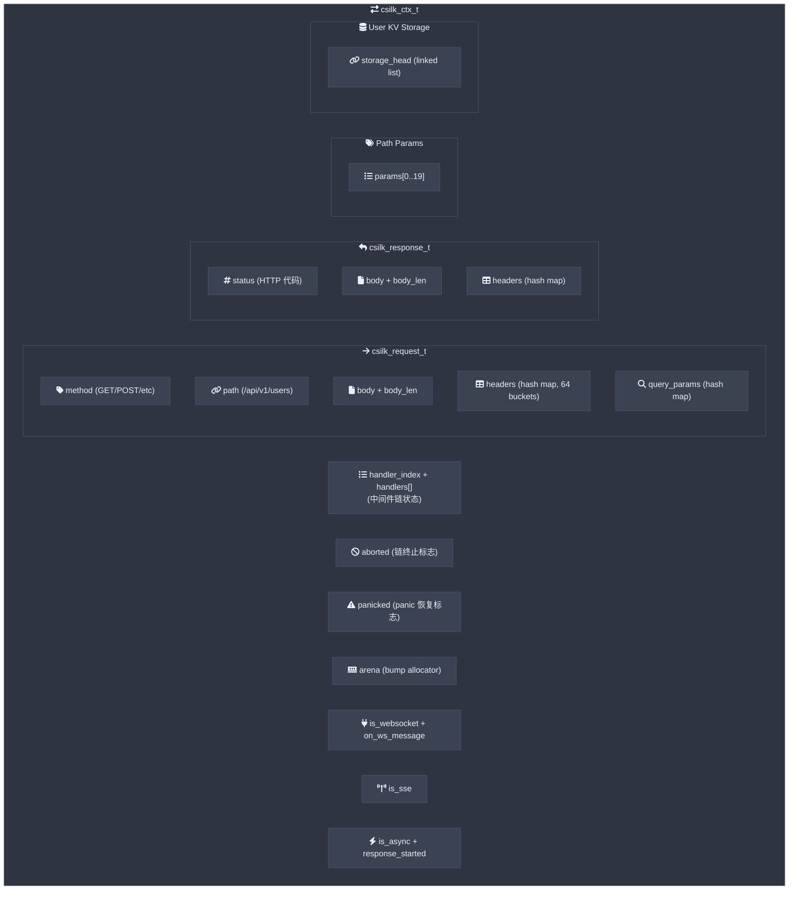
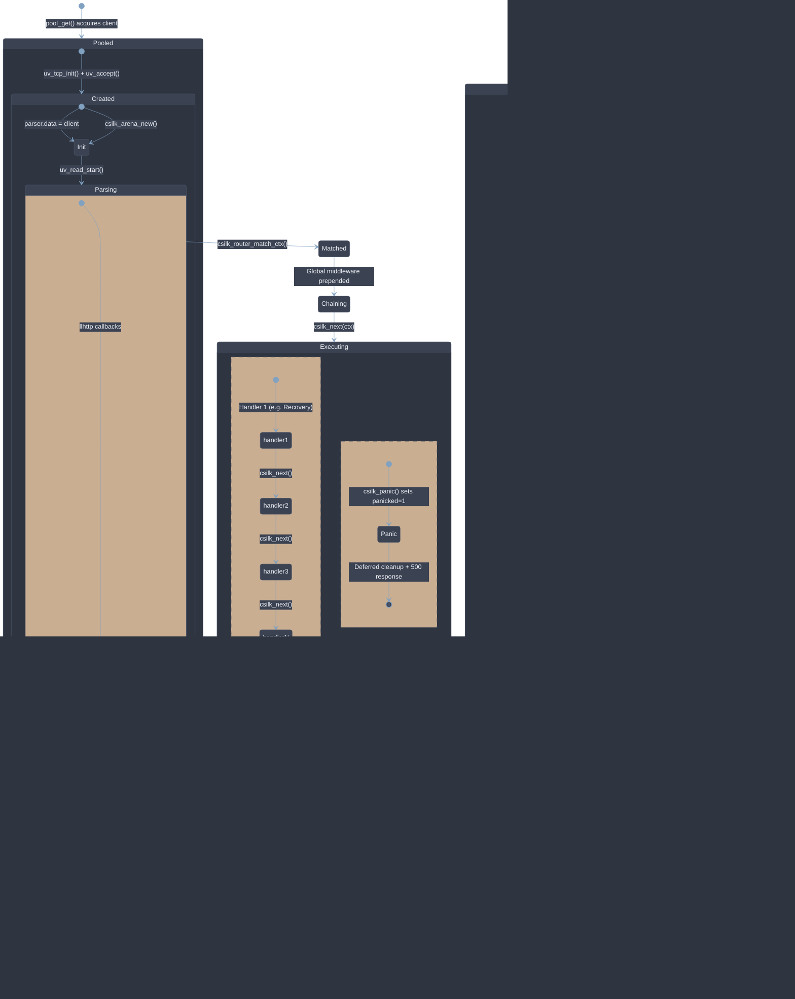
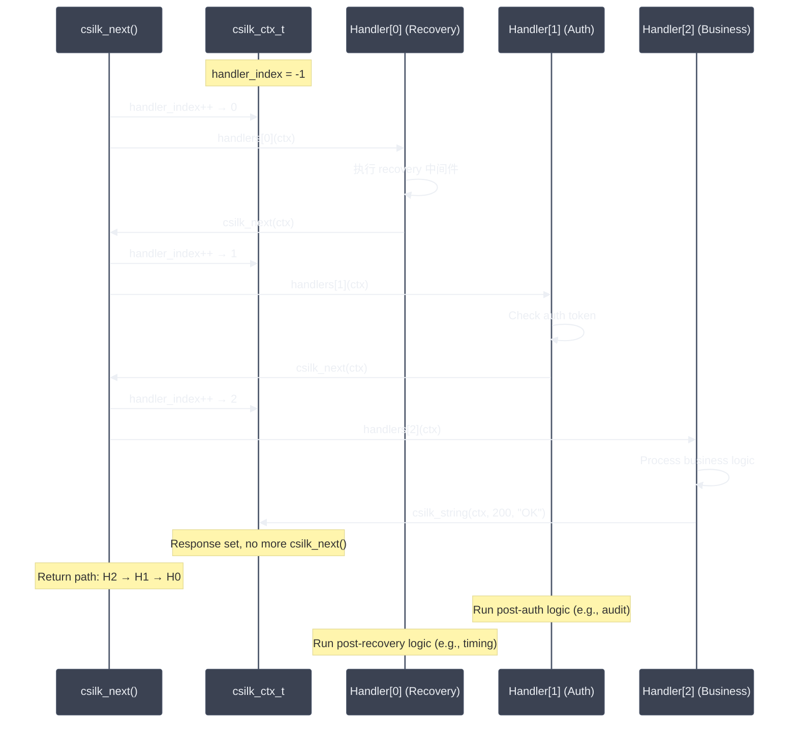
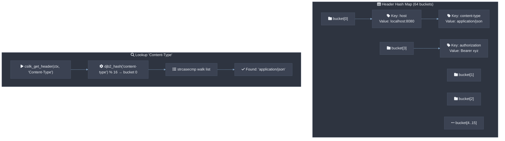

# 上下文设计

`csilk_ctx_t` (请求上下文) 是 csilk 的核心对象。它承载请求状态、响应缓冲区、处理器链、WebSocket 回调和 Arena 分配器贯穿整个请求生命周期。所有 HTTP 头使用 **零拷贝** `csilk_str_view_t` 引用原始接收缓冲区 — 无需每个头的 `malloc`。上下文在 keep-alive 请求之间通过 arena 指针重置在 O(1) 内完成。用户 **MUST NOT** 在请求之间持有 `csilk_str_view_t` 指针；数据 **SHOULD** 通过 `csilk_arena_strdup()` 复制到堆中（如果需要超出当前请求生命周期）。

## 上下文结构


```mermaid
%%{init: {
  'theme': 'base',
  'themeVariables': {
    'background': '#2E3440',
    'primaryColor': '#81A1C1',
    'primaryBorderColor': '#4C566A',
    'primaryTextColor': '#ECEFF4',
    'secondaryColor': '#3B4252',
    'secondaryBorderColor': '#434C5E',
    'secondaryTextColor': '#D8DEE9',
    'lineColor': '#81A1C1',
    'textColor': '#ECEFF4',
    'mainBkg': '#3B4252',
    'nodeBorder': '#4C566A',
    'clusterBkg': '#2E3440',
    'clusterBorder': '#4C566A',
    'titleColor': '#ECEFF4',
    'edgeLabelBackground': '#3B4252',
    'nodeTextColor': '#ECEFF4'
  },
  'flowchart': {'htmlLabels': true, 'curve': 'basis'}
}}%%
flowchart TB
    subgraph ctx_t["fa:fa-exchange-alt csilk_ctx_t"]
        HW["fa:fa-list handler_index + handlers[]<br/>(中间件链状态)"]
        AB["fa:fa-ban aborted (链终止标志)"]
        PN["fa:fa-exclamation-triangle panicked (panic 恢复标志)"]

        subgraph Request["fa:fa-arrow-right csilk_request_t"]
            RM["fa:fa-tag method (GET/POST/etc)"]
            RP["fa:fa-link path (/api/v1/users)"]
            RB["fa:fa-file body + body_len"]
            RH["fa:fa-table headers (hash map, 64 buckets)"]
            RQ["fa:fa-search query_params (hash map)"]
        end

        subgraph Response["fa:fa-reply csilk_response_t"]
            RS["fa:fa-hashtag status (HTTP 代码)"]
            RBODY["fa:fa-file body + body_len"]
            RH2["fa:fa-table headers (hash map)"]
        end

        subgraph Params["fa:fa-tags Path Params"]
            P1["fa:fa-list params[0..19]"]
        end

        subgraph Storage["fa:fa-database User KV Storage"]
            ST["fa:fa-link storage_head (linked list)"]
        end

        AR["fa:fa-memory arena (bump allocator)"]
        WS["fa:fa-plug is_websocket + on_ws_message"]
        SE["fa:fa-broadcast-tower is_sse"]
        AS["fa:fa-bolt is_async + response_started"]
    end
```

## 上下文生命周期


```mermaid
%%{init: {
  'theme': 'base',
  'themeVariables': {
    'background': '#2E3440',
    'primaryColor': '#81A1C1',
    'primaryBorderColor': '#4C566A',
    'primaryTextColor': '#ECEFF4',
    'secondaryColor': '#3B4252',
    'secondaryBorderColor': '#434C5E',
    'secondaryTextColor': '#D8DEE9',
    'lineColor': '#81A1C1',
    'textColor': '#ECEFF4',
    'mainBkg': '#3B4252',
    'nodeBorder': '#4C566A',
    'clusterBkg': '#2E3440',
    'clusterBorder': '#4C566A',
    'titleColor': '#ECEFF4',
    'edgeLabelBackground': '#3B4252',
    'nodeTextColor': '#ECEFF4'
  }
}}%%
stateDiagram-v2
    [*] --> Pooled: pool_get() acquires client

    state Pooled {
        [*] --> Created: uv_tcp_init() + uv_accept()
    }

    state Created {
        [*] --> Init: csilk_arena_new()
        [*] --> Init: parser.data = client
        Init --> Parsing: uv_read_start()

        state Parsing {
            [*] --> Headers: llhttp callbacks
            Headers --> Body: on_body() called
            Body --> Complete: on_message_complete()
        }
    }

    Parsing --> Matched: csilk_router_match_ctx()
    Matched --> Chaining: Global middleware prepended
    Chaining --> Executing: csilk_next(ctx)

    state Executing {
        [*] --> handler1: Handler 1 (e.g. Recovery)
        handler1 --> handler2: csilk_next()
        handler2 --> handler3: csilk_next()
        handler3 --> handlerN: csilk_next()
        handlerN --> [*]
        --
        [*] --> Panic: csilk_panic() sets panicked=1
        Panic --> [*]: Deferred cleanup + 500 response
    }

    Executing --> Sending: Response body set OR aborted
    Sending --> Cleanup: _csilk_send_response()

    state Cleanup {
        [*] --> Defer: csilk_ctx_defer_free()
        Defer --> Storage: Storage 析构函数
        Storage --> BodyFree: 释放管理的 body
        BodyFree --> PathFree: 释放 path
        PathFree --> Buffers: 归还读缓冲区
        Buffers --> Arena: csilk_arena_reset()
        Arena --> Headers: 清除已使用的 header maps
        Headers --> Flags: 重置标志
        Flags --> [*]
    }

    Cleanup --> KeepAlive: Connection: keep-alive
    KeepAlive --> Parsing: Wait for next request

    Cleanup --> Closing: Connection: close
    Closing --> Freed: csilk_arena_free() + pool_put(client)
    Freed --> [*]
```

### 多线程安全

在多工作线程模式下（通过 `worker_threads > 1` 配置），csilk 使用每个工作线程的 **无锁连接对象池** (`pool_get`/`pool_put`) 避免互斥锁争用。每个工作线程拥有自己独立的池，消除了共享互斥池设计中存在的争用问题。

## 处理器链执行

处理器链使用简单的索引迭代器模式：


```mermaid
%%{init: {
  'theme': 'base',
  'themeVariables': {
    'background': '#2E3440',
    'primaryColor': '#81A1C1',
    'primaryBorderColor': '#4C566A',
    'primaryTextColor': '#ECEFF4',
    'secondaryColor': '#3B4252',
    'secondaryBorderColor': '#434C5E',
    'secondaryTextColor': '#D8DEE9',
    'lineColor': '#81A1C1',
    'textColor': '#ECEFF4',
    'mainBkg': '#3B4252',
    'nodeBorder': '#4C566A',
    'clusterBkg': '#2E3440',
    'clusterBorder': '#4C566A',
    'titleColor': '#ECEFF4',
    'edgeLabelBackground': '#3B4252',
    'nodeTextColor': '#ECEFF4'
  }
}}%%
sequenceDiagram
    participant S as csilk_next()
    participant C as csilk_ctx_t
    participant H0 as Handler[0] (Recovery)
    participant H1 as Handler[1] (Auth)
    participant H2 as Handler[2] (Business)

    Note over C: handler_index = -1

    S->>C: handler_index++ → 0
    S->>H0: handlers[0](ctx)

    H0->>H0: 执行 recovery 中间件
    H0->>S: csilk_next(ctx)

    S->>C: handler_index++ → 1
    S->>H1: handlers[1](ctx)

    H1->>H1: Check auth token
    H1->>S: csilk_next(ctx)

    S->>C: handler_index++ → 2
    S->>H2: handlers[2](ctx)

    H2->>H2: Process business logic
    H2->>C: csilk_string(ctx, 200, "OK")

    Note over C: Response set, no more csilk_next()

    Note over S: Return path: H2 → H1 → H0
    Note over H1: Run post-auth logic (e.g., audit)
    Note over H0: Run post-recovery logic (e.g., timing)
```

## 头哈希表

头使用不区分大小写的 DJB2 哈希表 (16 个固定桶) 和链表：


```mermaid
%%{init: {
  'theme': 'base',
  'themeVariables': {
    'background': '#2E3440',
    'primaryColor': '#81A1C1',
    'primaryBorderColor': '#4C566A',
    'primaryTextColor': '#ECEFF4',
    'secondaryColor': '#3B4252',
    'secondaryBorderColor': '#434C5E',
    'secondaryTextColor': '#D8DEE9',
    'lineColor': '#81A1C1',
    'textColor': '#ECEFF4',
    'mainBkg': '#3B4252',
    'nodeBorder': '#4C566A',
    'clusterBkg': '#2E3440',
    'clusterBorder': '#4C566A',
    'titleColor': '#ECEFF4',
    'edgeLabelBackground': '#3B4252',
    'nodeTextColor': '#ECEFF4'
  },
  'flowchart': {'htmlLabels': true, 'curve': 'basis'}
}}%%
graph TB
    subgraph header_map["fa:fa-table Header Hash Map (64 buckets)"]
        B0["fa:fa-folder bucket[0]"] --> H1["fa:fa-tag Key: host<br/>Value: localhost:8080"]
        H1 --> H2["fa:fa-tag Key: content-type<br/>Value: application/json"]
        B1["fa:fa-folder bucket[1]"]
        B2["fa:fa-folder bucket[2]"]
        B3["fa:fa-folder bucket[3]"] --> H3["fa:fa-tag Key: authorization<br/>Value: Bearer xyz"]
        B4["fa:fa-ellipsis-h bucket[4..15]"]
    end

    subgraph lookup["fa:fa-search Lookup 'Content-Type'"]
        IN["fa:fa-play csilk_get_header(ctx, 'Content-Type')"]
        IN --> HASH["fa:fa-cog djb2_hash('content-type') % 16 → bucket 0"]
        HASH --> SCAN["fa:fa-list strcasecmp walk list"]
        SCAN --> MATCH["fa:fa-check Found: 'application/json'"]
    end
```

## 零拷贝字符串视图与所有权语义

csilk 提供双重访问接口以兼顾极限性能与生命周期安全性：

```c
typedef struct {
    const char* data; /**< 指向解析/网络缓冲区的借用指针 */
    size_t      len;  /**< 字节长度（不保证以 NUL 结尾） */
} csilk_view_t;
```

| 查询作用域 | 零拷贝借用视图 (Zero-Copy View) | 独立所有权字符串 (NUL-Terminated) |
|-----------|--------------------------------|----------------------------------|
| **查询参数** | `csilk_get_query_view(c, "key")` | `csilk_get_query(c, "key")` |
| **路径参数** | `csilk_get_param_view(c, "id")`  | `csilk_get_param(c, "id")`  |
| **请求头部** | `csilk_get_header_view(c, "Host")` | `csilk_get_header(c, "Host")` |
| **请求体**   | `csilk_get_body_view(c)` | `csilk_get_body(c)` |

> [!IMPORTANT]
> `csilk_view_t` 直接引用底层网络接收缓冲区，零拷贝、零内存分配开销。其生命周期仅在当前请求处理器执行期间有效。若需在上下文重置后持久化持有，请使用标准 `csilk_get_*()` 函数或通过 `csilk_arena_strndup()` 复制到 Arena 中。

## 统一所有权模型 (`csilk_ownership_t`)

为避免模糊的所有权隐式传递（如隐式 `int managed` 标志），csilk 建立了统一的显式内存所有权模型：

```c
typedef enum {
    CSILK_OWN_BORROWED = 0, /**< 借用语义，调用方持有内存；框架不负责释放也不执行拷贝 */
    CSILK_OWN_ARENA    = 1, /**< Arena 托管，在请求结束重置 Arena 时自动批量释放 */
    CSILK_OWN_HEAP     = 2, /**< 堆分配内存 (malloc)，在上下文清理时由框架调用 free() 释放 */
    CSILK_OWN_TRANSFER = 3, /**< 所有权转移，转交给接收方，生命周期结束时自动安全释放 */
    CSILK_OWN_SHARED   = 4  /**< 共享/驱动托管引用，通过自定义析构器或引用计数管理 */
} csilk_ownership_t;
```

### 响应体所有权 API

```c
// 显式指定所有权设置响应体
csilk_set_response_body_ex(c, data, len, CSILK_OWN_HEAP);

// 查询响应体当前所有权模型
csilk_ownership_t own = csilk_get_response_body_ownership(c);
```

## 自定义存储析构器 (RAII)

对于存放在 `csilk_ctx_t` 中的堆分配对象（例如 cJSON 结构体、数据库连接或第三方句柄），`csilk_set_ex()` 允许注册自动析构函数，在请求结束时由框架自动回收：

```c
typedef void (*csilk_destructor_t)(void* value);

// 存储堆对象并绑定自动析构器
cJSON* payload = jwt_verify_internal(...);
csilk_set_ex(c, "jwt_payload", payload, (csilk_destructor_t)csilk_json_free);
```


## 出站流式传输与背压流控

流式写入接口（`csilk_response_write()`、`csilk_sse_send()`、`csilk_ws_send()`）内置连接级出站队列水位线流控：

```c
// 配置连接水位线（默认值：高水位 64KB，低水位 16KB，最大缓冲 16MB）
csilk_set_write_watermarks(c, 128 * 1024, 32 * 1024, 32 * 1024 * 1024);

// 写入数据并检测背压状态
int status = csilk_response_write(c, data, len);
if (status == 0) {
    // 超过高水位线 — 暂停生产者输出
    csilk_on_drain(c, on_stream_drain, producer_state);
} else if (status < 0) {
    // 队列溢出（超过 max_write_buffer_size）或套接字异常
}
```

## 响应生成流程


```mermaid
%%{init: {
  'theme': 'base',
  'themeVariables': {
    'background': '#2E3440',
    'primaryColor': '#81A1C1',
    'primaryBorderColor': '#4C566A',
    'primaryTextColor': '#ECEFF4',
    'secondaryColor': '#3B4252',
    'secondaryBorderColor': '#434C5E',
    'secondaryTextColor': '#D8DEE9',
    'lineColor': '#81A1C1',
    'textColor': '#ECEFF4',
    'mainBkg': '#3B4252',
    'nodeBorder': '#4C566A',
    'clusterBkg': '#2E3440',
    'clusterBorder': '#4C566A',
    'titleColor': '#ECEFF4',
    'edgeLabelBackground': '#3B4252',
    'nodeTextColor': '#ECEFF4'
  },
  'flowchart': {'htmlLabels': true, 'curve': 'basis'}
}}%%
flowchart TB
    subgraph sync_resp["fa:fa-bolt 同步响应"]
        SYNC_H["fa:fa-play Handler 调用 csilk_string/json/redirect"] --> SYNC_SET["fa:fa-cog ctx->response.status = 200\nctx->response.body = 'OK'"]
        SYNC_SET --> SYNC_RET["fa:fa-undo Handler 返回（无需调用 csilk_next）"]
        SYNC_RET --> SYNC_SEND["fa:fa-reply _csilk_send_response(ctx)\n序列化 HTTP 响应行+头部+体\ncsilk_io_write() 写入套接字"]
    end

    subgraph async_resp["fa:fa-cloud 异步 / 流式响应"]
        ASYNC_H["fa:fa-play Handler 设置 ctx->is_async = 1"] --> ASYNC_RET["fa:fa-undo 归还控制权给事件循环"]
        ASYNC_RET --> ASYNC_WAIT["fa:fa-hourglass 稍后: csilk_response_write()"]
        ASYNC_WAIT --> ASYNC_SEND["fa:fa-file send_chunked_headers() (首次调用)\nwrite_chunk_frame() (分块帧)\ncsilk_response_end() (终止分块)"]
    end

    subgraph ws_resp["fa:fa-plug WebSocket 响应"]
        WS_H["fa:fa-play Handler 调用 csilk_ws_handshake()"] --> WS_101["fa:fa-random 101 Switching Protocols\nctx->is_websocket = 1"]
        WS_101 --> WS_READ["fa:fa-sync-alt csilk_io_read_start() 持续监听\n解析器切换为 csilk_ws_parse_frame()"]
    end
```

## 上下文清理

### 常规清理

在 keep-alive 请求之间 (`csilk_ctx_cleanup`)，高效重置状态：

1. **延迟回调 (LIFO)** — `csilk_ctx_defer_free()` 执行所有注册的清理函数。
2. **Storage 析构函数** — 执行 `csilk_set_ex()` 注册的自定义析构函数和驱动清理。
3. **零拷贝文件响应** — 如果打开了 `file_fd` 则关闭，重置 `file_offset` 和 `file_size`。
4. **请求体** — 仅在 managed 时释放（`CSILK_OWN_HEAP`、`CSILK_OWN_TRANSFER` 或 `body_is_managed`）。尺寸类缓存的缓冲区归还到 TLS 池。
5. **响应体** — 相同的拥有权逻辑；同时重置 `status = 0`。
6. **路径** — 始终释放（`csilk_split_url` malloc'd）。
7. **读缓冲区** — 将池支持的缓冲区归还到工作线程本地池；释放其他缓冲区。将数组指针重置为嵌入式存储。
8. **Arena 重置** — `csilk_arena_reset()` 以 O(1) 回收所有请求范围的分配（headers、params、query/form、storage items、defer nodes）。
9. **Header maps** — 仅对本题请求中写入的 maps 进行 `memset()` 清零（通过 `used` 标志跟踪）。
10. **Handler 链** — 重置 `handler_index = -1`、`handlers = NULL`、`handler_count = 0`、`current_handler = NULL`。
11. **流控** — 重置 `aborted`、`panicked`、`is_websocket`、`is_sse`、`is_async`、`response_started`、`write_paused`、`on_drain`、`on_drain_data`、`on_ws_message`、`on_ws_send`。
12. **请求 ID** — 仅在本请求中设置时清除。

### 延迟清理 (Panic-Safe)

延迟清理 API (`csilk_ctx_defer` / `csilk_ctx_defer_free`) 防止 panic 恢复期间的资源泄漏。当处理器通过 `csilk_panic()` 触发 panic 时，上下文被标记为 `panicked = 1` 和 `aborted = 1`，然后延迟回调立即按 LIFO 顺序执行。这确保处理器持有的堆分配、打开的文件描述符和互斥锁在 recovery 中间件发送 500 响应之前被释放：

```c
char* buf = malloc(1024);
csilk_ctx_defer(c, free, buf);                 // free(buf) 在清理或 panic 时调用
csilk_ctx_defer(c, (void(*)(void*))close, &fd);// close(fd) 在清理或 panic 时调用
csilk_ctx_defer(c, (void(*)(void*))csilk_mutex_unlock, &mutex); // unlock 在清理或 panic 时调用
```


项在 arena 中分配并随 arena 重置自动释放。回调由 `csilk_ctx_cleanup` 和 panic 恢复路径自动调用。