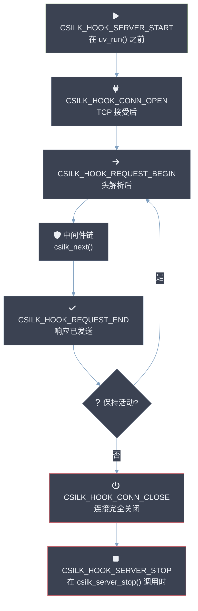

# 钩子系统设计

csilk 提供了一个灵活的钩子系统，允许开发人员监听服务器和请求生命周期事件。与中间件不同，钩子不拦截请求流程，但允许进行副作用，如指标收集、自定义日志记录或资源清理。钩子 **MUST** 在调用 `csilk_server_run()` 之前注册 — 运行时钩子注册 **SHOULD** 限于事件通知。钩子回调 **MUST NOT** 阻塞 — 任何 I/O 或繁重计算 **MUST** 延迟到 libuv 线程池。钩子执行顺序 **SHOULD** 在同一优先级内匹配注册顺序。

## 生命周期



## 钩子类型

| 枚举值 | 触发点 | 回调类型 |
|--------|--------|----------|
| `CSILK_HOOK_SERVER_START` | 在 `uv_run()` 之前 | `csilk_server_hook_handler_t` |
| `CSILK_HOOK_SERVER_STOP` | 调用 `csilk_server_stop()` 时 | `csilk_server_hook_handler_t` |
| `CSILK_HOOK_CONN_OPEN` | TCP 连接接受后 | `csilk_ctx_hook_handler_t` |
| `CSILK_HOOK_CONN_CLOSE` | 连接完全关闭时 | `csilk_ctx_hook_handler_t` |
| `CSILK_HOOK_REQUEST_BEGIN` | HTTP 请求头解析后 | `csilk_ctx_hook_handler_t` |
| `CSILK_HOOK_REQUEST_END` | 响应发送到客户端后 | `csilk_ctx_hook_handler_t` |

## 使用示例

### 1. 连接监控

```c
void on_connect(csilk_ctx_t* c) {
    CSILK_LOG_I("新连接来自 IP: %s", csilk_get_client_ip(c));
}

void on_disconnect(csilk_ctx_t* c) {
    CSILK_LOG_I("客户端断开连接");
}

int main() {
    // ... 初始化服务器 ...
    csilk_server_add_hook(server, CSILK_HOOK_CONN_OPEN, on_connect);
    csilk_server_add_hook(server, CSILK_HOOK_CONN_CLOSE, on_disconnect);
    // ... 运行服务器 ...
}
```

### 2. 请求计时

```c
void on_req_end(csilk_ctx_t* c) {
    const char* req_id = csilk_get_request_id(c);
    int status = csilk_get_status(c);
    CSILK_LOG_I("请求 %s 以状态 %d 完成", req_id, status);
}

int main() {
    // ...
    csilk_server_add_hook(server, CSILK_HOOK_REQUEST_END, on_req_end);
}
```

## 实现细节

钩子存储在 `csilk_server_t` 结构中作为链表数组，每个钩子类型一个链表。这允许为同一事件注册多个处理器。

处理器按其注册顺序执行（FIFO）。

```c
typedef struct csilk_hook_node_s {
    void* handler;
    struct csilk_hook_node_s* next;
} csilk_hook_node_t;
```