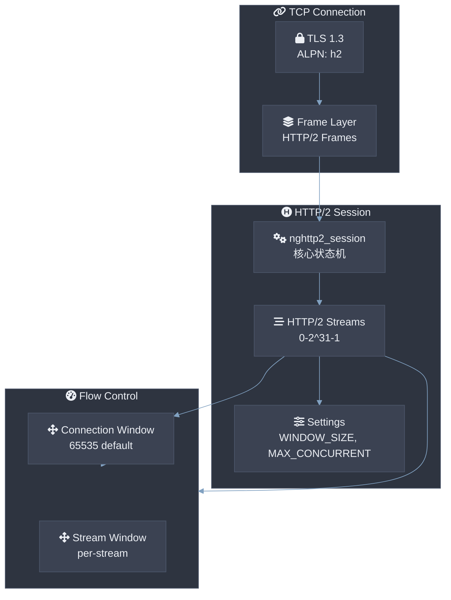
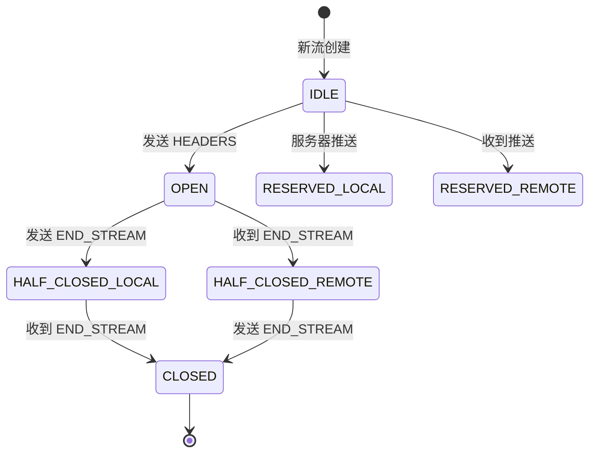

# HTTP/2 协议栈深度解析

> **Version**: 0.5.2 | **Last updated**: 2026-08-22

csilk 通过 nghttp2 库实现 HTTP/2 支持，提供多路复用、服务器推送和二进制分帧。本文档深入解析 HTTP/2 会话管理、流控制和优先级调度。

---

## 1. HTTP/2 核心特性

| 特性 | 说明 |
|------|------|
| **多路复用** | 单个 TCP 连接上并发多个请求/响应 |
| **二进制分帧** | 所有消息以二进制帧传输 |
| **头部压缩** | HPACK 算法压缩请求/响应头 |
| **服务器推送** | 服务端主动推送资源给客户端 |
| **流优先级** | 请求流优先级调度 |
| **流量控制** | 连接级和流级背压 |

---

## 2. 架构概览



---

## 3. 会话管理

### 3.1 会话与流映射结构 (csilk_h2_stream_map_t)

```c
#define CSILK_H2_INLINE_BUCKETS 16
#define CSILK_H2_STREAM_POOL_MAX 64

/**
 * @brief HTTP/2 自适应流哈希映射表与 Context 回收池
 */
typedef struct csilk_h2_stream_map_s {
    csilk_ctx_t** buckets;  /**< 活跃 Bucket 数组指针 (指向内嵌或堆分配数组) */
    uint32_t      capacity; /**< 总 Bucket 容量 (2 的整数次幂) */
    uint32_t      mask;     /**< 快速按位与掩码 (capacity - 1) */
    uint32_t      count;    /**< 当前活跃流数量 */
    csilk_ctx_t*  inline_buckets[CSILK_H2_INLINE_BUCKETS]; /**< 快速路径内嵌 16 槽位 */
    csilk_ctx_t*  free_list;  /**< 空闲已重置的 Context 单向回收链表 */
    uint32_t      pool_count; /**< 当前连接池内缓存 Context 数量 */
    uint32_t      pool_max;   /**< 连接池允许缓存的最大 Context 上限 (默认 64) */
} csilk_h2_stream_map_t;
```

HTTP/2 流上下文（`csilk_ctx_t`）直接内联在 Client 的 `h2_stream_map` 中，每个流拥有独立的 Arena，在流关闭时重置并回收到 `free_list`，避免频繁调用 `malloc`/`free`。

### 3.2 会话创建

```c
static int session_on_frame_recv(nghttp2_session* session, 
                                  const nghttp2_frame* frame, 
                                  void* user_data);
static int session_on_stream_close(nghttp2_session* session,
                                    int32_t stream_id,
                                    uint32_t error_code,
                                    void* user_data);

csilk_h2_session_t* csilk_h2_session_new(csilk_client_t* client) {
    csilk_h2_session_t* h2 = calloc(1, sizeof(csilk_h2_session_t));
    
    // 初始化 nghttp2 会话
    nghttp2_session_callbacks* callbacks;
    nghttp2_session_callbacks_new(&callbacks);
    
    nghttp2_session_callbacks_set_frame_recv_callback(callbacks, session_on_frame_recv);
    nghttp2_session_callbacks_set_on_stream_close_callback(callbacks, session_on_stream_close);
    
    nghttp2_session_client_new(&h2->session, callbacks, h2);
    nghttp2_session_callbacks_del(callbacks);
    
    // 默认设置
    h2->max_concurrent_streams = 100;
    h2->window_size = NGHTTP2_INITIAL_WINDOW_SIZE;
    h2->next_stream_id = 1;
    
    return h2;
}
```

---

## 4. 帧处理

### 4.1 帧类型

```c
// HTTP/2 帧类型
typedef enum {
    H2_FRAME_DATA = 0,           // 请求/响应体
    H2_FRAME_HEADERS = 1,        // 头部块
    H2_FRAME_PRIORITY = 2,       // 优先级
    H2_FRAME_RST_STREAM = 3,     // 流重置
    H2_FRAME_SETTINGS = 4,       // 设置
    H2_FRAME_PUSH_PROMISE = 5,   // 服务器推送
    H2_FRAMEPing = 6,            // 心跳
    H2_FRAME_GOAWAY = 7,         // 优雅关闭
    H2_FRAME_WINDOW_UPDATE = 8,  // 流量控制
    H2_FRAME_CONTINUATION = 9    // 头部连续
} h2_frame_type_t;
```

### 4.2 帧接收回调

```c
static int session_on_frame_recv(nghttp2_session* session,
                                  const nghttp2_frame* frame,
                                  void* user_data) {
    csilk_h2_session_t* h2 = (csilk_h2_session_t*)user_data;
    
    switch (frame->type) {
        case NGHTTP2_FRAME_HEADERS:
            // 处理请求头
            return h2_handle_headers(h2, frame);
            
        case NGHTTP2_FRAME_DATA:
            // 处理请求体
            return h2_handle_data(h2, frame);
            
        case NGHTTP2_FRAME_SETTINGS:
            // 处理设置
            return h2_handle_settings(h2, frame);
            
        case NGHTTP2_FRAME_WINDOW_UPDATE:
            // 流量控制更新
            return h2_handle_window_update(h2, frame);
            
        case NGHTTP2_FRAME_RST_STREAM:
            // 流重置
            return h2_handle_rst_stream(h2, frame);
            
        default:
            return 0;
    }
}
```

### 4.3 头部处理

```c
static int h2_on_header(const nghttp2_frame* frame,
                        const nghttp2_http_header* header,
                        void* user_data) {
    csilk_h2_session_t* h2 = user_data;
    csilk_h2_stream_t* stream = h2_get_stream(h2, frame->headers.stream_id);
    
    if (!stream) {
        stream = h2_create_stream(h2, frame->headers.stream_id);
    }
    
    // 解码头部到 ctx
    const uint8_t* value = nghttp2_buf_base(&header->value);
    size_t nvlen = nghttp2_buf_len(&header->value);
    
    if (header->name.base[0] == ':') {
        // 伪头部
        if (memcmp(header->name.base, ":method", 7) == 0) {
            csilk_set_method(stream->ctx, (const char*)value, nvlen);
        } else if (memcmp(header->name.base, ":path", 5) == 0) {
            csilk_set_path(stream->ctx, (const char*)value, nvlen);
        }
    } else {
        // 普通头部
        csilk_set_request_header(stream->ctx,
                                  (const char*)header->name.base,
                                  header->name.len,
                                  (const char*)value,
                                  nvlen);
    }
    
    return 0;
}
```

---

## 5. 流管理

### 5.1 流生命周期



### 5.2 流创建与销毁

```c
static csilk_h2_stream_t* h2_create_stream(csilk_h2_session_t* h2, int32_t stream_id) {
    csilk_h2_stream_t* stream = calloc(1, sizeof(csilk_h2_stream_t));
    stream->stream_id = stream_id;
    stream->state = H2_STREAM_OPEN;
    
    // 创建请求上下文
    stream->ctx = csilk_ctx_new(h2->client);
    
    // 添加到流表
    if (h2->stream_count >= h2->stream_capacity) {
        h2->stream_capacity *= 2;
        h2->streams = realloc(h2->streams, 
                              h2->stream_capacity * sizeof(csilk_h2_stream_t*));
    }
    h2->streams[h2->stream_count++] = stream;
    
    return stream;
}

static void h2_close_stream(csilk_h2_session_t* h2, csilk_h2_stream_t* stream,
                            uint32_t error_code) {
    if (!stream) return;
    
    stream->state = H2_STREAM_CLOSED;
    
    // 清理上下文
    if (stream->ctx) {
        csilk_ctx_cleanup(stream->ctx);
        csilk_ctx_free(stream->ctx);
    }
    
    // 从数组移除
    for (uint32_t i = 0; i < h2->stream_count; i++) {
        if (h2->streams[i] == stream) {
            h2->streams[i] = h2->streams[--h2->stream_count];
            break;
        }
    }
    
    free(stream);
}
```

---

## 6. 流量控制

### 6.1 窗口管理

```c
// 默认初始窗口: 65535 bytes
#define H2_DEFAULT_WINDOW_SIZE 65535
#define H2_MAX_WINDOW_SIZE     0x7FFFFFFF  // 2^31 - 1

typedef struct {
    int32_t connection_window;    // 连接级窗口
    int32_t stream_window;        // 流级窗口
    uint32_t default_window_size; // 默认值
} h2_flow_control_t;
```

### 6.2 窗口更新处理

```c
static int h2_handle_window_update(csilk_h2_session_t* h2, 
                                    const nghttp2_frame* frame) {
    uint32_t increment = frame->window_update.window_size_increment;
    
    if (frame->window_update.stream_id == 0) {
        // 连接级窗口更新
        h2->connection_window += increment;
    } else {
        // 流级窗口更新
        csilk_h2_stream_t* stream = h2_get_stream(h2, frame->window_update.stream_id);
        if (stream) {
            stream->window_size += increment;
        }
    }
    
    // 检查是否需要恢复发送
    if (h2->paused && h2->connection_window > 0) {
        h2->paused = false;
        h2_flush_output(h2);
    }
    
    return 0;
}
```

### 6.3 背压控制

```c
ssize_t h2_write_data(csilk_h2_session_t* h2, csilk_h2_stream_t* stream,
                      const uint8_t* data, size_t len) {
    // 检查流窗口
    if (len > (size_t)stream->window_size) {
        len = stream->window_size;
    }
    
    // 检查连接窗口
    if (len > (size_t)h2->connection_window) {
        len = h2->connection_window;
    }
    
    if (len == 0) {
        h2->paused = true;
        return 0;
    }
    
    // 发送 DATA 帧
    nghttp2_data_provider prd = {0};
    prd.source.ptr = (void*)data;
    prd.source.len = len;
    
    ssize_t ret = nghttp2_submit_data(h2->session, stream->stream_id, &prd);
    
    if (ret == 0) {
        stream->window_size -= len;
        h2->connection_window -= len;
        h2->pending_bytes += len;
    }
    
    return ret;
}
```

---

## 7. 服务器推送

```c
// 推送预承诺
static int h2_on_push_promise(nghttp2_session* session,
                               int32_t stream_id,
                               const nghttp2_http_header* request_headers,
                               size_t nrequest_headers,
                               void* user_data) {
    csilk_h2_session_t* h2 = user_data;
    
    // 创建推送流
    int32_t push_stream_id = nghttp2_session_get_remote_stream_id(session);
    csilk_h2_stream_t* push_stream = h2_create_stream(h2, push_stream_id);
    
    // 复制请求上下文
    push_stream->is_push = true;
    push_stream->parent_stream = h2_get_stream(h2, stream_id);
    
    // 解码推送请求头部
    for (size_t i = 0; i < nrequest_headers; i++) {
        // ... 处理头部
    }
    
    return 0;
}
```

---

## 8. 性能优化

### 8.1 头表优化

```c
// HPACK 静态头表 + 动态头表
// 默认动态表大小: 4096 bytes

static void h2_configure_header_table(csilk_h2_session_t* h2) {
    // 增大动态头表以提升压缩效率
    nghttp2_settings settings;
    nghttp2_session_get_settings(&settings, h2->session);
    
    settings.header_table_size = 16384;  // 16KB
    settings.enable_push = 1;
    settings.max_concurrent_streams = 100;
    settings.initial_window_size = 1048576;  // 1MB
    
    nghttp2_submit_settings(h2->session, NGHTTP2_FLAG_NONE, &settings);
}
```

### 8.2 并发控制

```c
// 限制并发流数，防止内存爆炸
#define H2_MAX_CONCURRENT_STREAMS_DEFAULT 100
#define H2_MAX_CONCURRENT_STREAMS_MAX    10000

static int h2_validate_max_concurrent(csilk_h2_session_t* h2, uint32_t max) {
    if (max > H2_MAX_CONCURRENT_STREAMS_MAX) {
        return NGHTTP2_ERR_INVALID_ARGUMENT;
    }
    h2->max_concurrent_streams = max;
    return 0;
}
```

---

## 9. 错误处理

### 9.1 错误码映射

| nghttp2 错误 | HTTP/2 错误 | 处理 |
|--------------|-------------|------|
| NGHTTP2_ERR_STREAM_CLOSED | INTERNAL_ERROR | 关闭流 |
| NGHTTP2_ERR_FLOW_CONTROL | FLOW_CONTROL_ERROR | 发送 RST_STREAM |
| NGHTTP2_ERR_ENHANCE_YOUR_CALM | ENHANCE_YOUR_CALM | 关闭连接 |
| NGHTTP2_ERR_REFUSED_STREAM | REFUSED_STREAM | 拒绝请求 |

### 9.2 流重置

```c
static void h2_reset_stream(csilk_h2_session_t* h2, int32_t stream_id,
                            uint32_t error_code) {
    nghttp2_submit_rst_stream(h2->session, stream_id, error_code);
    
    csilk_h2_stream_t* stream = h2_get_stream(h2, stream_id);
    if (stream) {
        h2_close_stream(h2, stream, error_code);
    }
}
```

---

## 10. 形式化生命周期验证与参考实现

HTTP/2 流多路复用通过 `tests/protocols/test_h2_stream_lifecycle.c` 进行严格形式化生命周期审计：
- **RST_STREAM 异步中途销毁**：验证重置流时立即移除路由上下文，排空中的写回调或异步任务安全失效。
- **GOAWAY 优雅排空**：验证拒绝新流建立的同时，活跃流全部正常完成并释放。
- **10,000 次流高频复用**：验证单连接内 10,000 个流在 `inline_buckets` 与 `free_list` 之间的快速回收复用，零内存泄漏。
- **连接断开级联清理**：连接关闭时 `csilk_h2_free_streams()` 级联排空所有活跃流并归还 Worker 连接池。

| 文件 | 作用 |
|------|------|
| `src/core/http/h2.c` | HTTP/2 入口、nghttp2 回调绑定与响应构建 |
| `src/core/http/h2.h` | `csilk_h2_stream_map_t` 声明与流操作接口 |
| `tests/protocols/test_h2_stream_lifecycle.c` | RST_STREAM / GOAWAY / 10K 流复用形式化审计测试 |
| `docs/design/http2.md` | 设计文档 |
