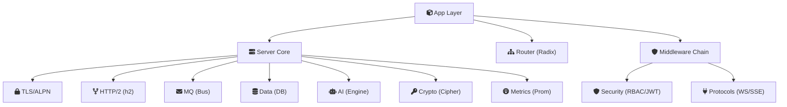

# 模块设计文档

csilk 核心子系统的深度架构文档。

## 核心引擎

| 文档 | 焦点 |
|------|------|
| [Server Core](server.md) | libuv（默认）/ io_uring（可选，仅 Linux）事件循环、TLS/ALPN、HTTP/2、工作线程池、优雅关闭 |
| [Router](router.md) | 基数树（Patricia trie）、SIMD 加速匹配、参数提取 |
| [Context](context.md) | 请求/响应生命周期、不透明 API、延迟清理 |
| [Arena](arena.md) | Bump 分配器、零拷贝头、SIMD 加速内存拷贝 |
| [Hooks](hooks.md) | 服务器/连接/请求生命周期钩子系统 |
| [Reflection](reflection.md) | 运行时类型自省、JSON 绑定 |

## 应用与中间件

| 文档 | 焦点 |
|------|------|
| [App Layer](app.md) | `csilk_app_t` 外观、启动序列、路由组匹配、管理后台、工作流引擎 |
| [Middleware](middleware.md) | 洋葱模型、链组装、16 个内置中间件模块 |

## 协议与消息

| 文档 | 焦点 |
|------|------|
| [Protocols](protocols.md) | WebSocket、SSE、Swagger UI、WebSocket Rooms |
| [Messaging](messaging.md) | 事件总线、发布/订阅、`uv_async_t` 分发、WAL 持久化 |

## 数据与 AI

| 文档 | 焦点 |
|------|------|
| [Data](data.md) | 数据库抽象、可插拔驱动、连接池、cJSON 结果 |
| [AI Engine](ai.md) | 统一聊天/嵌入、工具调用、流式传输 |
| [Workflow](workflow.md) | DAG 调度器、热重载、WAL 恢复、交互式节点 |
| [Drivers](drivers.md) | AI/Cipher/DB/Perm/Vector DB 可插拔驱动生命周期 |

## 安全与加密

| 文档 | 焦点 |
|------|------|
| [Security](security.md) | RBAC、JWT、CSRF、CORS、WAF、速率限制器 |
| [Crypto](crypto.md) | SHA-256、HMAC、UUID、随机数生成 |

## 可观测性

| 文档 | 焦点 |
|------|------|
| [Metrics](metrics.md) | Prometheus 导出、无锁计数器、延迟直方图 |

---

## 阅读指南

1. 从 **Server Core** 和 **Context** 开始了解基础。
2. 阅读 **Router** 和 **Middleware** 了解请求如何流动。
3. 根据您的重点领域选择更深入的文档（数据、AI、安全、协议）。

## 关系概览

另请参阅：[架构概览](../architecture.md)、[快速入门](../getting-started.md)。
