# Metrics / Prometheus 可观测性

> **版本**: 0.3.0 | **最后更新**: 2026-06-27

csilk 的 Metrics 模块提供了一套**高性能、无锁、生产就绪**的可观测性系统——基于 Prometheus 标准格式暴露全维度遥测数据，包括 HTTP 请求计数、延迟直方图、系统资源、安全事件及各子系统的内部状态。计数器更新为原子操作（无锁，≤ 10ns），直方图使用原子桶递增（≤ 5ns 每桶）。**MUST NOT** 在热点路径上阻塞 —— 所有指标写入均为 lock-free。**SHOULD** 通过 `/metrics` 端点暴露，由 Prometheus 定期拉取。

---

## 1. 整体架构

```mermaid
%%{init: {'theme': 'base', 'themeVariables': {'background': '#2E3440','primaryColor':'#81A1C1','primaryBorderColor':'#4C566A','primaryTextColor':'#ECEFF4','secondaryColor':'#3B4252','secondaryBorderColor':'#434C5E','secondaryTextColor':'#D8DEE9','lineColor':'#81A1C1','textColor':'#ECEFF4','mainBkg':'#3B4252','nodeBorder':'#4C566A','clusterBkg':'#2E3440','clusterBorder':'#4C566A','titleColor':'#ECEFF4','edgeLabelBackground':'#3B4252','nodeTextColor':'#ECEFF4'}, 'flowchart': {'htmlLabels': true, 'curve': 'basis'}}}%%
graph TB
    subgraph collection["fa:fa-dashboard 采集层"]
        MW["fa:fa-filter csilk_metrics_middleware<br/>Per-request hook"]
        TIMER["fa:fa-clock-o uv_hrtime()<br/>高精度计时器<br/>纳秒精度"]
        SEC["fa:fa-shield 安全子系统<br/>_csilk_metrics_inc_*"]
    end

    subgraph storage["fa:fa-database 存储层（无锁）"]
        GLOBAL["fa:fa-bar-chart 全局聚合<br/>_Atomic uint64_t<br/>http_requests_total<br/>http_request_duration_us"]
        SEC_CTR["fa:fa-exclamation-triangle 安全计数器<br/>_Atomic uint64_t<br/>rate_limit_blocks<br/>csrf_violations<br/>auth_failures"]
        DIM["fa:fa-th 维度指标<br/>固定大小哈希表<br/>开放寻址 + CAS<br/>method x route x status"]
        HIST["fa:fa-signal 直方图桶<br/>6 桶 + +Inf<br/>Per (method,route,status)"]
    end

    subgraph exposition["fa:fa-file-text 暴露层"]
        HANDLER["fa:fa-hand-o-right csilk_metrics_handler<br/>GET /metrics"]
        BUILDER["fa:fa-code 动态字符串构建器<br/>append_metric()<br/>realloc-based"]
        PROM["fa:fa-tachometer Prometheus 文本格式<br/>text/plain; version=0.0.4"]
    end

    subgraph telemetry["fa:fa-cogs 系统遥测源"]
        UV["fa:fa-server libuv<br/>uv_resident_set_memory<br/>uv_getrusage"]
        MQ["fa:fa-envelope 消息队列统计<br/>published/delivered/depth"]
        AI_ENG["fa:fa-robot AI 引擎统计<br/>requests/tokens/errors"]
        DB_ENG["fa:fa-database 数据库统计<br/>queries/execs/errors"]
        SRV["fa:fa-plug 服务器统计<br/>active/pooled connections"]
    end

    MW --> TIMER
    MW --> GLOBAL
    MW --> DIM
    DIM --> HIST
    SEC --> SEC_CTR

    HANDLER --> GLOBAL
    HANDLER --> DIM
    HANDLER --> HIST

    HANDLER --> PROM
    HANDLER --> SEC_CTR
    HANDLER --> UV
    HANDLER --> MQ
    HANDLER --> AI
    HANDLER --> DB
    HANDLER --> SRV
    HANDLER --> BUILDER --> PROM
```



### 指标分类

| 分类 | 指标名 | 类型 | 来源 |
|------|--------|------|------|
| HTTP 聚合 | `http_requests_total_agg` | Counter | 中间件 |
| HTTP 聚合 | `http_request_duration_microseconds_agg` | Counter | 中间件 |
| HTTP 维度 | `http_requests_total{method,status,route}` | Counter | 维度哈希表 |
| HTTP 维度 | `http_request_duration_seconds{_sum,_count,_bucket}` | Histogram | 维度哈希表 |
| 进程 | `process_resident_memory_bytes` | Gauge | `uv_resident_set_memory` |
| 进程 | `process_cpu_seconds_total{type}` | Counter | `uv_getrusage` |
| 安全 | `csilk_security_rate_limit_blocks_total` | Counter | 限流中间件 |
| 安全 | `csilk_security_csrf_violations_total` | Counter | CSRF 中间件 |
| 安全 | `csilk_security_auth_failures_total` | Counter | 认证中间件 |
| 服务器 | `csilk_server_active_connections` | Gauge | 连接池 |
| 服务器 | `csilk_server_pooled_connections` | Gauge | Worker 池 |
| MQ | `csilk_mq_messages_total{action}` | Counter | 消息队列 |
| MQ | `csilk_mq_queue_depth` | Gauge | 消息队列 |
| AI | `csilk_ai_requests_total` | Counter | AI 引擎 |
| AI | `csilk_ai_tokens_total` | Counter | AI 引擎 |
| AI | `csilk_ai_errors_total` | Counter | AI 引擎 |
| DB | `csilk_db_operations_total{type}` | Counter | 数据库层 |
| DB | `csilk_db_errors_total` | Counter | 数据库层 |

---

## 2. 核心数据结构

### 2.1 全局原子计数器

```c
static _Atomic uint64_t http_requests_total = 0;
static _Atomic uint64_t http_request_duration_microseconds = 0;
```

- **无锁** —— 所有 worker 线程通过 `atomic_fetch_add` 并发写入
- **聚合值** —— 不区分方法、路由、状态码，提供最快的累加路径

### 2.2 安全原子计数器

```c
static _Atomic uint64_t security_rate_limit_blocks = 0;
static _Atomic uint64_t security_csrf_violations = 0;
static _Atomic uint64_t security_auth_failures = 0;
```

- 由各安全中间件（限流、CSRF、认证）在拒绝请求时自增
- 通过 `csilk_security_get_stats()` 原子读取快照

### 2.3 维度指标哈希表

```c
typedef struct {
    char method[12];                              // HTTP 方法
    char route[128];                              // 路由模式（如 /users/:id）
    int status;                                   // HTTP 状态码
    _Atomic uint64_t count;                       // 请求计数
    _Atomic uint64_t duration_us;                 // 累计耗时（μs）
    _Atomic uint64_t buckets[BUCKET_COUNT + 1];   // 直方图桶计数（含 +Inf）
    _Atomic int in_use;                           // CAS 占领标志
} csilk_route_metric_t;

static csilk_route_metric_t route_metrics[MAX_ENTRIES];
```

**关键设计点**：
- 固定大小的静态数组（零堆分配，请求处理路径无 `malloc`）
- 开放寻址哈希表 + 线性探测
- `atomic_compare_exchange_strong` 锁式占领空槽位
- djb2 哈希算法
- 表满时静默丢弃新维度组合（log warning）

### 2.4 直方图桶

```c
static const double CSILK_METRICS_BUCKETS[BUCKET_COUNT] = {
    0.01, 0.05, 0.1, 0.5, 1.0, 5.0};
```

- 6 个 `le` 桶 + 1 个 `+Inf` 桶
- 覆盖 10ms 到 5s 的范围
- 多级桶分类逻辑在中间件中：
  若 `duration_sec <= buckets[i]`，则 `buckets[0..i]` 均自增
  这使得每个桶是**累计计数**（Prometheus histogram 的惯用做法）

---

## 3. 收集流程

### 3.1 HTTP 指标中间件

```c
void csilk_metrics_middleware(csilk_ctx_t* c, const char* arg) {
    uint64_t start = uv_hrtime();    // 纳秒级计时起点
    csilk_next(c);                    // 执行后续中间件 + 处理器
    uint64_t duration_ns = uv_hrtime() - start;

    // 1. 聚合计数器：最快路径
    atomic_fetch_add(&http_requests_total, 1);
    atomic_fetch_add(&http_request_duration_microseconds, duration_ns / 1000);

    // 2. 维度指标：方法、路由模式、状态码
    const char* method = csilk_get_method(c);
    const char* route = csilk_ctx_get_handler_path(c); // 静态路由模式
    int status = csilk_get_status(c);

    // 3. 哈希表找（或创建）槽位
    csilk_route_metric_t* slot = get_metric_slot(method, route, status);
    if (slot) {
        atomic_fetch_add(&slot->count, 1);
        atomic_fetch_add(&slot->duration_us, duration_us);

        // 4. 直方图桶更新（累计式）
        for (int i = 0; i < BUCKET_COUNT; i++) {
            if (duration_sec <= CSILK_METRICS_BUCKETS[i])
                atomic_fetch_add(&slot->buckets[i], 1);
        }
        atomic_fetch_add(&slot->buckets[BUCKET_COUNT], 1); // +Inf
    }
}
```

**性能数据**：整条路径无锁（仅原子操作），无堆分配。在 `csilk_next()` 之前完成，不阻塞响应路径。

### 3.2 安全指标

安全计数器由各个中间件在拒绝条件触发时自增，无需额外的收集基础设施：

- `_csilk_metrics_inc_rate_limit_blocks()` — 限流中间件
- `_csilk_metrics_inc_csrf_violations()` — CSRF 中间件
- `_csilk_metrics_inc_auth_failures()` — 认证中间件

---

## 4. 暴露端点

### 4.1 `/metrics` Handler

`csilk_metrics_handler` 是注册到路由树的 HTTP 处理器，通过 `GET /metrics` 访问。

渲染流程：

```
1. 聚合计数器          → http_requests_total_agg
                       → http_request_duration_microseconds_agg

2. 维度指标            → http_requests_total{method,status,route}
  （遍历哈希表，仅输出   → http_request_duration_seconds_sum{...}
   in_use == 1 的槽位） → http_request_duration_seconds_count{...}
                       → http_request_duration_seconds_bucket{le="0.01",...}
                       → http_request_duration_seconds_bucket{le="+Inf",...}

3. 进程遥测            → process_resident_memory_bytes
                       → process_cpu_seconds_total{type="user"}
                       → process_cpu_seconds_total{type="sys"}

4. 安全统计            → csilk_security_*_total

5. 服务器连接统计       → csilk_server_active_connections
                       → csilk_server_pooled_connections

6. MQ / AI / DB 统计   → csilk_mq_*（仅当 > 0）
  （条件输出，避免       → csilk_ai_*（仅当 > 0）
   零值噪声）           → csilk_db_*（仅当 > 0）
```

**响应格式**：`text/plain; version=0.0.4`（Prometheus 标准文本格式）

**动态字符串构建**：`append_metric()` 函数处理动态 buffer 增长（从 4KB 开始，按需 2 倍扩容），输出通过 `csilk_set_response_body(c, buf, offset, 1)` 交给框架——`body_is_managed = 1` 确保框架在响应发送后自动 `free(buf)`。

---

## 5. 系统遥测数据源

| 数据 | API 调用 | 说明 |
|------|----------|------|
| RSS 内存 | `uv_resident_set_memory(&rss_bytes)` | libuv 跨平台接口 |
| CPU 时间 | `uv_getrusage(&usage)` | 返回用户态/内核态 CPU 秒数 |
| 连接数 | `csilk_server_get_stats(server, &active, &pooled)` | 当前活跃连接 + 池化连接 |
| MQ 状态 | `csilk_mq_get_stats(mq, &mq_stats)` | 发布数、投递数、队列深度 |
| AI 统计 | `csilk_ai_get_stats(&ai_stats)` | 请求数、token 数、错误数 |
| DB 统计 | `csilk_db_get_stats(&db_stats)` | 查询数、执行数、错误数 |

---

## 6. 并发模型

| 组件 | 机制 | 说明 |
|------|------|------|
| 全局计数器 | `atomic_fetch_add` | 所有 worker 线程安全累加 |
| 安全计数器 | `atomic_fetch_add` | 中间件安全自增 |
| 哈希表占领 | `atomic_compare_exchange_strong` | CAS 实现无锁槽位分配 |
| 哈希表更新 | `atomic_fetch_add` | 槽位内的原子字段更新 |
| 读快照 | `atomic_load` | handler 读取所有计数器快照 |
| 输出构建 | 顺序执行 | /metrics handler 在单线程事件循环上运行 |

**为什么不需要 mutex？**
- 所有热点路径（请求计数器、维度槽位更新）使用 C11 `stdatomic.h` 原子操作
- 哈希表占领使用 CAS，避免了显式锁
- 读操作（`/metrics` scrape）和写操作（请求路径）可以并发进行，快照的不一致性对监控来说是允许的

---

## 7. 注册到 App

在完整应用中使用时，通过 `csilk_app_use` 注册 metrics 中间件并将 `/metrics` 路由添加到 app：

```c
csilk_app_t* app = csilk_app_new("config.yaml");

// 注册 Prometheus metrics 中间件（全局，衡量所有请求）
csilk_app_use(app, csilk_metrics_middleware);

// 注册 /metrics 端点
csilk_app_get(app, "/metrics", csilk_metrics_handler);

csilk_app_run(app, 8080);
```

---

## 8. 相关文件

| 文件 | 角色 |
|------|------|
| `src/middleware/metrics.c` | 核心实现（579 行）——计数器、哈希表、中间件、handler |
| `src/core/admin.c` | Admin dashboard（读取 metrics 做实时可视化） |
| `src/drivers/perm/perm.c` | 权限驱动（安全计数器） |
| `src/drivers/db/db.c` | DB 统计收集 |
| `src/ai/ai.c` | AI 统计收集 |
| `src/messaging/mq.c` | MQ 统计收集 |
| `src/core/server.c` | 服务器连接统计 |
| `docs/module-design/messaging.md` | MQ 设计文档 |
| `docs/module-design/ai.md` | AI 引擎设计文档 |
| `docs/module-design/data.md` | 数据库抽象层设计文档 |

---

## 9. 设计权衡

### 为什么是固定大小哈希表而不是动态 map？

- **零分配保证**：请求处理路径禁止堆分配（`malloc` 失败意味着丢请求）。静态数组保证槽位始终可用
- **无 GC 压力**：不需要清理过期条目——条目累积是 Prometheus counter 的预期行为
- **可预测性能**：线性探测 + 固定大小意味着最坏情况延迟是确定的

### 为什么使用 Prometheus 文本格式而非 JSON？

- Prometheus 是业界标准的 Metrics 暴露协议，Grafana 原生支持
- JSON 格式需要额外的解析器（cJSON），在 `/metrics` 重负载下产生更多分配
- 文本格式可以直接被 Prometheus server 抓取，无需中间转换

### 为什么系统指标是条件输出（只在 > 0 时显示）？

- 避免 Prometheus scrape 产生大量零值噪声
- 大多数子系统（MQ、AI、DB）在未使用时没有有意义的值
- 降低 `/metrics` 响应体积

### 为什么延迟直方图使用 Cumulative（累计）桶而非 Counter（独立）桶？

- Prometheus histogram 规范要求累计桶（每个桶包含所有更低桶的计数 + 自己的计数）
- 累计桶可以计算分位数（P50/P95/P99）和 `histogram_quantile` 函数
- 实现简单：`if (d <= buckets[i]) buckets[i]++` 自然满足累计语义

### 为什么不支持自定义 label 维度？

- 固定 schema (`method × route × status`) 是 Web 框架最通用的指标粒度
- 自定义 label 需要动态字符串键和更复杂的存储结构，与零分配原则冲突
- 有更细粒度需求时可以通过 prometheus_client 库或 sidecar exporter 扩展
