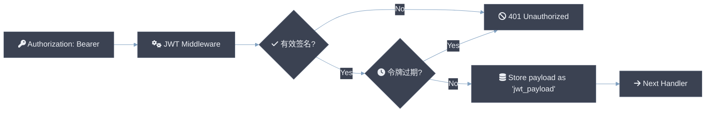

# 中间件设计概览

csilk 提供 15 个内置中间件处理器，涵盖认证、安全、可观测性、性能和开发者体验 — 所有都具有 **每个请求约 0 个分配**（热路径上的头通过零拷贝字符串视图解析到每个请求的 arena）。中间件 **MUST NOT** 阻塞事件循环；长时间运行的操作 **SHOULD** 使用延迟工作 API 或 offload 到工作线程。每个中间件 **MAY** 通过不透明 API (`csilk_get`/`csilk_set`/`csilk_string`) 访问和修改请求上下文。下表列出了通过 `csilk/middleware.h` 暴露的所有中间件处理器：

| 中间件 | 文件 | 说明 |
|-----------|------|-------------|
| Recovery | `src/core/primitives/recovery.c` | 通过 setjmp/longjmp 的崩溃恢复 |
| Logger | `src/middleware/logger.c` | 结构化请求日志记录 |
| Auth | `src/middleware/auth.c` | 基于令牌的认证 |
| CORS | `src/middleware/cors.c` | 跨域资源共享 |
| CSRF | `src/middleware/csrf.c` | 跨站请求伪造保护 |
| RateLimit | `src/middleware/ratelimit.c` | 滑动窗口速率限制 |
| Static | `src/middleware/static.c` | 静态文件服务，支持 Range |
| Gzip | `src/middleware/gzip.c` | 响应压缩 |
| SSE | `src/middleware/sse.c` | 服务器发送事件 |
| Multipart | `src/middleware/multipart.c` | 文件上传解析 |
| JWT | `src/middleware/jwt.c` | JSON Web Token 认证 (HS256) |
| Metrics | `src/middleware/metrics.c` | Prometheus 指标 |
| RequestID | `src/middleware/request_id.c` | UUID v4 请求追踪 |
| Session | `src/middleware/session.c` | 基于 Cookie 的会话管理 |
| Validate | `src/middleware/validate.c` | 请求参数验证 |
| WAF | `src/middleware/waf.c` | Web 应用程序防火墙 (SQLi, XSS, 路径遍历) |

---

# JWT 中间件设计

JWT (JSON Web Token) 中间件为 csilk 提供了一种安全的方式来处理无状态认证。它遵循 HS256 (HMAC with SHA-256) 签名算法。

## 特性

- **HS256 支持**: 使用框架的内部高性能 HMAC-SHA256 实现。
- **Base64URL 编码**: 遵循 RFC 4648 进行 URL 安全令牌传输。
- **过期验证**: 自动检查 `exp` 声明。
- **自动存储**: 成功验证后将载荷 JSON 存储在上下文存储中，便于轻松访问。

## 架构



## API 参考

### 1. 令牌生成

```c
char* csilk_jwt_generate(csilk_ctx_t* c, cJSON* payload, const char* secret);
```
- 生成已签名的 JWT 字符串。
- 调用者负责 `free()` 返回的字符串。

### 2. 令牌验证

```c
cJSON* csilk_jwt_verify(csilk_ctx_t* c, const char* token, const char* secret);
```
- 验证并解析令牌。
- 返回载荷的 `cJSON` 对象，如果验证失败返回 `NULL`。

### 3. 中间件使用

```c
void csilk_jwt_middleware(csilk_ctx_t* c, const char* secret);
```

## 集成示例

```c
#include "csilk/csilk.h"

// 1. 发放令牌（例如，在登录时）
void login_handler(csilk_ctx_t* c) {
    cJSON* payload = cJSON_CreateObject();
    cJSON_AddStringToObject(payload, "sub", "user_123");
    cJSON_AddNumberToObject(payload, "exp", (double)time(NULL) + 3600);

    char* token = csilk_jwt_generate(c, payload, "my_secret");
    
    cJSON* res = cJSON_CreateObject();
    cJSON_AddStringToObject(res, "token", token);
    csilk_json(c, 200, res);

    free(token);
    cJSON_Delete(payload);
}

// 2. 保护路由
int main() {
    // ...
    csilk_group_t* api = csilk_group_new(router, "/api");
    csilk_group_use(api, (csilk_handler_t)csilk_jwt_middleware, "my_secret");

    csilk_GET(api, "/me", profile_handler);
}
```

## 内部实现

JWT 中间件使用 **可插拔加密驱动**。默认情况下，它使用 `src/core/utils.c` 中的内置 HMAC-SHA256 实现。可以使用 `csilk_server_set_crypto_driver()` 将其替换为硬件加速或系统提供的库。