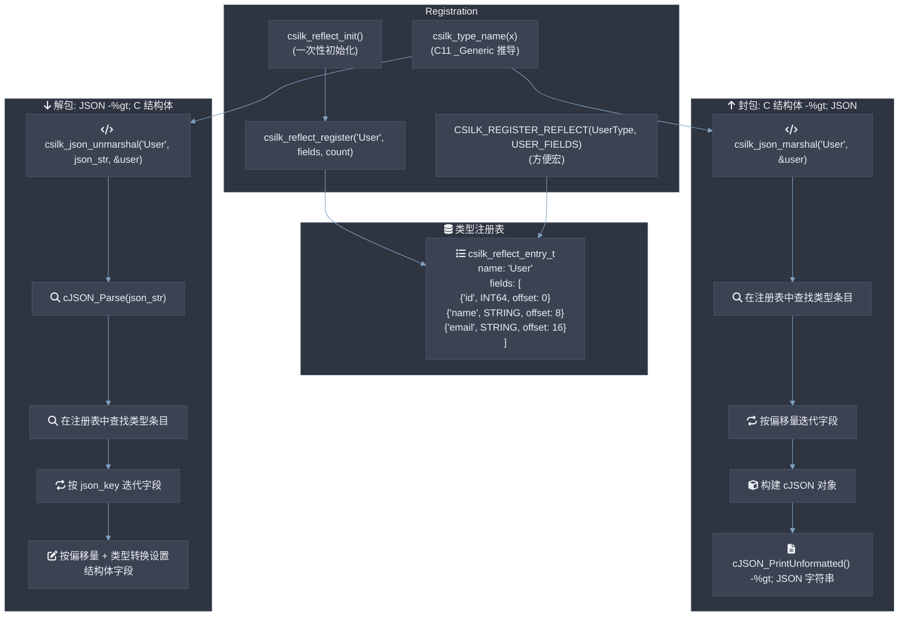
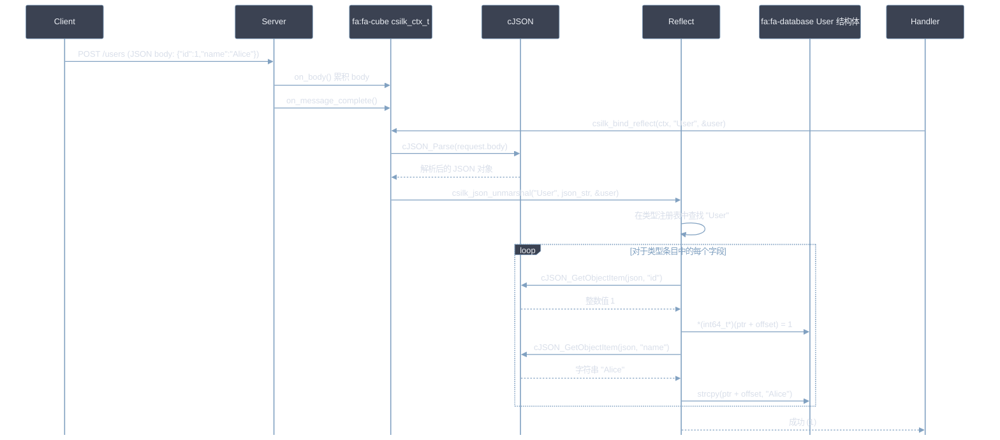
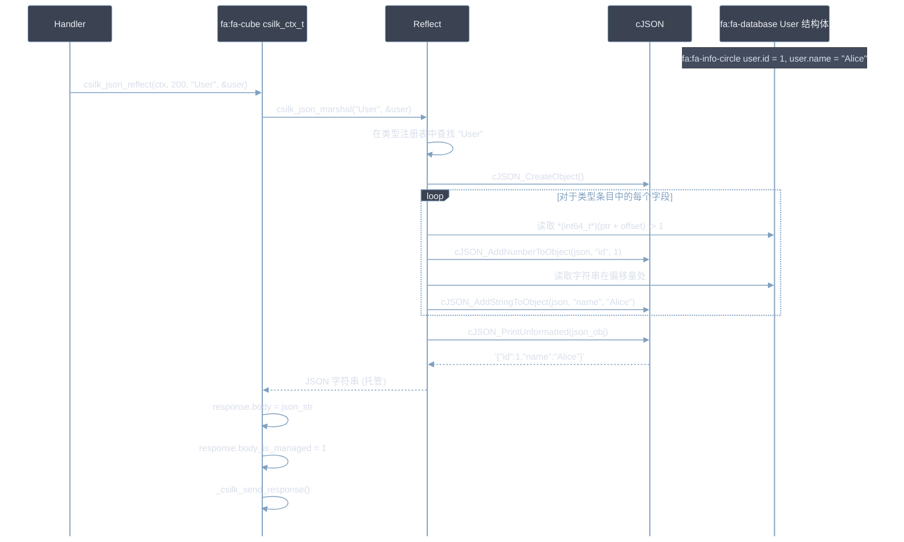
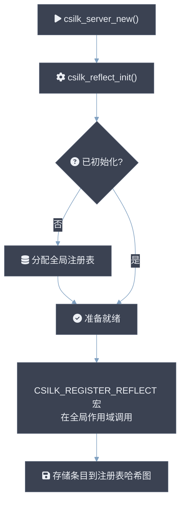

# 反射引擎

反射引擎连接 C 结构体和 JSON，实现自动序列化和反序列化，而无需手动编写 JSON 解析代码。所有注册的类型元数据 **MUST** 在注册后不可变。字段查找 **MUST** 在 O(n) 线性扫描内完成（n = 注册字段，通常 ≤ 32）。封包一个平面结构体（≤ 8 个字段） **SHOULD** 在 ≤ 200ns 内完成。JSON 绑定 **MUST NOT** 在提供的竞技场分配器之外调用 `malloc`。

## 架构



## 自动类型推导 (C11 _Generic)

Csilk 使用 C11 `_Generic` 在编译时自动确定类型名称字符串。这允许更简洁的 API：

```c
// 相反的写法:
csilk_json_marshal("User", &user);

// 您可以使用:
csilk_marshal(&user); // 宏推导出 "User"
```

### 支持的基本类型

以下类型由 `csilk_type_name` 和反射引擎原生支持：
- `bool`
- `int8`, `uint8`, `int16`, `uint16`, `int32`, `uint32`, `int64`, `uint64`
- `float`, `double`
- `string` (`char*` 或 `const char*`)

### 自定义类型映射

要启用用户定义结构体的自动推导，请在包含 `csilk.h` 之前扩展 `CSILK_USER_TYPE_MAP`：

```c
#undef CSILK_USER_TYPE_MAP
#define CSILK_USER_TYPE_MAP , struct User_s: "User"
#include "csilk/csilk.h"
```

---

## 顶层基本类型反射

引擎支持直接反射基本类型而无需包裹结构体：

```c
int count = 42;
char* json = csilk_marshal(&count); // 结果: "42"

bool active = true;
char* json_b = csilk_marshal(&active); // 结果: "true"

char* msg = "hello";
char* json_s = csilk_marshal(&msg); // 结果: "\"hello\""
```

---

## 数据流：JSON 绑定



---

## 数据流：通过反射的 JSON 响应



---

## 支持的字段类型

| 字段类型 | C 类型 | JSON 类型 |
|----------|--------|-----------|
| `CSILK_TYPE_INT8` | `int8_t` | Number |
| `CSILK_TYPE_INT16` | `int16_t` | Number |
| `CSILK_TYPE_INT32` | `int32_t` | Number |
| `CSILK_TYPE_INT64` | `int64_t` | Number |
| `CSILK_TYPE_FLOAT` | `float` | Number |
| `CSILK_TYPE_DOUBLE` | `double` | Number |
| `CSILK_TYPE_BOOL` | `bool` | Boolean |
| `CSILK_TYPE_STRING` | `char[N]` 或 `char*` | String |
| `CSILK_TYPE_STRUCT` | 嵌套结构体 | Object |

---

## 注册示例

```c
#include "csilk/csilk.h"

// 定义结构体
typedef struct {
    int64_t id;
    char name[64];
    char email[128];
    bool active;
} User;

// 定义字段描述宏
#define USER_FIELDS(_) \
    _(User, id, CSILK_TYPE_INT64, 0, 0, false, NULL) \
    _(User, name, CSILK_TYPE_STRING, 64, 0, false, NULL) \
    _(User, email, CSILK_TYPE_STRING, 128, 0, false, NULL) \
    _(User, active, CSILK_TYPE_BOOL, 0, 0, false, NULL)

// 注册类型（在启动时一次性完成）
CSILK_REGISTER_REFLECT(User, USER_FIELDS);
```

---

## 初始化流程



---

## 深度释放和循环引用检测

为了支持复杂的嵌套结构图，反射引擎包括用于安全深度内存清理和验证以防止循环结构的机制。

### 深度结构体释放 (`csilk_struct_free_reflect`)

当将 JSON 解包到嵌套结构中时，子结构和字符串的指针可能是动态分配的。标准顺序 `free()` 调用会错过这些嵌套的动态结构，导致内存泄漏。

`csilk_struct_free_reflect` 使用其元数据递归遍历注册的结构体字段：
- 检查字段是否是另一个注册结构体的指针（`CSILK_TYPE_STRUCT`）。
- 检查字段是否是字符串指针（`CSILK_TYPE_STRING`）。
- 递归释放子结构，然后释放父结构指针。
- 采用**最大递归深度限制**（当前为 `32`），防止在极其深的嵌套布局上发生栈溢出。

### 循环引用检测

如果两个结构相互引用（直接或通过循环间接），递归编组、解组或深度释放将导致无限递归和栈溢出。

Csilk 通过在类型注册期间执行**静态循环引用检测**（使用深度优先搜索循环查找算法）来防止此问题：
- 当新类型通过 `CSILK_REGISTER_REFLECT` 注册时，注册表构建类型依赖有向图。
- 如果检测到循环（例如 `A -> B -> A`），会记录编译时或启动警告/错误。
- 在运行时，编组/解组等 API 尊重递归限制以优雅地失败，而不是崩溃进程。