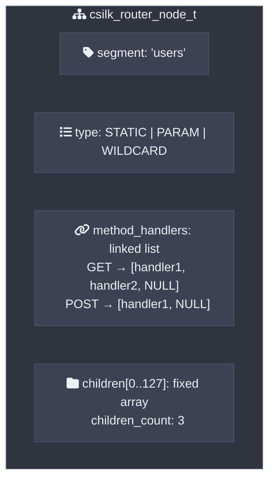
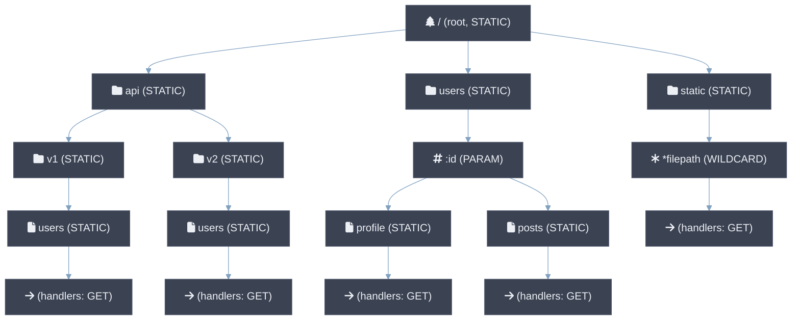
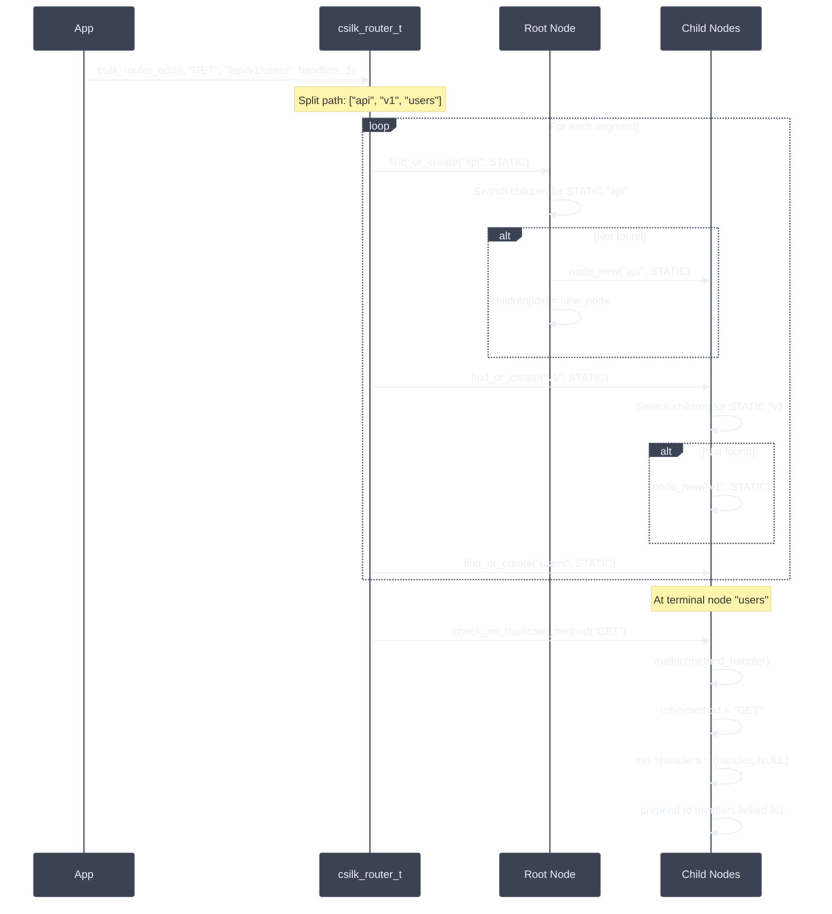
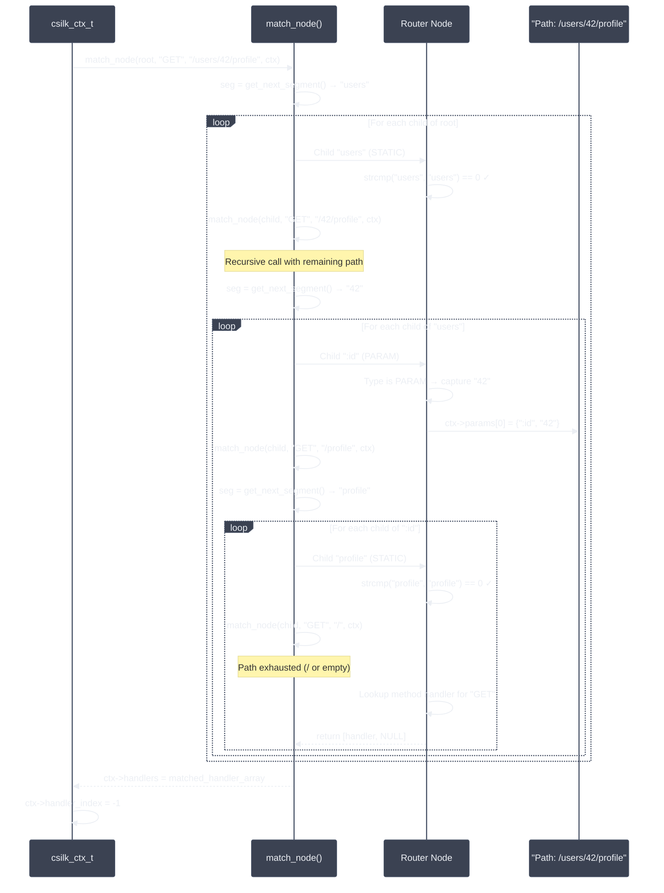
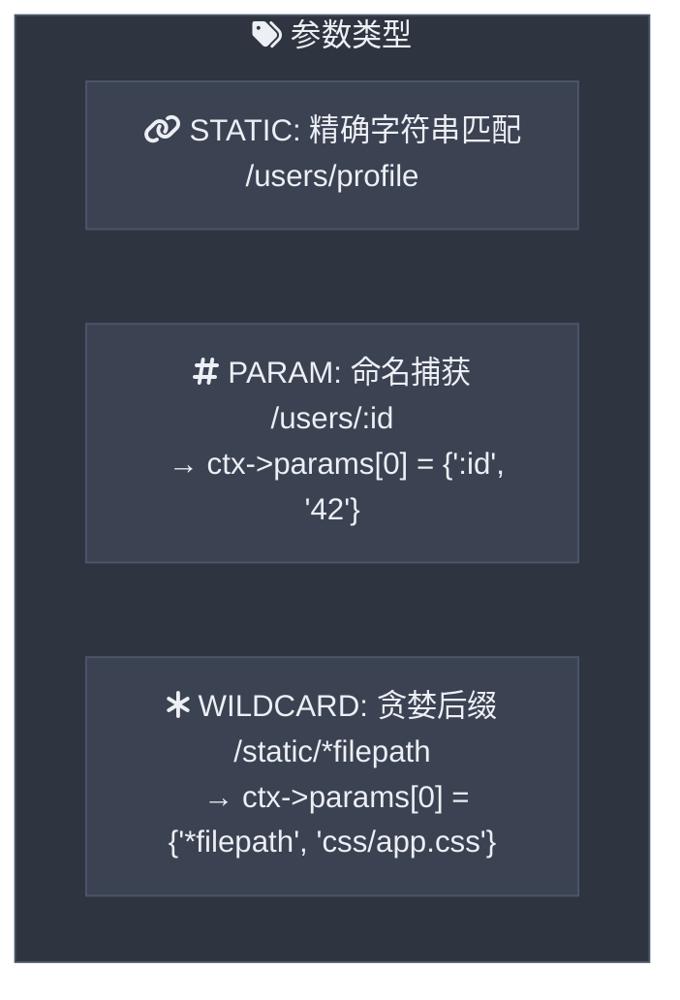

# 路由器设计

csilk 使用 **基数树** (紧凑前缀树) 进行高效路由匹配。路由器支持静态路由、命名参数 (`:param`) 和通配符 (`*wildcard`)。路径匹配 **SIMD 加速** 通过 AVX2 (x86_64) 和 ARM NEON (aarch64) 进行字节级前缀比较 — 在 AVX2 上每个查找约 50ns (P99 ≤ 100ns, 100K 路由)，在 NEON 上约 80ns。路由 **MUST** 在服务器启动前注册；路由器在请求处理期间为只读。通配符路由 **SHOULD** 最后注册以确保静态/参数路由优先。

## 节点结构

## 基数树可视化

## 路由注册流程

## 路由匹配流程

## 参数匹配

- **STATIC** 节点精确匹配路径段（区分大小写）。
- **PARAM** 节点匹配任何单个路径段并捕获值。匹配失败时支持回溯。
- **WILDCARD** 节点贪婪匹配剩余整个路径。路由遍历在通配符节点停止，检查处理器是否存在。

## 性能特征

| 操作 | 复杂度 | 说明 |
|-----------|-----------|-------|
| 路由插入 | O(L) | L = 路径段数 |
| 路由匹配 (最好) | O(S) | S = 段数，精确静态匹配 |
| 路由匹配 (最差) | O(N + P) | N = 静态子节点数，P = 参数分支 |
| 每路由内存 | O(S) | 每个路径段一个节点 |

固定大小的子节点数组 (`CSILK_MAX_CHILDREN = 128`) 为 CPU 缓存局部性而 traded 一些内存，确保快速线性扫描子节点。