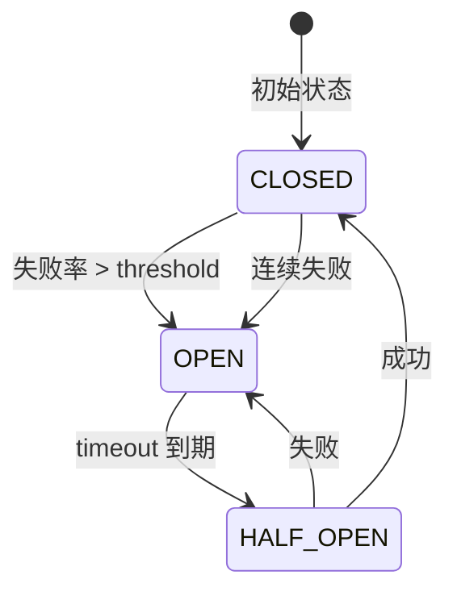
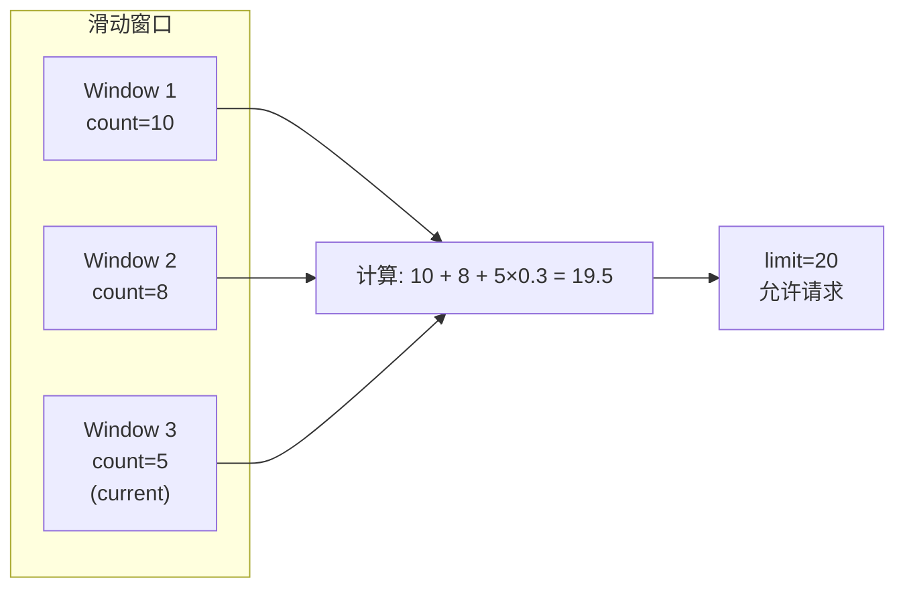
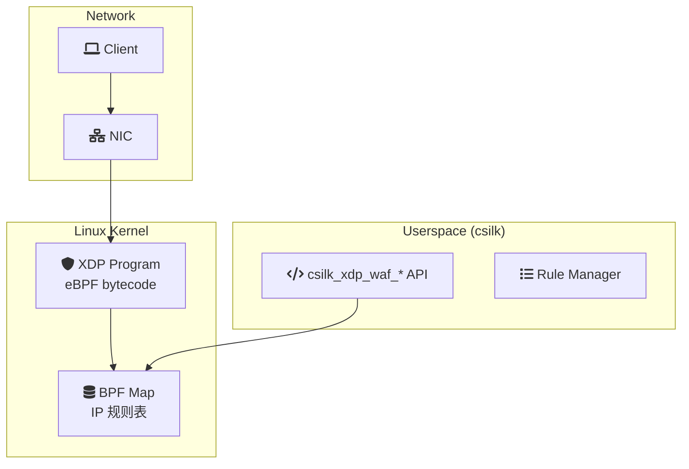

# 安全中间件深度解析

> **Version**: 0.5.2 | **Last updated**: 2026-08-22

本文档深入解析 csilk 的安全中间件实现：熔断器、限流器、WAF 和 eBPF XDP 防火墙。

---

## 1. 熔断器 (Circuit Breaker)

### 1.1 状态机



### 1.2 核心结构

```c
typedef struct csilk_circuit_breaker_s {
    // 状态
    cb_state_t state;              // CLOSED/OPEN/HALF_OPEN
    uint64_t last_failure_time;    // 上次失败时间
    
    // 计数器
    atomic_uint_fast64_t failures; // 连续失败数
    atomic_uint_fast64_t successes;// 半开成功数
    atomic_uint_fast64_t total;    // 总请求数
    
    // 配置
    uint32_t failure_threshold;    // 失败阈值
    uint32_t success_threshold;    // 半开成功阈值
    uint64_t timeout_ms;           // 打开超时
    
    // 滑动窗口
    csilk_sliding_window_t window; // 统计窗口
} csilk_circuit_breaker_t;
```

### 1.3 中间件实现

```c
int csilk_circuit_breaker_middleware(csilk_ctx_t* c) {
    csilk_circuit_breaker_t* cb = c->circuit_breaker;
    
    // 检查是否允许请求
    if (cb->state == OPEN) {
        if (now() - cb->last_failure_time < cb->timeout_ms) {
            csilk_string(c, 503, "Service Unavailable");
            return -1;  // 熔断中，拒绝请求
        }
        cb->state = HALF_OPEN;  // 尝试恢复
    }
    
    // 执行请求 (通过回调)
    int result = c->next(c);
    
    // 更新状态
    if (result >= 200 && result < 500) {
        atomic_fetch_add(&cb->successes, 1);
        if (cb->state == HALF_OPEN) {
            if (atomic_load(&cb->successes) >= cb->success_threshold) {
                cb->state = CLOSED;
                atomic_store(&cb->failures, 0);
            }
        }
    } else {
        atomic_fetch_add(&cb->failures, 1);
        cb->last_failure_time = now();
        if (atomic_load(&cb->failures) >= cb->failure_threshold) {
            cb->state = OPEN;
        }
    }
    
    return result;
}
```

---

## 2. 滑动窗口限流器

### 2.1 算法

采用 **加权计数器 + 滑动窗口** 组合：
- 时间窗口按固定大小切分
- 每个窗口记录请求计数
- 查询时加权计算当前窗口已过时间比例



### 2.2 数据结构

```c
typedef struct csilk_sliding_window_slot_s {
    uint64_t timestamp;    // 窗口开始时间
    uint64_t count;        // 窗口内请求数
} csilk_sliding_window_slot_t;

typedef struct csilk_sliding_limiter_s {
    csilk_sliding_window_slot_t* slots;  // 窗口数组
    uint32_t window_count;               // 窗口数量
    uint64_t window_size_ms;             // 单窗口大小
    uint64_t limit;                      // 请求限制
    uint64_t last_cleanup;               // 上次清理时间
} csilk_sliding_limiter_t;
```

### 2.3 核心逻辑

```c
bool csilk_sliding_rate_limit_check(csilk_sliding_limiter_t* lim) {
    uint64_t now = csilk_io_hrtime() / 1000000;
    
    // 清理过期窗口
    csilk_sliding_window_cleanup(lim, now);
    
    // 计算当前窗口已过时间比例
    uint64_t window_start = (now / lim->window_size_ms) * lim->window_size_ms;
    uint64_t elapsed = now - window_start;
    double ratio = (double)elapsed / lim->window_size_ms;
    
    // 加权计算
    uint64_t total = 0;
    for (uint32_t i = 0; i < lim->window_count - 1; i++) {
        total += lim->slots[i].count;
    }
    total += (uint64_t)(lim->slots[lim->window_count - 1].count * ratio);
    
    if (total >= lim->limit) {
        return false;  // 超限
    }
    
    // 增加计数
    lim->slots[lim->window_count - 1].count++;
    return true;
}
```

---

## 3. Web 应用防火墙 (WAF)

### 3.1 规则引擎

```c
typedef enum waf_rule_type_e {
    WAF_RULE_SQL_INJECTION,
    WAF_RULE_XSS,
    WAF_RULE_PATH_TRAVERSAL,
    WAF_RULE_COMMAND_INJECTION,
    WAF_RULE_FILE_INCLUDE,
    WAF_RULE_CUSTOM
} waf_rule_type_t;

typedef struct waf_rule_s {
    waf_rule_type_t type;
    const char* pattern;           // 正则表达式
    uint8_t action;                // DENY/ALLOW/MONITOR
    uint8_t flags;                 // 匹配标志
} waf_rule_t;

typedef struct csilk_waf_s {
    waf_rule_t* rules;
    uint32_t rule_count;
    uint8_t default_action;
} csilk_waf_t;
```

### 3.2 匹配逻辑

```c
int csilk_waf_middleware(csilk_ctx_t* c) {
    csilk_waf_t* waf = c->waf;
    const char* path = csilk_get_path(c);
    const char* body = csilk_get_body_str(c);
    
    // 检查路径
    for (uint32_t i = 0; i < waf->rule_count; i++) {
        if (regex_match(waf->rules[i].pattern, path)) {
            if (waf->rules[i].action == WAF_ACTION_DENY) {
                CSILK_LOG_W("WAF deny: %s matched rule %u", path, i);
                csilk_string(c, 403, "Forbidden");
                return -1;
            }
        }
    }
    
    // 检查请求体 (POST/PUT)
    if (body && strlen(body) > 0) {
        for (uint32_t i = 0; i < waf->rule_count; i++) {
            if (waf->rules[i].type == WAF_RULE_SQL_INJECTION ||
                waf->rules[i].type == WAF_RULE_XSS) {
                if (regex_match(waf->rules[i].pattern, body)) {
                    csilk_string(c, 403, "Forbidden");
                    return -1;
                }
            }
        }
    }
    
    return 0;
}
```

### 3.3 内置规则集

```c
// SQL 注入检测
static const waf_rule_t sql_injection_rules[] = {
    {"(?i)(union\\s+select|select.*from|insert\\s+into|update.*set|delete\\s+from)", WAF_ACTION_DENY},
    {"(--|;|\\bOR\\b\\s+1\\s*=\\s*1|\\bAND\\b\\s+1\\s*=\\s*1)", WAF_ACTION_DENY},
    {"(exec\\s+|execute\\s+|xp_|sp_)", WAF_ACTION_DENY}
};

// XSS 检测
static const waf_rule_t xss_rules[] = {
    {"<script[^>]*>", WAF_ACTION_DENY},
    {"javascript:", WAF_ACTION_DENY},
    {"on(error|load|click|mouseover)=", WAF_ACTION_DENY},
    {"<iframe[^>]*>", WAF_ACTION_DENY}
};

// 路径遍历
static const waf_rule_t path_traversal_rules[] = {
    {"\\.\\.[\\/]", WAF_ACTION_DENY},
    {"/etc/(passwd|shadow|hosts)", WAF_ACTION_DENY},
    {"(/proc|/sys|/dev/)", WAF_ACTION_DENY}
};
```

---

## 4. eBPF XDP 防火墙

### 4.1 架构



### 4.2 API 接口

```c
// 添加 IP 规则
int csilk_xdp_waf_add_ip_rule(
    const char* ip,           // IPv4 地址
    uint8_t action,           // ALLOW/DENY
    uint32_t timeout_seconds  // 临时封禁时间
);

// 删除 IP 规则
int csilk_xdp_waf_remove_ip_rule(const char* ip);

// 批量更新
int csilk_xdp_waf_batch_update(
    const xdp_rule_t* rules,
    uint32_t count
);

// 加载/卸载 eBPF 程序
int csilk_xdp_waf_load(const char* elf_path);
int csilk_xdp_waf_unload(void);
```

### 4.3 eBPF 程序结构

```c
// xdp_waf.c (编译为 BPF bytecode)
SEC("xdp")
int xdp_waf_prog(struct xdp_md *ctx) {
    void *data = (void *)(long)ctx->data;
    void *data_end = (void *)(long)ctx->data_end;
    
    // 解析 IP 头
    struct ethhdr *eth = data;
    if ((void *)(eth + 1) > data_end) return XDP_PASS;
    
    struct iphdr *ip = (struct iphdr *)(eth + 1);
    if (ip->protocol != IPPROTO_TCP) return XDP_PASS;
    
    // 查找源 IP
    uint32_t src_ip = ip->saddr;
    uint64_t *action = bpf_map_lookup_elem(&ip_rules_map, &src_ip);
    
    if (action) {
        return *action == XDP_DROP ? XDP_DROP : XDP_PASS;
    }
    
    return XDP_PASS;
}
```

---

## 5. 安全中间件配置

### 5.1 YAML 配置

```yaml
security:
  circuit_breaker:
    enabled: true
    failure_threshold: 5
    success_threshold: 3
    timeout_ms: 30000
  
  rate_limit:
    enabled: true
    limit: 100        # 每秒请求数
    window_ms: 1000
  
  waf:
    enabled: true
    default_action: deny
    rules:
      - type: sql_injection
        action: deny
      - type: xss
        action: deny
      - type: path_traversal
        action: deny
  
  xdp_waf:
    enabled: false      # 需要 root 权限
    program_path: /etc/csilk/xdp_waf.o
    default_action: allow
```

### 5.2 编程式配置

```c
// 创建熔断器
csilk_circuit_breaker_t* cb = csilk_circuit_breaker_new(
    5,   // failure_threshold
    3,   // success_threshold  
    30000 // timeout_ms
);

// 创建限流器
csilk_sliding_limiter_t* limiter = csilk_sliding_limiter_new(
    100,   // limit
    1000   // window_ms
);

// 创建 WAF
csilk_waf_t* waf = csilk_waf_new(WAF_ACTION_DENY);
csilk_waf_add_rule(waf, WAF_RULE_SQL_INJECTION, sql_patterns);
csilk_waf_add_rule(waf, WAF_RULE_XSS, xss_patterns);
```

---

## 6. 性能影响

| 中间件 | 额外开销 | 说明 |
|--------|----------|------|
| Circuit Breaker | ~100 ns | 原子操作 + 时间比较 |
| Sliding Limiter | ~500 ns | 窗口查找 + 加权计算 |
| WAF (正则) | ~1-10 μs | 取决于规则复杂度 |
| XDP WAF | < 1 μs | 内核态，零拷贝 |

---

## 7. 测试覆盖

```c
// tests/middleware/test_circuit_breaker.c
TEST_CASE("circuit_breaker_transitions") {
    csilk_circuit_breaker_t* cb = csilk_circuit_breaker_new(3, 2, 1000);
    
    // CLOSED → OPEN
    for (int i = 0; i < 3; i++) {
        csilk_circuit_breaker_record_failure(cb);
    }
    CHECK(cb->state == CB_STATE_OPEN);
    
    // OPEN → HALF_OPEN
    sleep(1);
    CHECK(csilk_circuit_breaker_allow_request(cb) == true);
    
    // HALF_OPEN → CLOSED
    csilk_circuit_breaker_record_success(cb);
    csilk_circuit_breaker_record_success(cb);
    CHECK(cb->state == CB_STATE_CLOSED);
}

// tests/middleware/test_waf.c
TEST_CASE("waf_sql_injection") {
    csilk_waf_t* waf = csilk_waf_new(WAF_ACTION_DENY);
    csilk_waf_add_standard_rules(waf);
    
    // 应被拒绝
    CHECK(csilk_waf_check_path(waf, "/api?id=1 OR 1=1") == false);
    CHECK(csilk_waf_check_body(waf, "SELECT * FROM users") == false);
    
    // 应通过
    CHECK(csilk_waf_check_path(waf, "/api/users/123") == true);
}
```

---

## 8. 参考文件

| 文件 | 作用 |
|------|------|
| `src/middleware/circuit_breaker.c` | 熔断器实现 |
| `src/middleware/ratelimit.c` | 固定窗口限流 |
| `src/middleware/sliding_ratelimit.c` | 滑动窗口限流 |
| `src/middleware/waf.c` | 正则 WAF |
| `src/middleware/xdp_waf.c` | eBPF XDP WAF |
