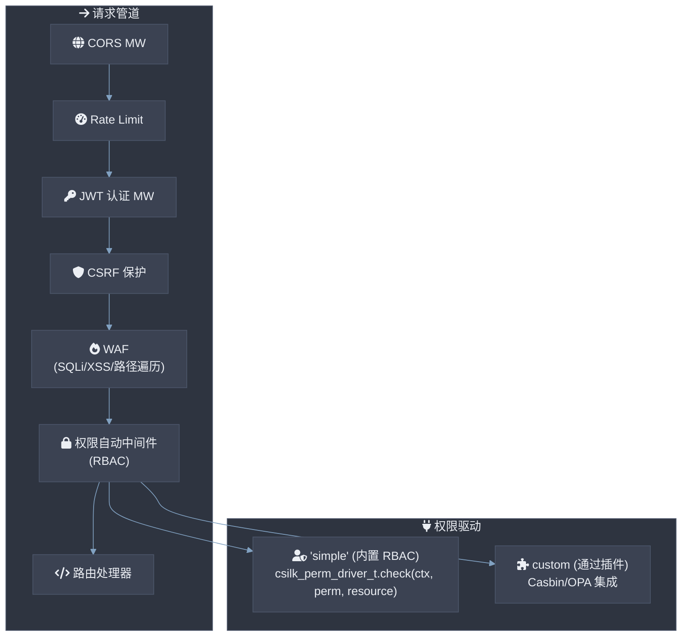

# 安全 / 权限模块

## 1. 概述

安全模块提供了一个 **分层安全架构**，跨越身份验证（JWT）、授权（可插拔权限/ACL 驱动）、请求验证（WAF、CSRF）以及传输级保护（CORS、速率限制）。每一层都实现为中间件，可以独立启用、配置或替换。安全中间件 **MUST** 按文档中所述的顺序进行评估：CORS → 速率限制器 → WAF → CSRF → JWT → 权限。速率限制器 **MUST** 使用滑动窗口计数器进行原子递增。JWT 验证 **MUST NOT** 在热路径（有效令牌）上分配。WAF 规则 **SHOULD** 编译为确定性有限自动机 (DFA)，以进行 O(n) 扫描（其中 n 为输入长度）。

**文件**: `src/drivers/perm/perm.c`, `src/middleware/jwt.c`, `src/middleware/waf.c`, `src/middleware/csrf.c`, `src/middleware/cors.c`, `include/csilk/drivers/perm.h`

---

## 2. 架构



### 关键设计决策

1. **可插拔权限驱动** — 授权层使用单个函数 vtable (`check(ctx, permission, resource)` → 0/≠0)。内置的 "simple" 驱动提供内存中的 RBAC；自定义驱动可以实现 Casbin、OPA 或任何其他策略引擎。

2. **路由级权限元数据** — 路由可以在注册时通过 `csilk_app_add_route_extended_perm()` 声明所需权限和资源。`csilk_perm_auto_middleware()` 读取此元数据并自动强制执行 — 无需每个路由的样板代码。

3. **JWT 驱动的身份** — JWT 中间件提取并验证 Bearer 令牌，将解码后的有效负载（包括 `role`）存储在请求上下文上，并为下游权限检查提供身份基础。

4. **分层而非单体** — 身份验证、授权、CSRF、WAF、CORS 和速率限制是单独的中间件模块，可以组合在处理器链中。每一层都可以独立启用、配置或省略。

---

## 3. 权限系统

### 3.1 驱动接口

```c
// include/csilk/drivers/perm.h
struct csilk_perm_driver_s {
    const char* name;
    int (*check)(csilk_ctx_t* c, const char* permission, const char* resource);
};
```

权限驱动是一个命名 vtable，具有单个 `check()` 回调。该回调接收请求上下文（身份）、所需权限和目标资源，并返回 0 表示允许，非零表示拒绝。

### 3.2 全局注册表

```c
static csilk_perm_driver_t* drivers[16];   // 固定大小注册表
static csilk_perm_driver_t* default_driver; // 活动驱动用于检查
static atomic_int perm_initialized;
```

| 函数 | 角色 |
|---|---|
| `csilk_perm_init()` | 原子 CAS-一次初始化 → 注册 "simple" 驱动 |
| `csilk_perm_register_driver(name, vtable)` | 将驱动添加到注册表（最多 16 个），第一个成为默认 |
| `csilk_perm_get_driver(name)` | 按名称线性搜索 |
| `csilk_perm_set_default(name)` | 在运行时切换活动驱动 |

第一个注册的驱动自动成为默认驱动。`csilk_perm_set_default()` 在运行时切换。

### 3.3 授权 API

| 函数 | 角色 |
|---|---|
| `csilk_perm_check(ctx, perm, resource)` | 委托给默认驱动 → 0 表示允许 |
| `csilk_perm_require(ctx, perm, resource)` | 检查 → 如果拒绝则中止并返回 403 JSON |
| `csilk_perm_auto_middleware(ctx)` | 读取路由元数据 → 通过 require 强制执行 |

### 3.4 内置 "simple" RBAC 驱动

**文件**: `src/drivers/perm/simple.c`

"simple" 驱动实现了内存中的基于角色的访问控制，具有固定大小的规则表（最多 128 条规则）。

```
规则表:
┌──────────┬──────────────┬──────────────┐
│  role     │  permission   │  resource     │
├──────────┼──────────────┼──────────────┤
│ "admin"  │ "write"      │ "*"          │
│ "editor" │ "read"       │ "articles:*" │
│ "viewer" │ "read"       │ "public:*"   │
└──────────┴──────────────┴──────────────┘
```

**模式匹配** (`match_pattern()`):

| 模式 | 匹配 |
|---|---|
| `"*"` | 全部（全局通配符） |
| `"namespace:*"` | 以 `"namespace:"` 开头的任意字符串 |
| `"exact"` | 仅完全匹配的字符串 |

**角色解析**（按顺序）:

1. `csilk_get(ctx, "role")` — 直接设置的角色键
2. `csilk_get(ctx, "jwt_payload")` → `payload.role` — 来自 JWT 令牌有效负载

**函数**:

| 函数 | 角色 |
|---|---|
| `csilk_perm_simple_init()` | 注册 "simple" 驱动，清空规则表 |
| `csilk_perm_simple_allow(role, perm, resource)` | 添加规则 |
| `csilk_perm_simple_clear()` | 删除所有规则 |

**检查算法**:

```
simple_check(ctx, permission, resource):
  1. 从上下文解析角色（get_role_from_ctx）
  2. 如果没有角色 → 拒绝 (-1)
  3. 对于表中的每个规则 [0..rule_count):
     a. match_pattern(rule.role, role)
     b. match_pattern(rule.permission, permission)
     c. match_pattern(rule.resource, resource)
     d. 如果三者全部匹配 → 允许 (0)
  4. 没有匹配 → 拒绝 (-1)
```

---

## 4. 身份验证：JWT 中间件

**文件**: `src/middleware/jwt.c`

### 算法

```
csilk_jwt_middleware(ctx, secret):
  1. 读取 Authorization 头
  2. 如果不是 "Bearer <token>" → 401，返回并中止
  3. 解码 + 验证令牌（HS256）:
     a. Base64url 解码 header、payload、signature
     b. 验证 HMAC-SHA256(header + "." + payload, secret) == signature
     c. 将 payload 解析为 cJSON
  4. 检查 exp 声明 → 如果过期，401，返回并中止
  5. 将 payload 存储为 ctx["jwt_payload"] (cJSON*)
  6. csilk_next(ctx)  // 传递给下一个处理器
```

### 关键特性

| 特性 | 详情 |
|---|---|
| **算法** | HS256 (HMAC-SHA256) |
| **令牌来源** | `Authorization: Bearer <token>` 头 |
| **过期时间** | 检查 `exp` 声明与 `time()` |
| **有效负载** | 存储在上下文的 `"jwt_payload"` (cJSON 指针) |
| **恒定时间比较** | 签名比较使用 `constant_time_compare()` 防止定时攻击 |
| **清理** | `csilk_ctx_cleanup_jwt_payload()` 在处理器完成后释放有效负载 |
| **扩展 API** | `csilk_jwt_middleware_ex()` 接受密钥长度 + 算法参数以支持未来算法 |

---

## 5. CSRF 保护

**文件**: `src/middleware/csrf.c`

### 模式：双重提交 Cookie

```
安全方法 (GET, HEAD, OPTIONS):
  └─ 检查 csrf_token cookie 是否存在
     ├─ 不存在  → 生成 16 个随机字节 → 设置 cookie (HttpOnly, path=/)
     └─ 存在 → 传递

状态改变方法 (POST, PUT, DELETE 等):
  ├─ 读取 X-CSRF-Token 头
  │   └─ 缺失 → 403，中止，递增 csrf_violations 指标
  ├─ 读取 csrf_token cookie
  ├─ 比较 header == cookie (strcmp)
  │   ├─ 匹配 → csilk_next()
  │   └─ 不匹配 → 403，中止，递增 csrf_violations 指标
```

### 令牌生成

1. 主要方法：来自 `/dev/urandom` 的 16 字节，格式化为 32 字符十六进制字符串
2. 备选方法（如果 `/dev/urandom` 不可用）：使用 `rand_r()` 以 `time() ^ getpid()` 作为种子

---

## 6. Web 应用防火墙 (WAF)

**文件**: `src/middleware/waf.c`

### 攻击检测

WAF 中间件扫描请求路径、查询参数和表单字段以查找已知攻击模式：

| 类别 | 模式（不区分大小写） |
|---|---|
| **SQL 注入** | `UNION SELECT`, `SELECT FROM`, `INSERT INTO`, `UPDATE SET`, `DELETE FROM`, `DROP TABLE`, `OR '1'='1`, `OR "1"="1`, `WAITFOR DELAY`, `SLEEP(`, `PG_SLEEP(` |
| **XSS** | `<SCRIPT`, `ONERROR=`, `ONLOAD=`, `JAVASCRIPT:`, `ALERT(` |
| **目录遍历** | `../`, `..\\` |

### 处理流程

```
csilk_waf_middleware(ctx):
  1. 检查请求路径是否包含目录遍历模式
  2. 如果未被阻止：通过 csilk_for_each_query() 遍历查询参数
     └─ 对于每个值：检查 SQLi、XSS、遍历模式
  3. 如果未被阻止：通过 csilk_for_each_form_field() 遍历表单字段
     └─ 对于每个值：检查 SQLi、XSS、遍历模式
  4. 如果被阻止：403 JSON 错误 + csilk_abort()
  5. 如果清洁：csilk_next()
```

回调函数（`check_pattern_cb`）在第一次匹配时停止迭代，记录匹配的键、值、模式和攻击类型用于日志记录。

---

## 7. 其他安全中间件

### 7.1 CORS 中间件

**文件**: `src/middleware/cors.c`

可通过 `csilk_cors_config_t` 配置 CORS 头：

| 参数 | 默认值 | 头 |
|---|---|---|
| `allow_origin` | `"*"` | `Access-Control-Allow-Origin` |
| `allow_methods` | `"GET, POST, PUT, DELETE, OPTIONS"` | `Access-Control-Allow-Methods` |
| `allow_headers` | `"Content-Type, Authorization"` | `Access-Control-Allow-Headers` |
| `allow_credentials` | 0 | `Access-Control-Allow-Credentials` |
| `max_age` | 86400 | `Access-Control-Max-Age` |

自动处理预检 `OPTIONS` 请求。

### 7.2 速率限制中间件

**文件**: `src/middleware/rate_limit.c`

每个客户端 IP 的令牌桶速率限制器。可配置的最大请求数每秒。超过限制时返回 429 Too Many Requests。

### 7.3 请求 ID 中间件

**文件**: `src/middleware/request_id.c`

注入/读取 `X-Request-Id` 头用于端到端跟踪。如果客户端未提供，则生成 UUID。

---

## 8. 身份流程（端到端）

```
请求 → CORS → 速率限制 → JWT 认证 → WAF → CSRF → 权限检查 → 处理器
                         │                               │
                         │ 存储 jwt_payload               │
                         │ 带有 {sub, role, exp}          │
                         ▼                               ▼
                    Context["jwt_payload"]          perm_auto_middleware
                    Context["role"] (来自 JWT)      读取路由元数据
                                                   调用 driver->check()
```

典型集成：

```c
// 注册中间件（顺序很重要）
csilk_server_use(server, csilk_cors_middleware);       // 1. CORS
csilk_server_use(server, csilk_jwt_middleware, secret); // 2. 认证
csilk_server_use(server, csilk_waf_middleware);          // 3. WAF
csilk_server_use(server, csilk_csrf_middleware);         // 4. CSRF
csilk_server_use(server, csilk_perm_auto_middleware);    // 5. 权限

// 带有权限元数据的路由
csilk_app_add_route_extended_perm(app, "POST", "/orders",
    handlers, 1, nullptr, nullptr, "create", "orders");
```

---

## 9. 并发模型

- **权限注册表**：单一全局注册表。仅在启动期间写入（注册）。读取期间无锁（在初始化后不进行并发修改）。
- **Simple 驱动**：规则表在检查期间是只读的（规则仅在启动期间添加）。不需要锁定。
- **JWT**：无状态。JWT 中间件每请求分配和释放 cJSON 有效负载。没有共享状态。
- **WAF/CSRF/CORS**：每请求检查。没有共享状态。
- **速率限制器**：通过每个 IP 的令牌桶使用原子操作实现线程安全。

---

## 10. 相关文件

| 文件 | 角色 |
|---|---|
| `src/drivers/perm/perm.c` | 权限子系统：驱动注册表、检查、要求、自动中间件 |
| `include/csilk/drivers/perm.h` | 公共 API：perm_driver_t、注册、检查/要求 |
| `src/drivers/perm/simple.c` | 内置内存中的 RBAC 驱动，带有通配符模式匹配 |
| `src/middleware/jwt.c` | JWT HS256 身份认证中间件 + 令牌生成 |
| `src/middleware/waf.c` | WAF 中间件：SQLi/XSS/遍历模式检测 |
| `src/middleware/csrf.c` | 双重提交 Cookie CSRF 保护 |
| `src/middleware/cors.c` | CORS 头中间件 |
| `src/middleware/rate_limit.c` | 令牌桶速率限制器 |
| `src/middleware/request_id.c` | X-Request-Id 跟踪中间件 |
| `tests/security/test_perm.c` | 权限系统测试（14 个测试用例，全部通过） |

---

## 11. 设计理由

**为什么使用单函数驱动 vtable 而不是完整中间件链？**  
权限逻辑本质上是一个基于（身份、动作、资源）的二元决策（允许/拒绝）。单个 `check()` 回调涵盖所有访问控制模型（RBAC、ABAC、ReBAC、ACL），而不限制策略引擎。更复杂的工作流程可以通过组合多个权限驱动或中间件层构建。

**为什么选择 JWT 而不是基于会话的身份验证？**  
JWT 是无状态的 — 没有服务器端会话存储，也不需要每次请求进行数据库查找。解码后的有效负载直接携带用户角色和声明，使下游中间件（特别是权限检查器）能够在不进行额外 I/O 的情况下运行。无状态设计与 csilk 的零拷贝、低延迟架构相一致。

**为什么默认使用简单规则表而不是 Casbin/OPA？**  
内置驱动处理常见情况（带有通配符资源的基于角色的访问），仅需约 50 行匹配逻辑。在需要更复杂的策略要求（ABAC、多租户、带有角色层次结构的 RBAC）时，可以注册一个自定义驱动来替代，包装 Casbin、OPA 或基于数据库的策略存储。