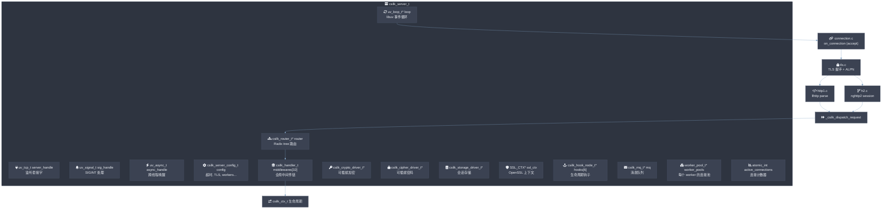
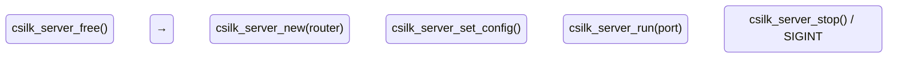
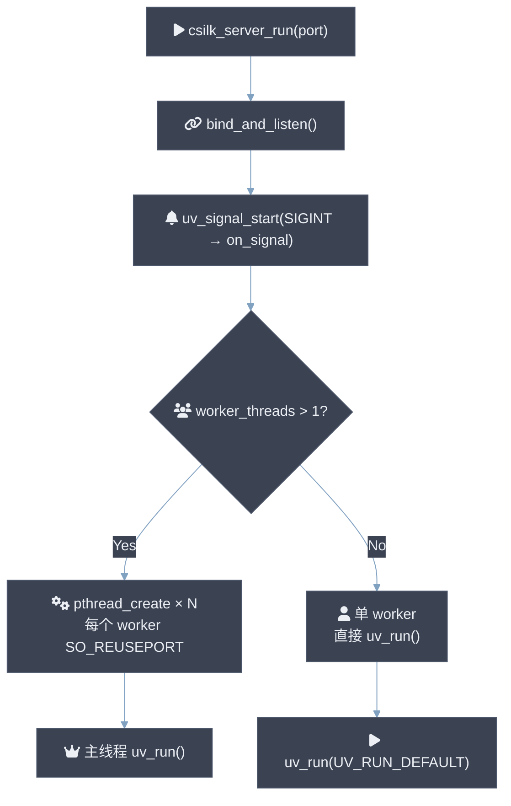
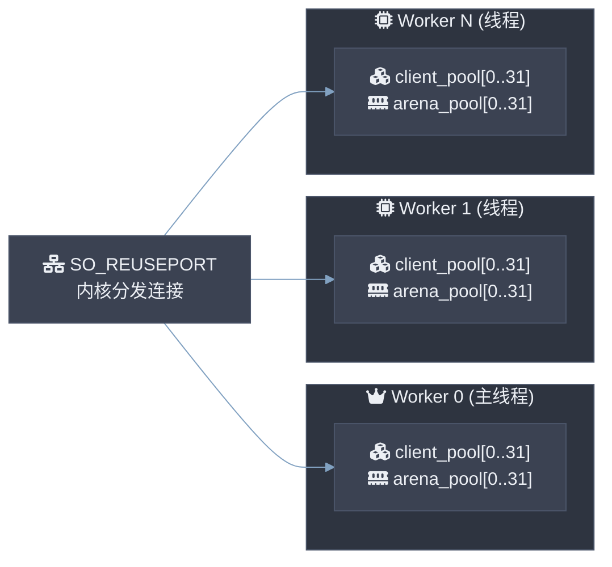
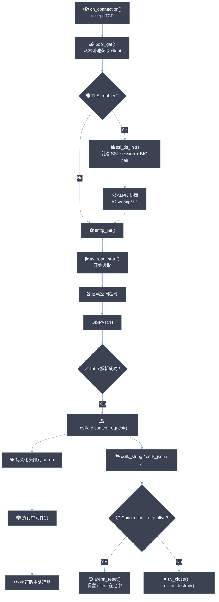
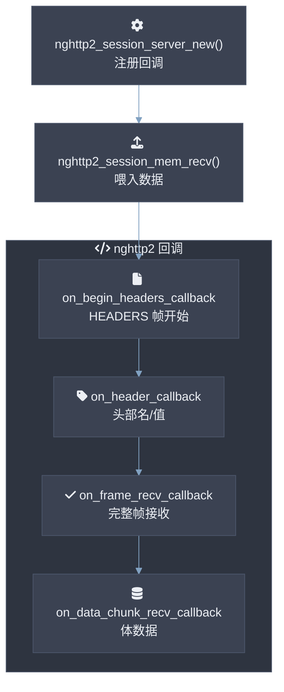
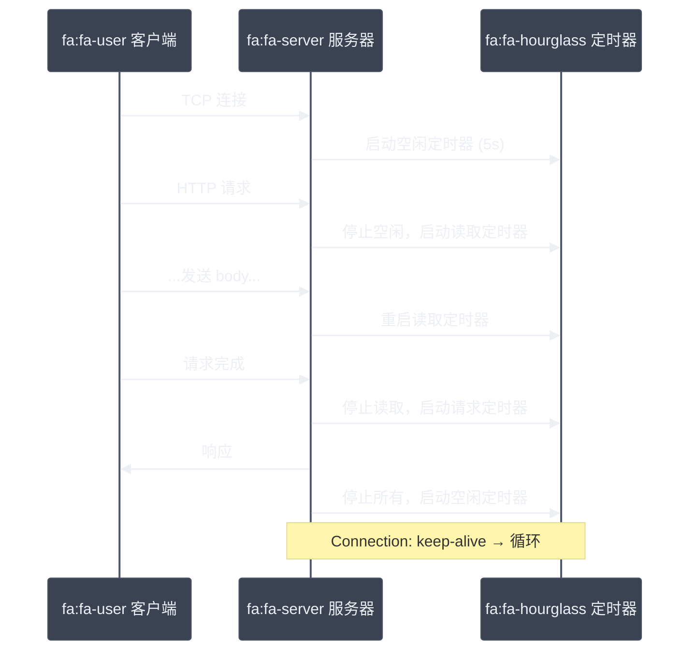
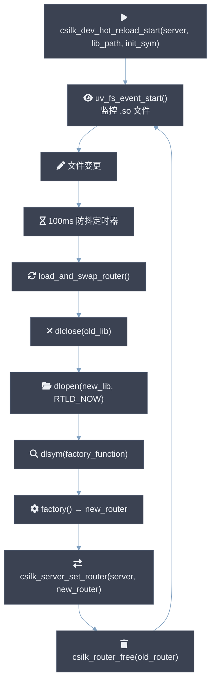

# 服务器核心设计

> **版本**: 0.3.0 | **最后更新**: 2026-06-27

csilk 的 Server Core 是框架的基石——管理 libuv（默认）或 io_uring（可选）事件循环、TCP 监听、多 worker 连接池、TLS/SSL 握手、HTTP/2 ALPN 协商、钩子系统以及优雅关闭。所有的连接 I/O、HTTP 解析和请求分发都在此之上构建。单 worker 模式实测可达 ~50K QPS (P99 ≤ 5ms) 于 4 核 CPU；多 worker 模式线性扩展至 ~200K QPS (16 核, P99 ≤ 8ms)。

---

## 1. 整体架构



### 核心数据结构

`csilk_server_t`（定义在 `src/core/srv_internal.h`）是服务器的中心结构体：

| 字段 | 类型 | 作用 |
|------|------|------|
| `loop` | `uv_loop_t*` | libuv 事件循环实例 |
| `server_handle` | `uv_tcp_t` | TCP 监听套接字 |
| `sig_handle` | `uv_signal_t` | SIGINT 信号处理 |
| `async_handle` | `uv_async_t` | 跨线程唤醒 |
| `config` | `csilk_server_config_t` | 服务器配置（超时、TLS、Worker 数等） |
| `router` | `csilk_router_t*` | 路由表（Radix Tree） |
| `middlewares[32]` | `csilk_handler_t[]` | 全局中间件链 |
| `max_connections` | `int` | 最大并发连接数（0=无限） |
| `active_connections` | `atomic_int` | 当前活动连接数 |
| `worker_pools` | `worker_pool_t*` | 每个 Worker 的连接/内存池 |
| `worker_tids` | `uv_thread_t*` | Worker 线程 ID 数组 |
| `ssl_ctx` | `SSL_CTX*` | OpenSSL 上下文 |
| `mq` | `csilk_mq_t*` | 消息队列实例 |
| `hooks[6]` | `csilk_hook_node_t*` | 生命周期钩子链表 |
| `active_clients` | `csilk_client_t*` | 活跃连接链表头 |
| `clients_mutex` | `uv_mutex_t` | 活跃链表互斥锁 |

---

## 2. 服务器生命周期



### 2.1 创建阶段

```c
csilk_server_t* csilk_server_new(csilk_router_t* router);
```

- 分配 `csilk_server_t` 并初始化所有字段为零
- 设置默认超时和最大尺寸（头部 64KB、URL 8KB、请求体 1MB）
- 关联路由器实例
- 设置 llhttp 解析器回调
- 创建内部消息队列
- 设置 `on_server_handle_close` 为关闭句柄回调

### 2.2 配置阶段

```c
void csilk_server_set_config(csilk_server_t* server, const csilk_server_config_t* config);
```

- 覆盖服务器默认配置
- 如果 `enable_tls` 为真，调用 `tls.c` 初始化 SSL_CTX：
  - 加载 SSL 错误字符串
  - 创建 TLS 服务器方法上下文
  - 加载证书文件（`tls_cert_file`）和私钥（`tls_key_file`）
  - 可选加载 CA 文件并启用对等验证
- 任何 TLS 初始化失败时，SSL_CTX 被释放，TLS 相当于被禁用

### 2.3 运行阶段



核心步骤：

1. **绑定并监听 TCP 端口**：创建 `uv_tcp_t`，设置 `SO_REUSEPORT`（多 worker 模式需要），绑定端口，`listen()`。
2. **注册 SIGINT 处理**：`on_signal()` 回调调用 `csilk_server_stop()`。
3. **多 Worker 模式**（`worker_threads > 1`）：
   - 创建 `worker_threads` 个 worker_pool_t（索引 0 为主线程，1..N-1 为子线程）
   - 每个 worker 拥有独立的 `uv_loop_t`、`uv_tcp_t`（SO_REUSEPORT 共享端口）
   - 通过 `uv_barrier_t` 确保所有 worker 同时开始运行
   - 主线程调用 `uv_run()`，子线程在 `worker_thread()` 中运行
4. **单 Worker 模式**（默认）：直接在调用线程运行 `uv_run(UV_RUN_DEFAULT)`。

### 2.4 停止阶段

```c
void csilk_server_stop(csilk_server_t* server);
```

停止序列：

1. 停止监听（关闭 `server_handle`）
2. 遍历 `active_clients` 链表，分类关闭连接：
   - WebSocket → 发送关闭帧 `ws_close(1001)`
   - SSE → 发送 `"close"` 事件
   - 普通 HTTP → `uv_close()`
3. 向每个 worker 发送 `uv_async` 停止通知
4. 等待所有 worker 线程 join（`uv_thread_join`）
5. 关闭主事件循环

### 2.5 释放阶段

```c
void csilk_server_free(csilk_server_t* server);
```

- 释放消息队列 (`csilk_mq_free`)
- 释放路由表 (`csilk_router_free`)
- 释放 TLS 上下文 (`SSL_CTX_free`)
- 释放配置中的字符串
- 释放钩子链表
- 释放 worker pool
- 释放服务器结构体本身

---

## 3. 多 Worker 与连接池

### 3.1 Worker 池结构 (`worker_pool_t`)

```c
typedef struct {
    csilk_server_t* server;              // 所属服务器
    uv_loop_t loop;                      // 本 worker 的事件循环
    uv_tcp_t server_handle;              // 本 worker 的监听句柄 (SO_REUSEPORT)
    csilk_client_t* client_pool[32];     // Worker 本地空闲客户端列表
    int client_pool_count;
    uv_async_t stop_async;               // 停止通知
    int worker_index;                    // 0 = 主线程, 1+ = 工作线程
    csilk_arena_t* arena_pool[32];       // 预分配的 Arena 池
    int arena_pool_count;
    uv_async_t dispatch_async;           // 跨线程任务派发
    uv_mutex_t dispatch_mutex;
    csilk_dispatch_task_t* dispatch_head;
    csilk_dispatch_task_t* dispatch_tail;
} worker_pool_t;
```

### 3.2 无锁连接池

**设计哲学**：每个 Worker 拥有独立的本地连接池，`pool_get()` 和 `pool_put()` 是完全的线程本地操作，零锁开销。Worker 数 **SHOULD** 配置为 CPU 核数 (`worker_threads = N_CPUS`)。当 `worker_threads > 1` 时，TCP 端口 **MUST** 支持 `SO_REUSEPORT`（Linux ≥ 3.9）。



**`pool_get(wp)`** — 从 worker 本地空闲列表获取 `csilk_client_t`：
- 如果 `client_pool_count > 0`，弹出栈顶（LIFO，保持缓存热度）
- 否则 `calloc` 新分配一个

**`pool_put(wp, client)`** — 归还连接到池中：
- 如果 `client_pool_count < CSILK_CLIENT_POOL_SIZE (32)`，压入栈顶
- 否则 `free()`

同样的模式用于 Arena 池（`pool_get_arena` / `pool_put_arena`）。

### 3.3 客户端连接结构 (`csilk_client_t`)

```c
struct csilk_client_s {
    uv_tcp_t handle;              // libuv TCP 流句柄
    uv_timer_t timer;             // 空闲 (keep-alive) 定时器
    uv_timer_t read_timer;        // 读取超时定时器
    uv_timer_t write_timer;       // 写入超时定时器
    uv_timer_t request_timer;     // 请求超时定时器
    int close_pending;            // 待关闭引用计数
    int async_ref;                // 异步任务引用计数
    csilk_protocol_t protocol;    // CSILK_PROTO_HTTP1 / CSILK_PROTO_HTTP2
    nghttp2_session* h2_session;  // HTTP/2 会话
    csilk_ctx_t* h2_streams;      // 活跃 HTTP/2 流链表
    llhttp_t parser;              // HTTP/1.1 解析器
    csilk_server_t* server;       // 所属服务器
    worker_pool_t* owner_pool;    // 所属 worker 池
    csilk_ctx_t ctx;              // 请求上下文
    // 零拷贝解析状态
    csilk_str_view_t current_url;
    csilk_str_view_t current_header_field;
    csilk_str_view_t current_header_value;
    SSL* ssl;                     // OpenSSL 会话对象
    BIO* read_bio;                // 加密数据读取 BIO
    BIO* write_bio;               // 加密数据写入 BIO
};
```

### 3.4 连接生命周期



### 3.5 客户端销毁 (`client_destroy`)

```c
static void client_destroy(csilk_client_t* client) {
    atomic_fetch_sub(&client->server->active_connections, 1);
    csilk_ctx_cleanup(&client->ctx);                  // 清理上下文、释放 arena
    pool_put_arena(client->owner_pool, client->ctx.arena);  // 归还 arena 到池
    pool_put(client->owner_pool, client);              // 归还 client 到池
}
```

---

## 4. TLS/SSL 集成

TLS 实现在 `src/core/tls.c` 中，基于 OpenSSL 的 **BIO pair**（内存 BIO）模式，无需阻塞网络调用。

### 4.1 初始化 (`ssl_server_init`)

```mermaid
%%{init: {
  'theme': 'base',
  'themeVariables': {
    'background': '#2E3440',
    'primaryColor': '#81A1C1',
    'primaryBorderColor': '#4C566A',
    'primaryTextColor': '#ECEFF4',
    'secondaryColor': '#3B4252',
    'secondaryBorderColor': '#434C5E',
    'secondaryTextColor': '#D8DEE9',
    'lineColor': '#81A1C1',
    'textColor': '#ECEFF4',
    'mainBkg': '#3B4252',
    'nodeBorder': '#4C566A',
    'clusterBkg': '#2E3440',
    'clusterBorder': '#4C566A',
    'titleColor': '#ECEFF4',
    'edgeLabelBackground': '#3B4252',
    'nodeTextColor': '#ECEFF4'
  },
  'flowchart': {'htmlLabels': true, 'curve': 'basis'}
}}%%
flowchart LR
    START["fa:fa-play ssl_server_init(server)"] --> CTX["fa:fa-cog SSL_CTX_new(TLS_server_method())"]
    CTX --> CERT["fa:fa-file-certificate SSL_CTX_use_certificate_file<br/>加载 tls_cert_file"]
    CERT --> KEY["fa:fa-key SSL_CTX_use_PrivateKey_file<br/>加载 tls_key_file"]
    KEY --> CA{"fa:fa-question tls_ca_file?"}
    CA -->|Yes| VERIFY["fa:fa-shield SSL_CTX_load_verify_locations<br/>SSL_CTX_set_verify"]
    CA -->|No| ALPN
    VERIFY --> ALPN["fa:fa-random SSL_CTX_set_alpn_select_cb<br/>alpn_select_cb"]
    ALPN --> DONE["fa:fa-check server->ssl_ctx = ctx"]
```



### 4.2 ALPN 协商

`alpn_select_cb()` 选择客户端和服务端都支持的协议：

- 通告列表：`"\x02h2\x08http/1.1"`（HTTP/2 优先）
- 协议由 `SSL_select_next_proto()` 协商
- 支持 HTTP/1.1 (`http/1.1`) 和 HTTP/2 (`h2`)
- 协商结果写入 `client->protocol`（`CSILK_PROTO_HTTP1` 或 `CSILK_PROTO_HTTP2`）

### 4.3 BIO Pair 加密 I/O

```c
// 接受连接时
client->ssl = SSL_new(server->ssl_ctx);
client->read_bio = BIO_new(BIO_s_mem());
client->write_bio = BIO_new(BIO_s_mem());
SSL_set_bio(client->ssl, client->read_bio, client->write_bio);

// 读取加密数据
SSL_read(client->ssl, buf, len);  // 从 read_bio 解密

// 发送加密数据
SSL_write(client->ssl, data, len); // 加密到 write_bio
// 从 write_bio 读取密文并写入 TCP socket
```

---

## 5. HTTP/2 支持

HTTP/2 实现在 `src/core/h2.c`，基于 nghttp2 库。

### 5.1 nghttp2 会话



### 5.2 流管理

- 每个 HTTP/2 流对应一个独立的 `csilk_ctx_t`，通过 `csilk_h2_get_or_create_stream()` 获取
- 伪头部（`:method`, `:path`）解析为请求方法和路径
- `:path` 进一步拆分为 path 和 query string
- 普通头部通过 `csilk_set_request_header()` 存储
- 每个流独立经过 `_csilk_dispatch_request()` 分发

### 5.3 HTTP/2 推送

```c
int csilk_h2_push(csilk_ctx_t* c, const char* path, const char* method,
                  const char* headers[], int header_count);
```

- 调用 `nghttp2_submit_push_promise()` 发起服务器推送
- 推送的请求将作为新的流处理

---

## 6. 超时系统

每个客户端连接维护四个 libuv 定时器：

| 定时器 | 默认值 | 触发行为 |
|--------|--------|----------|
| `timer` (空闲) | 5s (`CSILK_DEFAULT_IDLE_TIMEOUT`) | Keep-alive 空闲超时，关闭连接 |
| `read_timer` | `config.read_timeout_ms` | 读取超时，关闭连接 |
| `write_timer` | `config.write_timeout_ms` | 写入超时，关闭连接 |
| `request_timer` | `config.request_timeout_ms` | 请求整体超时，关闭连接 |



---

## 7. 跨线程任务派发

csilk 通过无锁 MPMC 队列实现跨线程通信：

```c
// 派发一个任务到指定 worker
int csilk_server_dispatch(csilk_server_t* server, int worker_index,
                          void (*cb)(void*), void* arg);
```

**派发流程**：

1. 在目标 worker 的 `dispatch_mutex` 保护下入队
2. 调用 `uv_async_send(&wp->dispatch_async)` 唤醒 worker
3. Worker 在 `on_dispatch_async()` 回调中出队并执行

---

## 8. 热重载（Hot Reload）

实现在 `src/core/hot_reload.c`，通过 `dlopen`/`dlsym` 技术实现运行中路由替换。



- 基于 libuv `uv_fs_event_t` 监听文件系统变化
- 100ms 防抖避免频繁重新加载
- `csilk_server_set_router()` 原子性地替换路由表
- 旧路由通过 `csilk_router_free()` 在设置新路由后自动释放

---

## 9. 钩子系统

六种生命周期钩子（定义见 `src/core/hooks.c`）：

| 枚举值 | 触发时机 | 回调签名 |
|--------|----------|----------|
| `CSILK_HOOK_SERVER_START` (0) | `uv_run()` 之前 | `void(csilk_server_t*)` |
| `CSILK_HOOK_SERVER_STOP` (1) | `csilk_server_stop()` 调用时 | `void(csilk_server_t*)` |
| `CSILK_HOOK_CONN_OPEN` (2) | TCP 接受连接后 | `void(csilk_ctx_t*)` |
| `CSILK_HOOK_CONN_CLOSE` (3) | 连接完全关闭后 | `void(csilk_ctx_t*)` |
| `CSILK_HOOK_REQUEST_BEGIN` (4) | HTTP 头部解析完成后 | `void(csilk_ctx_t*)` |
| `CSILK_HOOK_REQUEST_END` (5) | 响应发送完成后 | `void(csilk_ctx_t*)` |

钩子以链表形式存储（`csilk_hook_node_t`），`_csilk_trigger_hooks()` 遍历执行。

---

## 10. 配置参考

```c
typedef struct {
    uint64_t idle_timeout_ms;      // Keep-alive 空闲超时 (默认 5000)
    uint64_t read_timeout_ms;      // 读取超时 (默认 0=禁用)
    uint64_t write_timeout_ms;     // 写入超时 (默认 0=禁用)
    uint64_t request_timeout_ms;   // 请求超时 (默认 0=禁用)
    size_t   max_body_size;        // 最大请求体 (默认 1MB)
    size_t   max_header_size;      // 最大请求头部 (默认 64KB)
    size_t   max_url_size;         // 最大 URL 长度 (默认 8192)
    int      max_headers_count;    // 最大头部数量 (默认 100)
    int      max_connections;      // 最大并发连接 (默认 0=无限)
    int      listen_backlog;       // listen backlog (默认 128)
    int      tcp_nodelay;          // TCP_NODELAY (默认 0=禁用)
    int      tcp_keepalive;        // 启用 TCP keepalive
    int      worker_threads;       // Worker 线程数 (默认 1)
    int      enable_tls;           // 启用 TLS
    char*    tls_cert_file;        // TLS 证书路径
    char*    tls_key_file;         // TLS 私钥路径
    char*    tls_ca_file;          // CA 证书路径
    int      tls_verify_peer;      // 对等验证
    int      h2_push_enable;       // HTTP/2 推送
    int      h2_max_push_per_request;
    int      enable_simd;          // SIMD 路由加速
    int      enable_arena_alignment;
    int      enable_openapi;       // OpenAPI 端点
} csilk_server_config_t;
```

---

## 11. 关键文件参考

| 文件 | 职责 |
|------|------|
| `src/core/server.c` | Server 生命周期：创建、配置、运行、停止、释放、驱动注入 |
| `src/core/srv_internal.h` | 内部类型：`csilk_server_t`、`csilk_client_t`、`worker_pool_t` |
| `src/core/srv_impl.h` | 内部函数声明：`_csilk_dispatch_request()`、`csilk_client_write()` |
| `src/core/connection.c` | TCP 接受连接、连接池、客户端创建/销毁 |
| `src/core/tls.c` | TLS/SSL 初始化、ALPN 协商、BIO pair I/O |
| `src/core/h2.c` | HTTP/2 会话、nghttp2 回调、流管理、服务器推送 |
| `src/core/hooks.c` | 生命周期钩子注册与触发 |
| `src/core/hot_reload.c` | 基于 dlopen 的路由热重载 |
| `src/core/arena.c` | Arena 分配器（连接级的 bump 分配器） |
