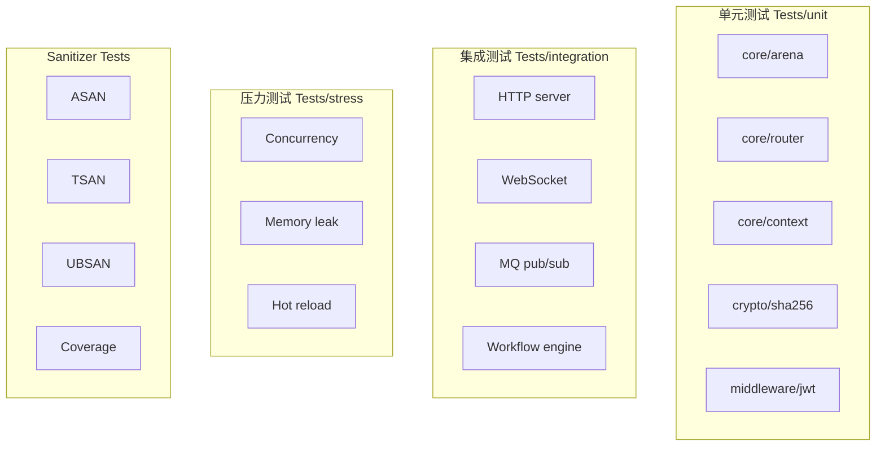

# 测试架构深度解析

> **Version**: 0.5.1 | **Last updated**: 2026-08-22

csilk 拥有 200+ 测试文件，覆盖单元测试、集成测试、性能基准和 sanitizer 测试。本文档深入解析测试架构、测试模式和最佳实践。

---

## 1. 测试分类



---

## 2. 测试基础设施

### 2.1 CTest 配置

```cmake
# cmake/tests.cmake
enable_testing()

# 定义测试可执行文件
function(add_csilk_test name)
    add_executable(${name} ${ARGN})
    target_link_libraries(${name} csilk pthread)
    add_test(NAME ${name} COMMAND ${name})
endfunction()

# 设置测试超时
set_tests_properties(test_integration PROPERTIES TIMEOUT 60)
set_tests_properties(test_mq_concurrent PROPERTIES TIMEOUT 30)
```

### 2.2 测试宏

```c
// tests/test_macros.h
#define CHECK(expr) do { \
    if (!(expr)) { \
        fprintf(stderr, "CHECK failed: %s at %s:%d\n", \
                #expr, __FILE__, __LINE__); \
        abort(); \
    } \
} while(0)

#define REQUIRE(expr) do { \
    if (!(expr)) { \
        fprintf(stderr, "REQUIRE failed: %s at %s:%d\n", \
                #expr, __FILE__, __LINE__); \
        exit(1); \
    } \
} while(0)

#define TEST_CASE(name) static void name(void)
#define RUN_TEST(name) do { \
    printf("Running %s... ", #name); \
    name(); \
    printf("PASSED\n"); \
} while(0)
```

---

## 3. 核心测试模式

### 3.1 HTTP 服务器测试

```c
// tests/core/test_http_server.c
TEST_CASE(test_basic_request) {
    // 创建测试服务器
    csilk_router_t* router = csilk_router_new();
    csilk_server_t* server = csilk_server_new(router);
    
    // 注册处理函数
    csilk_router_add(router, "GET", "/hello", 
        (csilk_handler_t[]){
            ^(csilk_ctx_t* c) {
                csilk_string(c, 200, "Hello World");
            },
            NULL
        }, 1);
    
    // 启动服务器
    csilk_server_run(server, 0);  // 随机端口
    
    // 发送请求
    csilk_client_t* client = csilk_client_new();
    csilk_client_connect(client, "127.0.0.1", server->port);
    
    csilk_client_request(client, "GET", "/hello", NULL, 0);
    
    // 验证响应
    CHECK(client->status == 200);
    CHECK(strcmp(client->body, "Hello World") == 0);
    
    // 清理
    csilk_client_free(client);
    csilk_server_stop(server);
    csilk_server_free(server);
}
```

### 3.2 并发测试

```c
// tests/core/test_concurrency.c
#define NUM_WORKERS 4
#define REQUESTS_PER_WORKER 1000

TEST_CASE(test_concurrent_requests) {
    pthread_t threads[NUM_WORKERS];
    atomic_int errors = 0;
    atomic_int successes = 0;
    
    // 启动 worker 线程
    for (int i = 0; i < NUM_WORKERS; i++) {
        worker_arg_t* arg = malloc(sizeof(worker_arg_t));
        arg->server = server;
        arg->errors = &errors;
        arg->successes = &successes;
        pthread_create(&threads[i], NULL, worker_routine, arg);
    }
    
    // 等待完成
    for (int i = 0; i < NUM_WORKERS; i++) {
        pthread_join(threads[i], NULL);
    }
    
    // 验证结果
    CHECK(atomic_load(&errors) == 0);
    CHECK(atomic_load(&successes) == NUM_WORKERS * REQUESTS_PER_WORKER);
}
```

### 3.3 内存泄漏测试

```c
// tests/core/test_memory.c
#ifdef USE_ASAN
TEST_CASE(test_no_memory_leaks) {
    // ASAN 会自动检测泄漏
    csilk_server_t* server = csilk_server_new(router);
    csilk_server_run(server, 8080);
    csilk_server_stop(server);
    csilk_server_free(server);
    // 退出时 ASAN 检查泄漏
}
#endif

// 自定义内存追踪
#ifdef DEBUG_ALLOC
void* tracked_malloc(size_t size, const char* file, int line) {
    void* ptr = malloc(size);
    track_allocation(ptr, size, file, line);
    return ptr;
}
#endif
```

---

## 4. Sanitizer 测试

### 4.1 ASAN (Address Sanitizer)

```bash
# 构建 ASAN 版本
cmake -B build_asan -S . \
    -DCMAKE_BUILD_TYPE=Debug \
    -DUSE_ASAN=ON \
    -DENABLE_OOM_TEST=ON

# 运行测试
ctest --test-dir build_asan --output-on-failure
```

**检测内容**：
- Use-after-free
- Buffer overflow
- Memory leaks
- Invalid free

### 4.2 TSAN (Thread Sanitizer)

```bash
# 构建 TSAN 版本
cmake -B build_tsan -S . \
    -DCMAKE_BUILD_TYPE=Debug \
    -DUSE_TSAN=ON

# 运行并发测试
ctest --test-dir build_tsan -R test_concurrent
```

**检测内容**：
- Data races
- Lock ordering violations
- Thread safety issues

### 4.3 UBSan (Undefined Behavior Sanitizer)

```bash
cmake -B build_ubsan -S . \
    -DCMAKE_BUILD_TYPE=Debug \
    -DUSE_UBSAN=ON
```

### 4.4 覆盖率测试

```bash
# 需要 gcc (不支持 clang)
cmake -B build_cov -S . \
    -DCMAKE_C_COMPILER=gcc \
    -DCMAKE_BUILD_TYPE=Debug \
    -DUSE_COVERAGE=ON \
    -DENABLE_OOM_TEST=OFF

cmake --build build_cov
ctest --test-dir build_cov
lcov --capture --directory build_cov --output-file coverage.info
genhtml coverage.info --output-directory coverage_html
```

---

## 5. OOM 模拟测试

### 5.1 原理

通过 `TEST_OOM` 宏拦截 `malloc`/`calloc`，在特定调用次数后返回 NULL，验证错误处理路径。

```c
// src/core/primitives/arena.c
#ifdef TEST_OOM
static int g_oom_fail_after = -1;
static int g_oom_count = 0;

void* arena_aligned_alloc(size_t size) {
#ifdef TEST_OOM
    if (g_oom_fail_after >= 0 && g_oom_count >= g_oom_fail_after) {
        return NULL;
    }
    g_oom_count++;
#endif
    // ... 正常分配逻辑
}
#endif
```

### 5.2 测试用例

```c
// tests/core/test_oom.c
TEST_CASE(test_oom_server_startup) {
    // 在第 5 次 malloc 后失败
    test_oom_set_fail_after(5);
    
    csilk_server_t* server = csilk_server_new(router);
    CHECK(server == NULL);  // 应返回 NULL
    
    test_oom_reset();
}

TEST_CASE(test_oom_request_handling) {
    // 正常启动服务器
    csilk_server_t* server = csilk_server_new(router);
    csilk_server_run(server, 8080);
    
    // 在处理请求时触发 OOM
    test_oom_set_fail_after(100);
    
    // 发送请求，应优雅处理错误
    csilk_client_request(client, "GET", "/test", NULL, 0);
    CHECK(client->status == 500);
    
    test_oom_reset();
    csilk_server_stop(server);
}
```

---

## 6. 压力测试

### 6.1 连接压力测试

```c
// tests/core/test_stress.c
TEST_CASE(test_stress_connections) {
    const int NUM_CONNECTIONS = 10000;
    
    csilk_client_t** clients = calloc(NUM_CONNECTIONS, sizeof(csilk_client_t*));
    
    // 建立所有连接
    for (int i = 0; i < NUM_CONNECTIONS; i++) {
        clients[i] = csilk_client_new();
        csilk_client_connect(clients[i], "127.0.0.1", server->port);
    }
    
    // 发送请求
    for (int i = 0; i < NUM_CONNECTIONS; i++) {
        csilk_client_request(clients[i], "GET", "/health", NULL, 0);
    }
    
    // 验证所有响应
    for (int i = 0; i < NUM_CONNECTIONS; i++) {
        CHECK(clients[i]->status == 200);
    }
    
    // 清理
    for (int i = 0; i < NUM_CONNECTIONS; i++) {
        csilk_client_free(clients[i]);
    }
    free(clients);
}
```

### 6.2 长时间运行测试

```c
TEST_CASE(test_long_running) {
    struct timespec start, end;
    clock_gettime(CLOCK_MONOTONIC, &start);
    
    int iterations = 100000;
    for (int i = 0; i < iterations; i++) {
        // 发送请求
        csilk_client_request(client, "GET", "/api/data", NULL, 0);
        
        // 定期清理
        if (i % 1000 == 0) {
            csilk_server_reap_connections(server);
        }
    }
    
    clock_gettime(CLOCK_MONOTONIC, &end);
    
    double elapsed = (end.tv_sec - start.tv_sec) + 
                     (end.tv_nsec - start.tv_nsec) / 1e9;
    printf("QPS: %.2f\n", iterations / elapsed);
}
```

---

## 7. 性能基准测试

### 7.1 路由器基准

```c
// tests/core/test_dispatch_bench.c
static void run_router_benchmark(csilk_router_t* router, int iterations) {
    struct timespec start, end;
    
    // 预热
    for (int i = 0; i < 1000; i++) {
        csilk_router_match(router, "GET", "/api/users/123");
    }
    
    clock_gettime(CLOCK_MONOTONIC, &start);
    
    // 基准测试
    for (int i = 0; i < iterations; i++) {
        csilk_router_match(router, "GET", "/api/users/123");
    }
    
    clock_gettime(CLOCK_MONOTONIC, &end);
    
    double elapsed_ns = (end.tv_sec - start.tv_sec) * 1e9 +
                        (end.tv_nsec - start.tv_nsec);
    double ns_per_match = elapsed_ns / iterations;
    
    printf("Router benchmark: %.2f ns/match (%d routes)\n",
           ns_per_match, router->node_count);
}
```

### 7.2 Arena 分配基准

```c
static void run_arena_benchmark(int iterations) {
    csilk_arena_t* arena = csilk_arena_new(4096);
    
    struct timespec start, end;
    clock_gettime(CLOCK_MONOTONIC, &start);
    
    for (int i = 0; i < iterations; i++) {
        void* p = csilk_arena_alloc(arena, 64);
        CHECK(p != NULL);
    }
    
    clock_gettime(CLOCK_MONOTONIC, &end);
    
    double elapsed_ns = (end.tv_sec - start.tv_sec) * 1e9 +
                        (end.tv_nsec - start.tv_nsec);
    double ns_per_alloc = elapsed_ns / iterations;
    
    printf("Arena benchmark: %.2f ns/alloc\n", ns_per_alloc);
    
    csilk_arena_free(arena);
}
```

---

## 8. 测试文件组织

```
tests/
├── core/                    # 核心模块测试
│   ├── test_arena.c        # Arena 分配器
│   ├── test_router.c       # 路由匹配
│   ├── test_context.c      # 请求上下文
│   ├── test_server.c       # 服务器生命周期
│   ├── test_connection.c   # 连接管理
│   ├── test_uring.c        # io_uring 后端
│   ├── test_hot_reload.c   # RCU 热重载
│   └── test_concurrency.c  # 并发测试
├── crypto/                  # 加密测试
│   ├── test_sha256.c
│   ├── test_hmac.c
│   └── test_bcrypt.c
├── middleware/              # 中间件测试
│   ├── test_jwt.c
│   ├── test_cors.c
│   └── test_ratelimit.c
├── messaging/               # 消息队列测试
│   ├── test_mq_pubsub.c
│   └── test_mq_wal.c
├── protocols/               # 协议测试
│   ├── test_websocket.c
│   └── test_sse.c
├── drivers/                 # 驱动测试
│   ├── test_sqlite.c
│   └── test_redis.c
└── integration/             # 集成测试
    ├── test_http_full.c
    └── test_workflow_full.c
```

---

## 9. CI 测试矩阵

```yaml
# .github/workflows/ci.yml
strategy:
  matrix:
    os: [ubuntu-24.04, macos-14]
    build_type: [Debug, Release]
    
steps:
  - name: ASAN Tests (Linux Debug only)
    if: runner.os == 'Linux' && matrix.build_type == 'Debug'
    run: cmake --build build_asan && ctest --test-dir build_asan
    
  - name: TSAN Tests (Separate job)
    run: cmake --build build_tsan && ctest --test-dir build_tsan
    
  - name: Coverage (GCC only)
    if: runner.os == 'Linux'
    run: |
      cmake -B build_cov -DCMAKE_C_COMPILER=gcc -DUSE_COVERAGE=ON
      cmake --build build_cov
      ctest --test-dir build_cov
```

---

## 10. 最佳实践

### 10.1 测试编写规范

```c
// ✅ 好的测试
TEST_CASE(test_empty_body_returns_null) {
    csilk_ctx_t* ctx = create_test_context();
    const char* body = csilk_get_body(ctx, NULL);
    CHECK(body == NULL);
    csilk_ctx_free(ctx);
}

// ❌ 坏的测试 (资源泄漏)
TEST_CASE(bad_test) {
    csilk_ctx_t* ctx = csilk_ctx_new();
    // 忘记 cleanup!
}
```

### 10.2 断言选择

| 宏 | 行为 | 使用场景 |
|----|------|----------|
| `CHECK` | 记录失败继续执行 | 多个独立检查 |
| `REQUIRE` | 失败立即退出 | 前置条件 |
| `WARN` | 记录警告不退出 | 可选检查 |

### 10.3 异步测试模式

```c
// 使用 eventfd 等待异步操作完成
static void wait_for_condition(atomic_int* flag, int timeout_ms) {
    struct timespec ts;
    clock_gettime(CLOCK_MONOTONIC, &ts);
    ts.tv_sec += timeout_ms / 1000;
    ts.tv_nsec += (timeout_ms % 1000) * 1000000;
    
    while (atomic_load(flag) == 0) {
        if (clock_gettime(CLOCK_MONOTONIC, &ts) < 0) break;
        struct timespec now;
        clock_gettime(CLOCK_MONOTONIC, &now);
        if (now.tv_sec > ts.tv_sec || 
            (now.tv_sec == ts.tv_sec && now.tv_nsec >= ts.tv_nsec)) {
            FAIL("Timeout waiting for condition");
        }
        usleep(100);
    }
}
```
