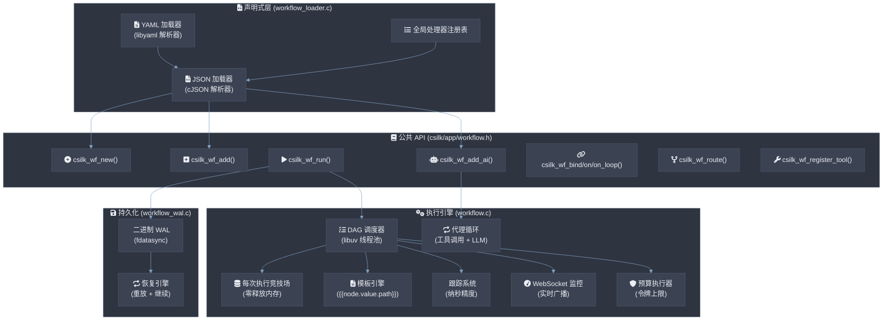

# AI 工作流 & 代理引擎

workflow 模块提供了一个基于图的编排引擎，用于在 csilk AI 统一接口之上构建 AI 管道和自主代理。每个工作流 **MUST** 是有向无环图 (DAG) — 在注册时检测循环 **MUST** 拒绝并返回错误码。节点调度 **MUST** 每个节点完成时间 ≤ 1µs；100 个节点的完整 DAG 调度器开销 **SHOULD** ≤ 100µs。热重载 **MUST NOT** 放弃正在进行的工作流执行。

## 架构



## 核心概念

### 工作流图

工作流是一个 **有向无环图 (DAG)**，其中：

- **节点** 是执行单元（C 函数或内置 AI 节点）。
- **边** 定义节点之间的数据流和控制流。
- **入口节点** 启动执行（具有 0 个传入边的节点或显式标记的节点）。
- **数据** 沿边以 `csilk_data_t` 容器（类型 + 值 + 元数据）流动。

```c
csilk_wf_t* wf = csilk_wf_new("ResearchPipeline");

// 添加节点
csilk_wf_node_t* n1 = csilk_wf_add(wf, "search", search_handler, NULL);
csilk_wf_node_t* n2 = csilk_wf_add_ai(wf, "summarize", &ai_config);

// 连接
csilk_wf_bind(n1, n2);

// 运行
csilk_wf_run(wf, &input, on_complete);
```

### 节点类型

| 类型 | 创建 API | 行为 |
|------|----------|------|
| **自定义处理器** | `csilk_wf_add()` | 执行 `csilk_wf_handler_t` C 函数 |
| **AI 节点** | `csilk_wf_add_ai()` | 内置处理器，调用 LLM 带模板注入 + 工具循环 |
| **入口节点** | `csilk_wf_node_set_entry()` | 启动工作流执行（通过 0 个传入边自动检测） |

### AI 节点和模板注入

AI 节点接受带模板提示的 `csilk_ai_config_t`：

```c
csilk_wf_node_t* n = csilk_wf_add_ai(wf, "formatter", &(csilk_ai_config_t){
    .model = "gpt-4",
    .system_msg = "You are a technical writer.",
    .prompt = "Summarize: {{search.value}}. Previous draft: {{draft.value.content}}",
    .temperature = 0.3,
    .max_tokens = 2048
});
```

**模板语法**:
- `{{node_id.value}}` — 插入另一个节点的完整输出值
- `{{node_id.value.path.to.field}}` — 从 JSON 输出中提取 JSONPath
- `{{input.value}}` / `{{input.value.path}}` — 引用初始工作流输入

### 边类型

| API | 边类型 | 行为 |
|-----|--------|------|
| `csilk_wf_bind(from, to)` | **默认** | 当 `from` 完成时始终触发 `to` |
| `csilk_wf_on(from, "condition", to)` | **条件** | 仅当输出类型匹配条件时触发 |
| `csilk_wf_on_loop(from, "cond", to)` | **循环返回** | 类似条件，但不递增传入计数（防止死锁） |
| `csilk_wf_on_error(from, to)` | **错误回退** | 当 `from` 处理器返回 NULL 时触发 |

### 连接策略

当节点具有多个传入边时：

| 策略 | API | 行为 |
|------|-----|------|
| **AND** (默认) | `CSILK_WF_JOIN_AND` | 仅在所有前驱完成后执行 |
| **OR** | `CSILK_WF_JOIN_OR` | 在任何前驱完成后执行 |

```c
csilk_wf_node_set_join(node, CSILK_WF_JOIN_OR);
```

---

## 代理工作流

### 工具调用循环

内置 AI 节点处理器（`ai_node_handler()`）实现自主代理循环：

1. 将提示 + 注册的工具发送到 LLM。
2. 如果响应包含 `tool_calls`，通过 libuv 线程池**并行**执行它们。
3. 将工具结果重新注入作为新消息。
4. 重复（最多 10 次迭代），直到 LLM 响应内容。

```c
// 注册工具
csilk_wf_register_tool(wf, "get_weather",
    "Get current weather for a location",
    "{\"type\":\"object\",\"properties\":{\"location\":{\"type\":\"string\"}}}",
    weather_fn, NULL);

// AI 节点将自动使用注册的工具
csilk_wf_add_ai(wf, "agent", &ai_config);
```

### 动态路由

功能路由允许运行时决定下一个节点：

```c
const char* my_router(csilk_data_t* output) {
    if (strstr(output->value, "ERROR")) return "fallback";
    if (strstr(output->value, "REJECT")) return "retry_node";
    return "next_node";
}

csilk_wf_route(node, my_router);
```

### 带条件边的代理循环


```c
csilk_wf_bind(n1, n2);
csilk_wf_on_loop(n2, "fail", n1);  // 循环返回不递增计数
csilk_wf_on(n2, "pass", n3);
```

---

## 内存管理

每次工作流执行创建 **每次执行竞技场分配器**：

- 所有节点输出、字符串复制和元数据都是竞技场分配的。
- 整个竞技场在执行完成时一次性释放。
- 处理器内无需手动 `free()`。
- 竞技场是线程安全的（互斥锁保护，用于并行工具调用）。

```c
csilk_data_t* my_handler(csilk_wf_ctx_t* ctx, csilk_data_t* input, void* user_data) {
    char* result = csilk_wf_strdup(ctx, "hello");
    return csilk_wf_data_new(ctx, "text/plain", result);
}
```

---

## 安全性与防护措施

### 令牌预算

强制最大总令牌消耗（提示 + 完成）跨所有 AI 节点：

```c
csilk_wf_set_budget(wf, 10000);  // 在 10K 总令牌后停止
```

### 节点超时

每个节点超时防止挂起：

```c
csilk_wf_node_set_timeout(node, 5000);  // 5 秒超时
```

### 工作流 TTL

整个执行的全局生存时间：

```c
csilk_wf_set_ttl(wf, 30);  // 30 秒 TTL
```

### 步骤限制

每个运行的总节点执行次数硬性限制 `MAX_WORKFLOW_STEPS` (1000)。

---

## 可观测性

### 执行跟踪

每次节点执行都以纳秒精度记录：

```c
csilk_wf_run_traced(wf, &input, on_complete_with_trace);
// 跟踪作为回调发出: void on_trace(csilk_data_t* result, csilk_wf_trace_t* trace)
```

每个节点的跟踪字段: `node_id`, `start_time`, `end_time`, `duration_us`, `input_dump`, `output_dump`, `model`, `prompt_tokens`, `completion_tokens`, `error`。

导出跟踪到 JSON：

```c
char* json = csilk_wf_trace_to_json(trace);
```

### Admin 仪表板集成

实时工作流执行状态通过统一 admin 仪表板暴露：

- **GET /admin/stats**: 返回工作流指标（`workflow_count`, `node_count`, `active_executions`）作为 JSON。
- **GET /admin/ws**: WebSocket 端点广播实时工作流生命周期事件。

### WebSocket 监控

实时工作流事件通过 WebSocket 广播：

```c
csilk_wf_register_monitor(wf, upgraded_ws_context);
```

事件: `workflow_start`, `node_queued`, `node_start`, `node_finish`, `workflow_end`。

### Mermaid 可视化

将工作流图导出为 Mermaid 图表字符串：

```c
char* mermaid = csilk_wf_to_mermaid(wf);
// 输出: "graph TD\n  search --> summarize\n  summarize -. error .-> fallback\n"
```

---

## 持久化与恢复

### 预写日志 (WAL)

每次工作流执行记录二进制 WAL 文件：

| 事件类型 | 记录数据 |
|----------|----------|
| `WF_EV_START` | 初始输入 |
| `WF_EV_NODE_START` | 节点 ID |
| `WF_EV_NODE_FINISH` | 节点 ID + 输出类型 + 输出值 |
| `WF_EV_END` | （空） |

WAL 格式（二进制，打包头）：

```
[MAGIC:4][TYPE:1][TIMESTAMP:4][PAYLOAD_LEN:4][PAYLOAD...]
```

### 恢复

中断的执行可以从 WAL 恢复：

```c
csilk_wf_set_persistence(wf, "/var/log/workflows");
// ... 稍后，在崩溃后:
csilk_wf_resume(wf, "execution-uuid", on_complete);
```

恢复引擎重放 WAL 以重构状态，然后继续未完成的节点。

---

## 声明式工作流定义

### JSON 格式

工作流可以声明式定义并在运行时加载：

```json
{
    "name": "ResearchAssistant",
    "steps": [
        {"id": "search", "type": "handler", "handler": "web_search", "entry": true},
        {"id": "summarize", "type": "ai", "config": {
            "model": "gpt-4",
            "system_msg": "Summarize the following.",
            "prompt": "{{search.value}}"
        }},
        {"id": "fallback", "type": "handler", "handler": "default_response"}
    ],
    "connections": [
        {"from": "search", "to": "summarize"},
        {"from": "summarize", "to": "fallback", "condition": null}
    ]
}
```

```c
csilk_wf_register_handler("web_search", web_search_handler);
csilk_wf_t* wf = csilk_wf_from_json(json_string);
csilk_wf_run(wf, &input, on_complete);
```

### YAML 格式

通过 YAML 文件实现相同结构：

```c
csilk_wf_t* wf = csilk_wf_load_yaml("workflow.yaml");
```

---

## 实现细节

### 调度器

`execute_node()` 中的调度器通过 libuv 线程池的 `uv_queue_work()` 运行每个处理器：

1. **预执行**: 广播 `node_queued`，记录 WAL 开始事件，创建跟踪节点。
2. **执行**: `worker_cb` 在线程池线程上运行处理器。
3. **后执行**: `after_worker_cb` 处理输出，检查预算，求值边，调度下游节点。

### 代理循环

`src/app/workflow.c:505` 的 `ai_node_handler()` 实现：

1. 通过 `resolve_templates()` 解析模板占位符。
2. 构建消息数组（系统 + 用户）。
3. 调用 `csilk_ai_chat()`。
4. 如果存在 `tool_calls`:
   - 分派每个工具到 `uv_queue_work()` 进行**并行执行**。
   - 通过 `uv_cond_wait()` 等待全部完成。
   - 将工具结果作为新消息注入。
   - 重复（最多 10 次迭代）。
5. 返回最终内容作为 `csilk_data_t`。

### WAL 追加

`workflow_wal.c` 中的 `_wf_wal_append()` 函数使用原始 POSIX I/O（`open`/`write`/`fdatasync`/`close`）带 `O_APPEND` 进行崩溃安全的顺序日志记录。

---

## 文件布局

| 文件 | 目的 |
|------|------|
| `include/csilk/app/workflow.h` | 公共 API (355 行) |
| `include/csilk/app/workflow_wal.h` | WAL 类型和头格式 |
| `src/app/workflow.c` | 核心引擎 (1163 行) |
| `src/app/workflow_wal.c` | WAL 实现 (44 行) |
| `src/app/workflow_loader.c` | 声明式加载器 (268 行) |
| `tests/test_workflow_agentic.c` | 代理循环测试 |
| `tests/test_workflow_monitor.c` | 监控集成测试 |
| `examples/example_ai_workflow.c` | 完整工作流示例 |