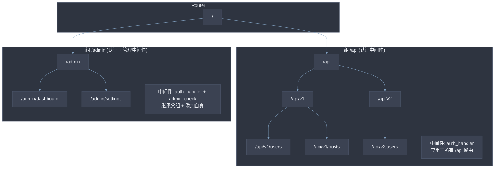
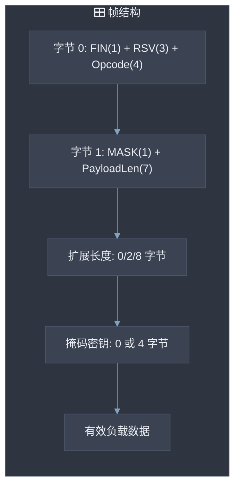
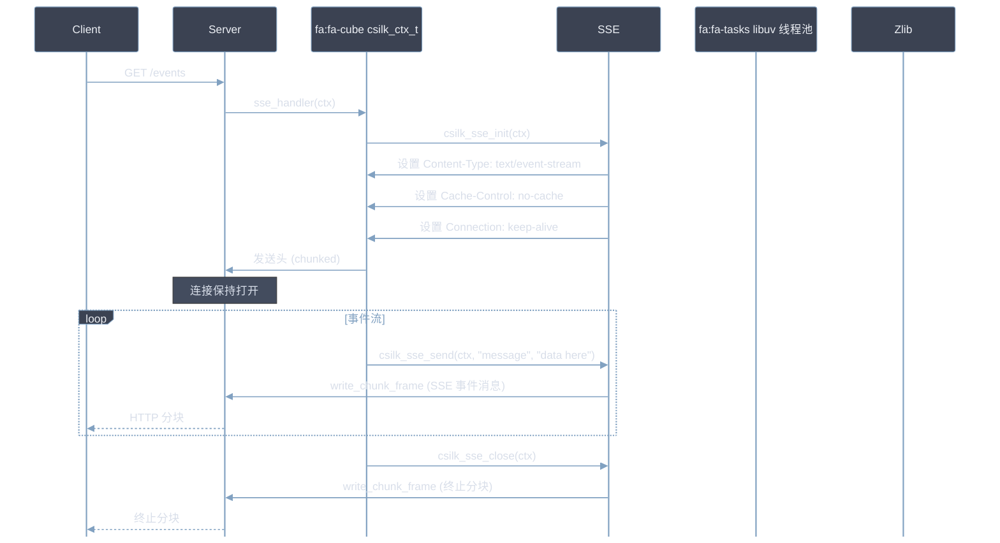
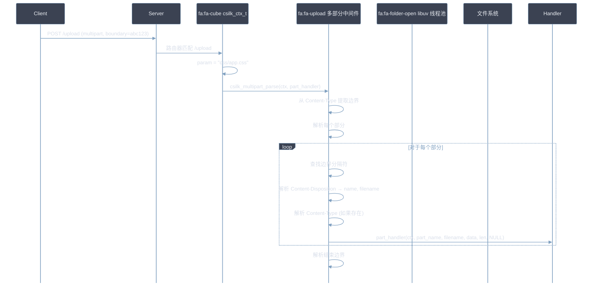
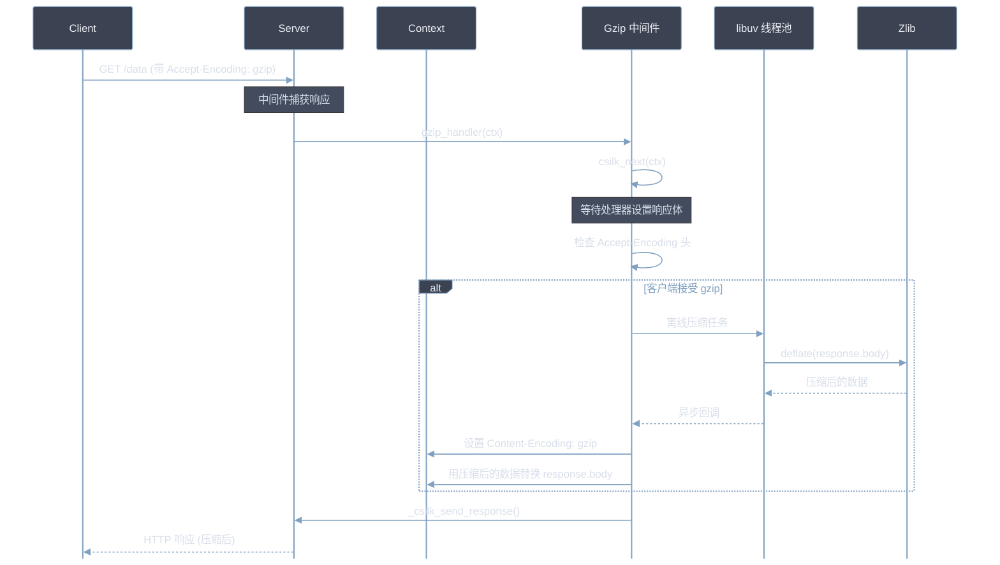
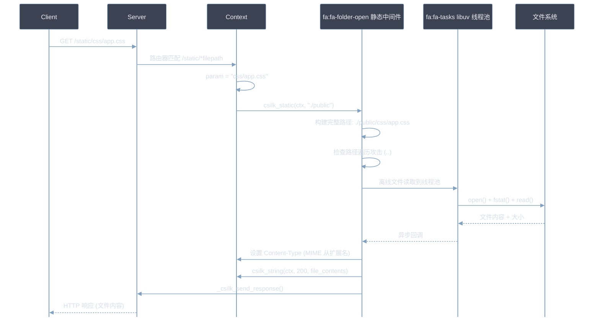
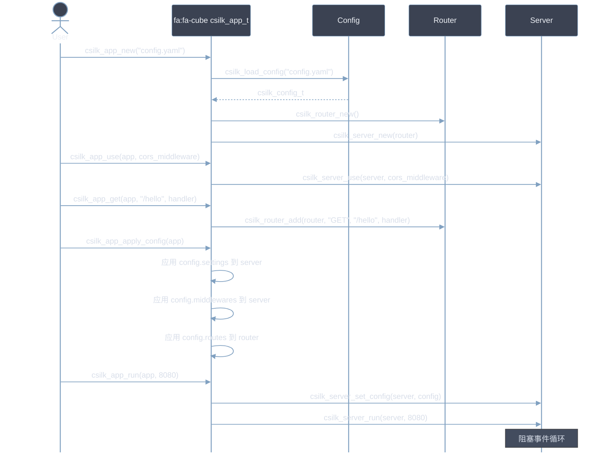

# 高级用法

本指南涵盖 csilk 的高级用法模式：WebSocket、SSE、多部分上传、gzip 压缩、静态文件服务和多工作线程配置。代码示例 **SHOULD** 适应您的具体用例。所有中间件 **MUST** 在 `csilk_server_run()` 之前注册。

## 路由组

路由组允许基于前缀的路由组织和中间件作用域：



### 分组代码示例

```c
csilk_group_t* api = csilk_group_new(router, "/api");
csilk_group_use(api, auth_handler);     // 所有 /api/* 路由需要认证
csilk_GET(api, "/users", list_users);

csilk_group_t* admin = csilk_group_group(api, "/admin");
csilk_group_use(admin, admin_handler);  // /api/admin/* 需要认证 + 管理权限
csilk_GET(admin, "/dashboard", dashboard);
```

## WebSocket 协议

WebSocket 帧格式：



## 服务器发送事件 (SSE)



## 多部分表单数据



## Gzip 压缩



## 静态文件服务



## 管理仪表板

统一的管理仪表板提供 csilk 应用的实时监控：

```c
#include "csilk/app/admin.h"

int main() {
    csilk_app_t* app = csilk_app_new("config.yaml");

    // 在 /admin 注册管理仪表板
    csilk_admin_serve(app, "/admin");

    csilk_app_run(app, 8080);
    csilk_app_free(app);
    return 0;
}
```

仪表板包括：
- **HTTP 指标**: QPS, 延迟直方图, 状态码分布, 活跃连接数。
- **工作流监控**: 实时执行图, 节点级计时, token 预算跟踪。
- **MQ 监控**: 队列深度, 消息吞吐量, 消费者滞后。
- **数据库遥测**: 连接池状态, 查询延迟。
- **AI 遥测**: 模型调用次数, token 使用量, 错误率。
- **进程指标**: RSS 内存, CPU 使用量, 运行时间。

## 数据库驱动

csilk 支持通过统一驱动接口的四种数据库后端：

```c
#include "csilk/drivers/db.h"

// 从配置初始化数据库连接池
csilk_db_pool_t* pool = csilk_db_pool_new("sqlite", "data/app.db", 10);

// 执行查询
csilk_db_result_t* result = csilk_db_query(pool, "SELECT * FROM users WHERE id = ?", 1);
if (result && result->row_count > 0) {
    printf("用户: %s\n", result->rows[0][1]); // 列 1 = 名称
}
csilk_db_result_free(result);
csilk_db_pool_free(pool);
```

## 高级应用编程接口

`csilk_app_t` 包装器简化服务器创建：



## 多工作线程模式

当 `worker_threads > 1` 时，csilk 使用 `SO_REUSEPORT` 绑定多个监听套接字 — 每个工作线程加主线程一个。内核在所有监听器之间分布传入连接。

### 线程安全

在多工作线程模式下，连接回调 (`on_new_connection`) 可以在任何事件循环线程上执行。在连接建立期间访问的所有共享可变状态必须是线程安全的：

- **客户端连接池** (`pool_get`/`pool_put`): 每个工作线程管理自己的无锁连接对象池，避免互斥锁争用。
- **活跃客户端列表**: 由 `clients_mutex` 保护。
- **连接计数器**: 使用原子操作 (`atomic_fetch_add`)。

### 优雅关闭

`csilk_server_stop()` 向主循环发送信号关闭其监听器和连接，然后通过每个工作线程的 `uv_async_t` 句柄向每个工作线程发送信号。主线程在事件循环退出后加入所有工作线程。

---

## 进一步阅读

有关本指南中涵盖的功能的深入架构细节，请参见：

| 功能 | 模块设计文档 |
|---------|----------------------|
| 路由组 & 路由器内部 | [路由器](../module-design/router.md) |
| WebSocket 协议 | [协议](../module-design/protocols.md) |
| SSE 协议 | [协议](../module-design/protocols.md) |
| 消息队列 / 事件总线 | [消息传递](../module-design/messaging.md) |
| 管理仪表板 | [应用层](../module-design/app.md) |
| 数据库驱动 | [数据层](../module-design/data.md) |
| 服务器多工作线程 & 关闭 | [服务器核心](../module-design/server.md) |

---

## 自定义中间件开发 (自定义中间件开发)

csilk 采用洋葱模型，请求自外向内经过中间件链。自定义中间件 MUST 遵循 `csilk_handler_t` 函数指针类型：

```c
typedef void (*csilk_handler_t)(csilk_ctx_t*, void*);

// 注册带参数的中间件
csilk_handler_t auth_handler = (csilk_handler_t)custom_auth_middleware;
csilk_set(c, "auth_role", "admin");  // 通过 Storage 传递参数

// 后续中间件可读取
csilk_str_view_t role = csilk_get(c, "auth_role");
```

**常见中间件模式**：

| 模式 | 用途 | MUST/SHOULD 规范 |
|:-----|------|-------------------|
| 认证 | JWT / Session 验证 | **MUST** 校验 Token 有效期和角色 |
| 验证 | 请求参数校验 | **SHOULD** 使用反射引擎（`csilk_bind_reflect`）自动绑定 |
| 限流 | 令牌桶算法 | **MUST** 设置 `Retry-After` Header |
| 日志 | 请求/响应记录 | **SHOULD** 记录 Request-Id 路径 |

### WebSocket Rooms 实现（基于 MQ）

WebSocket Rooms 实现跨连接的事件广播：

```c
// include/websocket/rooms.h
typedef struct {
    csilk_ws_t* ws;
    int client_fd;
    char room_id[64];
    bool is_active;
} ws_connection_t;

// 全局连接表（需加锁保护）
static struct {
    pthread_mutex_t lock;
    ws_connection_t* connections[4096];
    size_t count;
} rooms_ctx = {0};

int ws_rooms_join(csilk_ws_t* ws, const char* room_id) {
    pthread_mutex_lock(&rooms_ctx.lock);
    // 分配槽位、初始化连接、加入全局表
    // MUST 确保 thread-safe
    pthread_mutex_unlock(&rooms_ctx.lock);
    return 0;
}

int ws_rooms_broadcast(const char* room_id, const char* message, size_t len) {
    pthread_mutex_lock(&rooms_ctx.lock);
    // 遍历所有连接，查找属于该房间的连接
    // MUST 遍历时检查 is_active 标志
    pthread_mutex_unlock(&rooms_ctx.lock);
    return broadcast_count;
}
```

**路由注册**：
```c
csilk_handler_t ws_handlers[] = {ws_handler};
csilk_router_add(router, "GET", "/ws/{room_id}", ws_handlers, 1);
```

---

## SSE 流式推送

SSE 必须设置 `Content-Type: text/event-stream` 和 `Cache-Control: no-cache`：

```c
void sse_stream_handler(csilk_ctx_t* c) {
    csilk_sse_t* sse = csilk_sse_init(c);
    csilk_set_header(c, "Content-Type", "text/event-stream");
    csilk_set_header(c, "Cache-Control", "no-cache");
    csilk_set_header(c, "Connection", "keep-alive");

    csilk_sse_send(sse, "event: connected\ndata: connected\n\n", 24);

    for (int i = 0; i < 10; i++) {
        char buffer[512];
        int len = snprintf(buffer, sizeof(buffer),
            "event: update\ndata: {\"counter\": %d}\n\n", i);
        csilk_sse_send(sse, buffer, len);

        // 延长 keep-alive
        csilk_sse_extend_keepalive(sse, 5000);
        csilk_sleep(1000);
    }

    csilk_sse_close(sse);
}
```

**SSE 与 WebSocket 对比**：

| 维度 | SSE | WebSocket |
|:-----|:----:|:----------:|
| 协议 | HTTP | WebSocket |
| 双向通信 | 不支持 | **支持** |
| 兼容性 | 浏览器原生 | 浏览器原生 |
| 防火墙 | 常规 HTTP | 需手动配置 |
| 最佳场景 | 单向推送 | 双向实时通信 |

---

## AI 工作流编排

csilk 的 AI 引擎支持工具调用（Function Calling），结合 Python 实现复杂工作流：

**C 端工具定义**：
```c
typedef int (*csilk_tool_fn_t)(csilk_ctx_t* c, const char* args, char* result, size_t result_size);

typedef struct {
    const char* name;
    const char* description;  // MUST 包含
    csilk_tool_fn_t fn;
} csilk_tool_t;
```

**Python 端调用示例**：
```python
tools = [
    Tool(
        name="weather",
        description="Get weather information for a city",
        fn=lambda args: subprocess.check_output(
            ["./csilk-tools", "weather", args]
        ).decode("utf-8")
    )
]

response = openai.ChatCompletion.create(
    model="gpt-4",
    messages=[{"role": "user", "content": user_message}],
    functions=[tool.to_openai_schema() for tool in tools],
    function_call="auto"
)

if response["choices"][0]["message"].get("function_call"):
    # 执行工具
    result = tool.fn(tool_args)
    # 生成最终响应
```

---

## 数据库事务管理 (数据库事务管理)

使用 SQLite 事务保证数据一致性：

```c
int db_transaction_execute(sqlite3* conn, const char* sql) {
    // 1. 开始事务（MUST 使用 IMMEDIATE）
    sqlite3_exec(conn, "BEGIN IMMEDIATE TRANSACTION", NULL, NULL, NULL);

    // 2. 执行 SQL
    char* errmsg = NULL;
    int rc = sqlite3_exec(conn, sql, NULL, NULL, &errmsg);

    if (rc != SQLITE_OK) {
        // 回滚（MUST）
        sqlite3_exec(conn, "ROLLBACK TRANSACTION", NULL, NULL, NULL);
        fprintf(stderr, "SQL failed: %s\n", errmsg);
        sqlite3_free(errmsg);
        return -1;
    }

    // 3. 提交（SHOULD）
    sqlite3_exec(conn, "COMMIT TRANSACTION", NULL, NULL, NULL);
    return 0;
}
```

**批量事务**：
```c
int db_transaction_execute_json(sqlite3* conn, const char* queries) {
    // 1. 开始事务
    sqlite3_exec(conn, "BEGIN IMMEDIATE TRANSACTION", NULL, NULL, NULL);

    cJSON* json = cJSON_Parse(queries);
    cJSON* query_item = NULL;
    cJSON_ArrayForEach(query_item, json) {
        cJSON* sql_item = cJSON_GetObjectItem(query_item, "sql");
        if (sql_item && sql_item->valuestring) {
            // 逐条执行
            sqlite3_exec(conn, sql_item->valuestring, NULL, NULL, NULL);
        }
    }

    // 4. 提交或回滚
    if (success) {
        sqlite3_exec(conn, "COMMIT TRANSACTION", NULL, NULL, NULL);
    } else {
        sqlite3_exec(conn, "ROLLBACK TRANSACTION", NULL, NULL, NULL);
    }

    cJSON_Delete(json);
    return success ? 0 : -1;
}
```

---

## 性能优化技巧 (性能优化技巧)

### 零拷贝处理 (零拷贝)

**避免 JSON 解析时的内存复制**：
```c
// 传统方式（有拷贝）
cJSON* json = cJSON_Parse(body);
char* json_str = cJSON_PrintUnformatted(json);  // 分配新内存
csilk_set(c, "json", json_str);
cJSON_Delete(json);

// 零拷贝方式（引用缓冲区）
csilk_str_view_t body = csilk_get_body(c);
cJSON* json = cJSON_ParseWithLength(body.data, body.len);
csilk_set(c, "json", json);  // 传递指针，不复制
cJSON_Delete(json);
```

### 延迟释放 (延迟释放)

在 Recovery Handler 中保护资源：
```c
void custom_recovery(csilk_ctx_t* c) {
    csilk_set(c, "defer_pool", my_resource_pool);
    csilk_set(c, "defer_fd", my_file_descriptor);
    csilk_panic_recovery(c);
}

void custom_handler(csilk_ctx_t* c) {
    void* pool = csilk_get(c, "defer_pool");
    int fd = (int)(intptr_t)csilk_get(c, "defer_fd");
    if (pool) csilk_free(pool);
    if (fd >= 0) close(fd);
}
```

### 连接复用 (连接复用)

```c
void on_request_end(csilk_ctx_t* c) {
    // 复用 Arena 而非销毁（SHOULD）
    csilk_arena_reset(c->arena);

    // 重置上下文
    csilk_ctx_reset(c);
}

void on_connection_close(csilk_ctx_t* c) {
    // 连接关闭时销毁资源（MUST）
    csilk_arena_free(c->arena);
}
```

---

## 配置与错误处理 (配置与错误处理)

### 动态配置热更新 (动态配置热更新)

```c
void on_config_watch(csilk_ctx_t* c) {
    csilk_config_t new_config = csilk_config_load("config.yaml");
    csilk_server_set_config(c->server, &new_config);
}
```

### 自定义错误处理器 (自定义错误处理器)

```c
void custom_error_handler(csilk_ctx_t* c) {
    int status = csilk_get_status(c);
    cJSON* error = cJSON_CreateObject();

    cJSON_AddStringToObject(error, "error", "Internal Server Error");
    cJSON_AddNumberToObject(error, "status", status);

    csilk_json(c, status, error);
    cJSON_Delete(error);
}
```

---

## 最佳实践 (最佳实践)

| 实践 | 说明 |
|:-----|------|
| **MUST** 使用 `csilk_next(c)` 传递请求 | 中间件链必需步骤 |
| **SHOULD** 避免在热路径中 `malloc` | 使用 Arena 或预分配 |
| **SHOULD** 在 Recovery Handler 中清理资源 | 防止泄漏 |
| **MUST NOT** 直接修改 `csilk_ctx_s` | 间接通过 Accessor API |
| **MAY** 使用 `csilk_get/c` 传递中间件参数 | 简化函数签名 |
| **SHOULD** 长期连接设置 `keep_alive_timeout_ms` | 防止资源泄漏 |
| **MUST** TLS 1.3 用于生产环境 | 安全合规 |