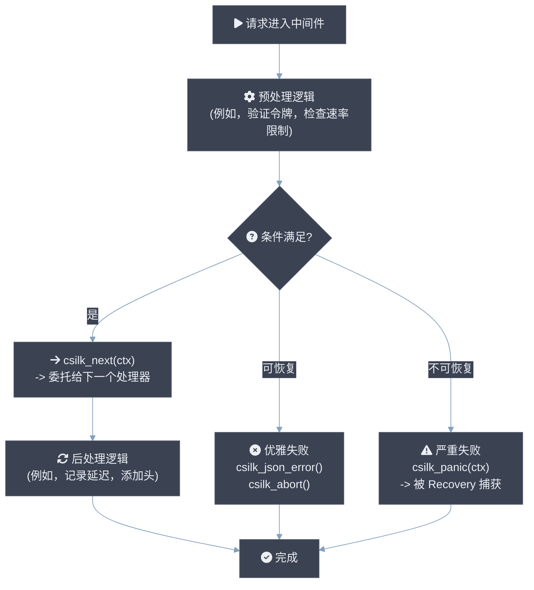
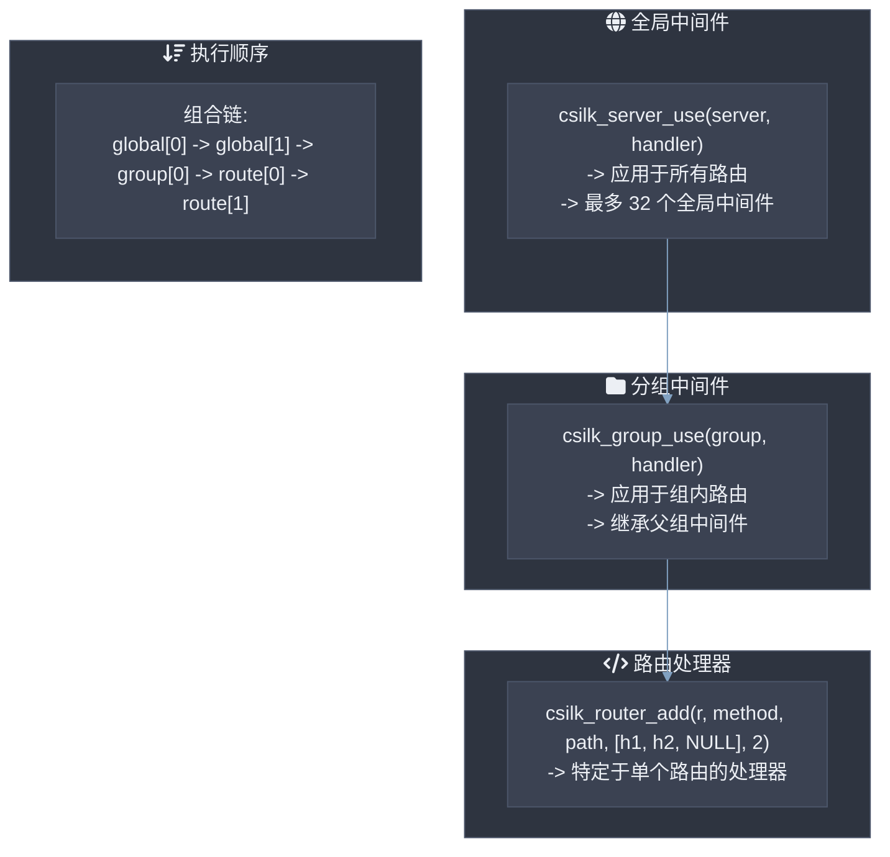
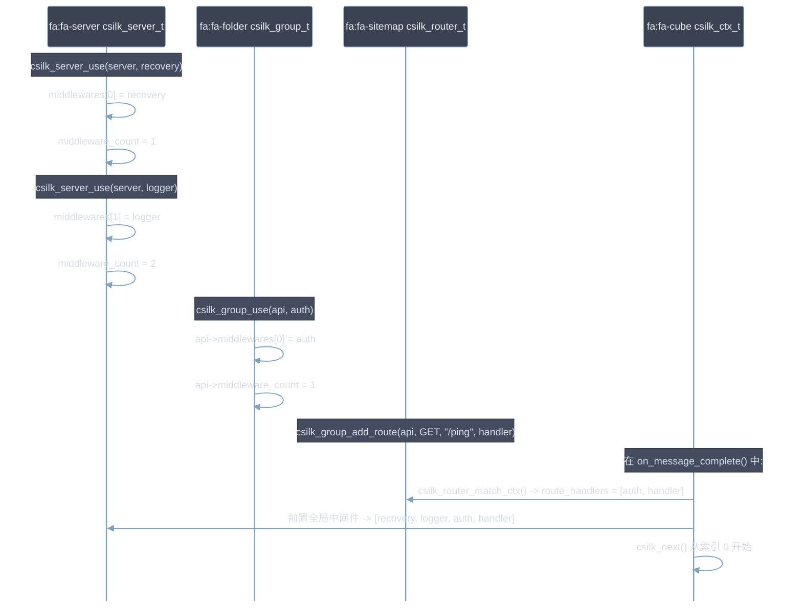

# 自定义中间件开发

csilk 中的中间件是一个具有签名 `void handler(csilk_ctx_t* c)` 的函数。中间件可以在实际业务处理器执行前后拦截请求。中间件 **MUST** 调用 `csilk_next(c)` 来传递控制权给下一个处理器 — 省略此调用 **MUST** 是有意为之（短路）。中间件 **MUST NOT** 阻塞 — 任何阻塞的 I/O **MUST** 使用 libuv 线程池。中间件 **SHOULD NOT** 在热路径上分配内存；应优先使用 Arena 分配。

## 中间件模式



## 基本中间件结构

```c
void my_middleware(csilk_ctx_t* c) {
    // === 预处理 ===
    // 访问请求数据
    const char* token = csilk_get_header(c, "Authorization");
    const char* ip = csilk_get_client_ip(c);

    // 验证 / 检查条件
    if (!token) {
        csilk_json_error(c, 401, "Missing token");
        return;  // 中止链（不调用 csilk_next）
    }

    // 存储供后续中间件使用的数据
    csilk_set(c, "user_id", (void*)42);

    // === 委托 ===
    csilk_next(c);

    // === 后处理 ===
    // 仅在 csilk_next 正常返回时运行
    // (即，没有中止且没有 panic)
    CSILK_LOG_I("请求完成");
}
```

## 常见中间件配方

### 1. 认证中间件

```c
void auth_middleware(csilk_ctx_t* c) {
    const char* auth = csilk_get_header(c, "Authorization");
    if (!auth || strncmp(auth, "Bearer ", 7) != 0) {
        csilk_json_error(c, 401, "Unauthorized");
        return;
    }

    const char* token = auth + 7;
    if (!validate_token(token)) {
        csilk_json_error(c, 403, "Invalid token");
        return;
    }

    csilk_next(c);
    // 后处理: 审计日志记录
}
```

### 2. 计时/日志中间件

```c
void timing_middleware(csilk_ctx_t* c) {
    uint64_t start = uv_hrtime();

    csilk_next(c);

    uint64_t elapsed = (uv_hrtime() - start) / 1000000;
    CSILK_LOG_I("%s %s → %d (%llums)",
        csilk_get_method(c),
        csilk_get_path(c),
        csilk_get_status(c),
        elapsed);
}
```

### 3. 响应头注入

```c
void security_headers_middleware(csilk_ctx_t* c) {
    csilk_next(c);

    // 添加安全头
    csilk_set_header(c, "X-Content-Type-Options", "nosniff");
    csilk_set_header(c, "X-Frame-Options", "DENY");
    csilk_set_header(c, "X-XSS-Protection", "1; mode=block");
}
```

### 4. JWT 授权示例

```c
void protected_resource_handler(csilk_ctx_t* c) {
    // JWT 中间件已将解码后的载荷存储到上下文中
    cJSON* payload = (cJSON*)csilk_get(c, "jwt_payload");
    if (payload) {
        const char* user = cJSON_GetObjectItem(payload, "sub")->valuestring;
        const char* role = cJSON_GetObjectItem(payload, "role")->valuestring;
        CSILK_LOG_I("认证用户: %s (角色: %s)", user, role);
    }
    csilk_string(c, 200, "Protected data");
}

// 在 main 中:
// csilk_group_use(api, (csilk_handler_t)csilk_jwt_middleware, "secret");
```

### 5. 请求追踪与请求 ID

```c
void trace_middleware(csilk_ctx_t* c) {
    const char* req_id = csilk_get_request_id(c);
    
    // 通过上下文感知日志记录添加请求 ID
    CSILK_LOG_I("[%s] 开始请求", req_id);

    csilk_next(c);
}
```

## 注册方法



## 中间件链组装



## 最佳实践

1. **始终调用 `csilk_next(c)`** 在希望继续链的中间件中。跳过它会终止链并发送响应。

2. **使用 `csilk_abort(c)`** 早期终止链而不设置响应体（与 `csilk_redirect` 结合使用时有用）。

3. **使用 `csilk_set(c, key, value)` 存储数据** 在中间件和处理器之间传递数据。数据存储在上下文的链表存储中。

4. **不要在后处理逻辑中调用 `csilk_next()`** — 仅调用一次您的中间件。调用堆栈自动处理返回路径。

5. **使用 Recovery 中间件作为第一个全局中间件** 以确保下游处理器中的任何 `csilk_panic()` 调用都被捕获。

6. **使用 Arena 分配的内存** 在处理器内的临时数据。分配在 Arena 上的内存会在请求周期结束时自动释放。

---

## 进一步阅读

有关中间件系统及相关组件的深入架构细节，请参见：

| 主题 | 模块设计文档 |
|-------|----------------------|
| 中间件洋葱模型 & 链组装 | [中间件](../module-design/middleware.md) |
| JWT / CSRF / CORS / WAF / 速率限制器 | [安全](../module-design/security.md) |
| 上下文生命周期 & Arena 分配器 | [上下文](../module-design/context.md) |
| 服务器钩子 | [钩子](../module-design/hooks.md) |